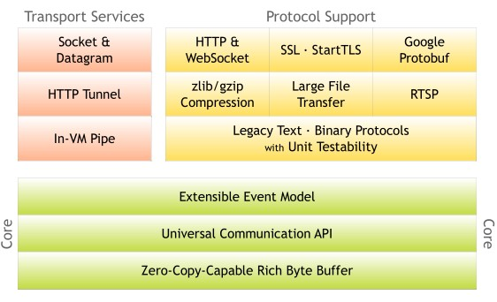
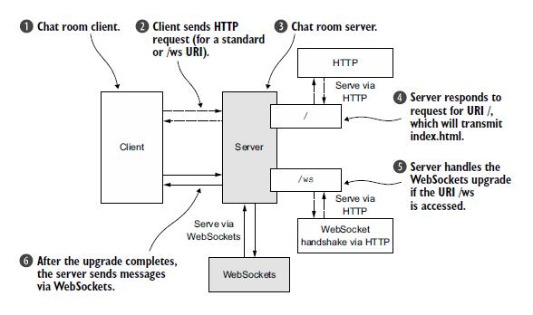

# 概念

Netty是由JBOSS提供的一个java开源框架。Netty提供异步的、事件驱动的网络应用程序框架和工具，用以快速开发高性能、高可靠性的网络服务器和客户端程序。



# Demo

## 抛弃服务

抛弃服务协议将会抛弃任何收到的数据，而不响应。

### 服务端处理通道

```java
import io.netty.buffer.ByteBuf;
import io.netty.channel.ChannelHandlerContext;
import io.netty.channel.ChannelInboundHandlerAdapter;
import io.netty.util.CharsetUtil;
import io.netty.util.ReferenceCountUtil;

/**
 * 服务端处理通道
 */
public class DiscardServerHandler extends ChannelInboundHandlerAdapter {

	/**
	 * 每当从客户端收到新的数据时，channelRead()这个方法会在收到消息时被调用
	 */
	@Override
	public void channelRead(ChannelHandlerContext ctx, Object msg) throws Exception {
		try {
			// 接受传入的数据
			ByteBuf buf = (ByteBuf) msg;
			System.out.println(buf.toString(CharsetUtil.UTF_8));
			// 另一种写法
			/*
			 * while (buf.isReadable()) { System.out.print((char) buf.readByte());
			 * System.out.flush(); }
			 */
		} catch (Exception e) {
			e.printStackTrace();
		} finally {
			//
			/**
			 * 抛弃接受到的数据 在这里ByteBuf是一个引用计数对象，需要,显示地调用 release()方法来释放 处理器的职责是释放所有传递到处理器的引用计数对象
			 */
			ReferenceCountUtil.release(msg);
			// 抛弃的另一种方法
			// ((ByteBuf) msg).release();
		}
	}

	/**
	 * 发生异常时触发
	 */
	@Override
	public void exceptionCaught(ChannelHandlerContext ctx, Throwable cause) throws Exception {
		cause.printStackTrace();// 打印错误
		ctx.close();// 关闭通道
	}

}
```

### 运行服务器

```java
import org.apache.log4j.Logger;
import org.apache.log4j.PropertyConfigurator;

import io.netty.bootstrap.ServerBootstrap;
import io.netty.channel.Channel;
import io.netty.channel.ChannelFuture;
import io.netty.channel.ChannelInitializer;
import io.netty.channel.ChannelOption;
import io.netty.channel.EventLoopGroup;
import io.netty.channel.nio.NioEventLoopGroup;
import io.netty.channel.socket.SocketChannel;
import io.netty.channel.socket.nio.NioServerSocketChannel;

/**
 * 运行服务器
 */
import org.apache.log4j.Logger;
import org.apache.log4j.PropertyConfigurator;

import io.netty.bootstrap.ServerBootstrap;
import io.netty.channel.Channel;
import io.netty.channel.ChannelFuture;
import io.netty.channel.ChannelInitializer;
import io.netty.channel.ChannelOption;
import io.netty.channel.EventLoopGroup;
import io.netty.channel.nio.NioEventLoopGroup;
import io.netty.channel.socket.SocketChannel;
import io.netty.channel.socket.nio.NioServerSocketChannel;

public class DiscardServer {

	private static Logger logger = Logger.getLogger(DiscardServer.class);

	private int port;

	public DiscardServer(int port) {
		super();
		this.port = port;
	}

	public void run() {
		/**
		 * NioEventLoopGroup 是用来处理I/O操作的多线程事件循环器 这里使用NioEventLoopGroup
		 * 第一个是‘boss’,用来接受进来的连接
		 * 第二个是‘worker’么,用来处理已接受的连接，一旦‘boss’接受连接,就会把连接信息注册到‘worker’上
		 */
		EventLoopGroup bossGroup = new NioEventLoopGroup();
		EventLoopGroup workerGroup = new NioEventLoopGroup();
		logger.info("准备运行端口：" + port);
		try {

			// ServerBootstrap 是一个启动NIO服务的辅助启动类,可以在这个服务中直接使用channel
			ServerBootstrap bootstrap = new ServerBootstrap();
			// 设置group
			bootstrap.group(bossGroup, workerGroup);

			/**
			 * Channel主要有两个实现
			 * 1.NioServerSocketChannel是给server用的，程序由始至终只有一个NioServerSocketChannel
			 * 2.NioSocketChannel是给客户端用的，每个连接生成一个NioSocketChannel对象
			 */
			bootstrap.channel(NioServerSocketChannel.class);

			/**
			 * 这里的事件处理类经常会被用来处理一个最近的已经接收的Channel ChannelInitializer是一个特殊的处理类
			 * 他的目的是帮助使用者配置一个新的Channel
			 */
			bootstrap.childHandler(new ChannelInitializer<Channel>() {

				@Override
				protected void initChannel(Channel ch) throws Exception {
					SocketChannel channel = (SocketChannel) ch;
					channel.pipeline().addLast(new DiscardServerHandler());

				}
			});

			/**
			 * 设置通道实现的配置参数 
			 */
			// option()是提供给NioServerSocketChannel用来接收进来的连接
			bootstrap.option(ChannelOption.SO_BACKLOG, 128);
			// childOption()是提供给由父管道 ServerChannel 接收到的连接
			bootstrap.childOption(ChannelOption.SO_KEEPALIVE, true);
			// 绑定端口并启动去接收进来的连接
			ChannelFuture future = bootstrap.bind(port).sync();
			// 一直等待，直到socket被关闭
			future.channel().closeFuture().sync();

		} catch (Exception e) {
			e.printStackTrace();
			throw new RuntimeException("服务器运行错误！", e);
		} finally {
			// 关闭
			bossGroup.shutdownGracefully();
			workerGroup.shutdownGracefully();
		}
	}

	public static void main(String[] args) {
		PropertyConfigurator.configure("resource/log4j.properties");

		int port;
		if (args.length > 0) {
			port = Integer.parseInt(args[0]);
		} else {
			port = 8080;
		}

		new DiscardServer(port).run();
		logger.info("Server:run");
	}

}
```

### 运行

可以使用Telnet进行测试

`telnet 127.0.0.1 8080`

## 时间服务器

TIME协议在不接受任何请求时他会发送一个含32位的整数的消息，并且一旦消息发送就会立即关闭连接。

### 服务端

#### 服务端处理类

```java
import com.gobha.timeServer.model.UnixTime;

import io.netty.channel.ChannelFuture;
import io.netty.channel.ChannelFutureListener;
import io.netty.channel.ChannelHandlerContext;
import io.netty.channel.ChannelInboundHandlerAdapter;

/**
 * 服务端处理类
 */
public class TimeServerHandler extends ChannelInboundHandlerAdapter {

	/**
	 * channelActive()方法将会在连接被建立并且准备进行通信时被调用
	 */
	@Override
	public void channelActive(final ChannelHandlerContext ctx) throws Exception {

		// /**
		// * TIME协议会发送一个32字节的整数消息
		// * ChannelHandlerContext.alloc()方法获取一个ByteBufAllocator(字节缓冲区分配器) 然后分配一个4字节的缓冲
		// */
		// final ByteBuf time = ctx.alloc().buffer(4);
		// // System.currentTimeMillis()获取格林尼治时间，加2208988800L变成东八区的时间
		// time.writeInt((int) (System.currentTimeMillis() / 1000L));
		// /**
		// * ChannelHandlerContext.write()/writeAndFlush()会返回一个ChannelFuture
		// * 由于Netty的操作是异步的，所以需要通过监听返回的ChannelFuture来判断操作是否完成
		// */
		// final ChannelFuture f = ctx.writeAndFlush(time);
		// // 构建一个匿名的 ChannelFutureListener类用来在操作完成时关闭 Channel
		// f.addListener(new ChannelFutureListener() {
		//
		// public void operationComplete(ChannelFuture future) throws Exception {
		// assert f == future;
		// ctx.close();
		//
		// }
		// });
		// // 预定义监听器
		// /* f.addListener(ChannelFutureListener.CLOSE); */

		ChannelFuture f = ctx.writeAndFlush(new UnixTime());
		f.addListener(ChannelFutureListener.CLOSE);

	}

	/**
	 * 发生异常时触发
	 */
	@Override
	public void exceptionCaught(ChannelHandlerContext ctx, Throwable cause) throws Exception {
		cause.printStackTrace();// 打印错误
		ctx.close();// 关闭通道
	}

}
```

#### 服务端Encoder

```java
import com.gobha.timeServer.model.UnixTime;

import io.netty.buffer.ByteBuf;
import io.netty.channel.ChannelHandlerContext;
import io.netty.handler.codec.MessageToByteEncoder;

/**
 * 服务端Encoder
 */
public class TimeEncoder extends MessageToByteEncoder<UnixTime>{

	@Override
	protected void encode(ChannelHandlerContext ctx, UnixTime msg, ByteBuf out) throws Exception {
		out.writeInt((int) msg.value());
	}

}
```

#### 启动服务端

```java
import org.apache.log4j.Logger;
import org.apache.log4j.PropertyConfigurator;

import io.netty.bootstrap.ServerBootstrap;
import io.netty.channel.Channel;
import io.netty.channel.ChannelFuture;
import io.netty.channel.ChannelInitializer;
import io.netty.channel.ChannelOption;
import io.netty.channel.EventLoopGroup;
import io.netty.channel.nio.NioEventLoopGroup;
import io.netty.channel.socket.SocketChannel;
import io.netty.channel.socket.nio.NioServerSocketChannel;

/**
 * 启动服务端
 */
public class TimeServer {

	private static Logger logger = Logger.getLogger(TimeServer.class);

	private int port;

	public TimeServer(int port) {
		super();
		this.port = port;
	}

	public void run() {
		/**
		 * NioEventLoopGroup 是用来处理I/O操作的多线程事件循环器 这里使用NioEventLoopGroup
		 * 第一个是‘boss’,用来接受进来的连接
		 * 第二个是‘worker’么,用来处理已接受的连接，一旦‘boss’接受连接,就会把连接信息注册到‘worker’上
		 */
		EventLoopGroup bossGroup = new NioEventLoopGroup();
		EventLoopGroup workerGroup = new NioEventLoopGroup();
		logger.info("准备运行端口：" + port);
		try {

			// ServerBootstrap 是一个启动NIO服务的辅助启动类,可以在这个服务中直接使用channel
			ServerBootstrap bootstrap = new ServerBootstrap();
			// 设置group
			bootstrap.group(bossGroup, workerGroup);

			/**
			 * Channel主要有两个实现
			 * 1.NioServerSocketChannel是给server用的，程序由始至终只有一个NioServerSocketChannel
			 * 2.NioSocketChannel是给客户端用的，每个连接生成一个NioSocketChannel对象
			 */
			bootstrap.channel(NioServerSocketChannel.class);

			/**
			 * 这里的事件处理类经常会被用来处理一个最近的已经接收的Channel ChannelInitializer是一个特殊的处理类
			 * 他的目的是帮助使用者配置一个新的Channel
			 */
			bootstrap.childHandler(new ChannelInitializer<Channel>() {

				@Override
				protected void initChannel(Channel ch) throws Exception {
					SocketChannel channel = (SocketChannel) ch;
					channel.pipeline().addLast(new TimeServerHandler());

				}
			});

			/**
			 * 设置通道实现的配置参数
			 */
			// option()是提供给NioServerSocketChannel用来接收进来的连接
			bootstrap.option(ChannelOption.SO_BACKLOG, 128);
			// childOption()是提供给由父管道 ServerChannel 接收到的连接
			bootstrap.childOption(ChannelOption.SO_KEEPALIVE, true);
			// 绑定端口并启动去接收进来的连接
			ChannelFuture future = bootstrap.bind(port).sync();
			logger.info("Server:run");
			// 一直等待，直到socket被关闭
			future.channel().closeFuture().sync();

		} catch (Exception e) {
			e.printStackTrace();
			throw new RuntimeException("服务器运行错误！", e);
		} finally {
			// 关闭
			bossGroup.shutdownGracefully();
			workerGroup.shutdownGracefully();
			logger.info("TimeServer 关闭");
		}
	}

	public static void main(String[] args) {
		PropertyConfigurator.configure("resource/log4j.properties");

		int port;
		if (args.length > 0) {
			port = Integer.parseInt(args[0]);
		} else {
			port = 8080;
		}

		new TimeServer(port).run();
	}

}
```

### 客户端

#### 客户端处理类

```java
import com.gobha.timeServer.model.UnixTime;

import io.netty.buffer.ByteBuf;
import io.netty.channel.ChannelHandlerContext;
import io.netty.channel.ChannelInboundHandlerAdapter;

/**
 * 客户端处理类
 */
public class TimeClientHandler extends ChannelInboundHandlerAdapter {

	private ByteBuf buf;

	@Override
	public void channelRead(ChannelHandlerContext ctx, Object msg) throws Exception {

		/*ByteBuf m = (ByteBuf) msg;
		buf.writeBytes(m);
		m.release();

		if(buf.readableBytes()>=4) {
			long currentTimeMillis = (buf.readUnsignedInt()) * 1000L;
			System.out.println(new Date(currentTimeMillis));
			ctx.close();
		}*/

		UnixTime m = (UnixTime) msg;
		System.out.println(m.toString());
		ctx.close();
	}

	@Override
	public void handlerAdded(ChannelHandlerContext ctx) throws Exception {
		buf = ctx.alloc().buffer(4);
	}

	@Override
	public void handlerRemoved(ChannelHandlerContext ctx) throws Exception {
		buf.release();
		buf = null;
	}

}}
```

#### 客户端Decoders

```java
import java.util.List;

import com.gobha.timeServer.model.UnixTime;

import io.netty.buffer.ByteBuf;
import io.netty.channel.ChannelHandlerContext;
import io.netty.handler.codec.ByteToMessageDecoder;

/**
 * 客户端Decoders
 */
public class TimeDecoder extends ByteToMessageDecoder {

	@Override
	protected void decode(ChannelHandlerContext ctx, ByteBuf in, List<Object> out) throws Exception {

		if (in.readableBytes() < 4) {
			return;
		}

		// 如果在 decode() 方法里增加了一个对象到 out 对象里，这意味着解码器解码消息成功
		// out.add(in.readBytes(4));
		out.add(new UnixTime(in.readUnsignedInt()));

	}

}
```

#### 启动客户端

```java
import org.apache.log4j.Logger;
import org.apache.log4j.PropertyConfigurator;

import io.netty.bootstrap.Bootstrap;
import io.netty.channel.ChannelFuture;
import io.netty.channel.ChannelInitializer;
import io.netty.channel.EventLoopGroup;
import io.netty.channel.nio.NioEventLoopGroup;
import io.netty.channel.socket.SocketChannel;
import io.netty.channel.socket.nio.NioSocketChannel;

/**
 * 启动客户端
 */
public class TimeClient {

	private static Logger logger = Logger.getLogger(TimeClient.class);

	private final int port;

	private final String host;

	public TimeClient(String host, int port) {
		super();
		this.host = host;
		this.port = port;
	}

	public void run() {

		// NioEventLoopGroup 是用来处理I/O操作的多线程事件循环器 这里使用NioEventLoopGroup
		EventLoopGroup group = new NioEventLoopGroup();
		try {

			// Bootstrap 是一个非服务端启动NIO服务的辅助启动类
			Bootstrap bootstrap = new Bootstrap();
			// 设置group
			bootstrap.group(group);
			/**
			 * Channel主要有两个实现
			 * 1.NioServerSocketChannel是给server用的，程序由始至终只有一个NioServerSocketChannel
			 * 2.NioSocketChannel是给客户端用的，每个连接生成一个NioSocketChannel对象
			 */
			bootstrap.channel(NioSocketChannel.class);
			bootstrap.handler(new ChannelInitializer<SocketChannel>() {

				@Override
				protected void initChannel(SocketChannel ch) throws Exception {
					ch.pipeline().addLast(new TimeClientHandler());

				}
			});

			// 绑定端口并启动去接收进来的连接
			ChannelFuture future = bootstrap.connect(host, port);
			logger.info("Client:run");
			// 一直等待，直到socket被关闭
			future.channel().closeFuture().sync();

		} catch (Exception e) {
			e.printStackTrace();
			throw new RuntimeException("客户端运行错误！", e);
		} finally {
			group.shutdownGracefully();
			logger.info("TimeClient 关闭");

		}

	}

	public static void main(String[] args) {
		PropertyConfigurator.configure("resource/log4j.properties");

		new TimeClient("localhost", 8080).run();
	}

}
```

### 运行

先运行TimeServer，再运行TimeClient。

## 聊天程序

### Model

使用POJO代替ByteBuf作为TIME协议消息的主要数据结构。

```java
import java.util.Date;

/**
 * TIME协议POJI
 */
public class UnixTime {

	private final long value;

	public UnixTime() {
		this(System.currentTimeMillis() / 1000L + 2208988800L);
	}

	public UnixTime(long value) {
		this.value = value;
	}

	public long value() {
		return value;
	}

	@Override
	public String toString() {
		return new Date(value() * 1000L).toString();
	}

}
```

### 服务端

#### 服务端处理类

```java
import org.apache.log4j.Logger;

import io.netty.channel.Channel;
import io.netty.channel.ChannelHandlerContext;
import io.netty.channel.SimpleChannelInboundHandler;
import io.netty.channel.group.ChannelGroup;
import io.netty.channel.group.DefaultChannelGroup;
import io.netty.util.concurrent.GlobalEventExecutor;

/**
 * 服务端处理类
 */
public class SimpleChatServerHandler extends SimpleChannelInboundHandler<String> {

	private static Logger logger = Logger.getLogger(SimpleChatServerHandler.class);

	public static ChannelGroup channels = new DefaultChannelGroup(GlobalEventExecutor.INSTANCE);

	/**
	 * 每当从服务端收到新的客户端连接时，客户端的 Channel 存入 ChannelGroup 列表中，并通知列表中的其他客户端 Channel
	 */
	@Override
	public void handlerAdded(ChannelHandlerContext ctx) throws Exception {
		Channel incoming = ctx.channel();

		channels.writeAndFlush("[Server] - " + incoming.remoteAddress() + "加入\n");
		channels.add(ctx.channel());
	}

	/**
	 * 每当从服务端收到客户端断开时，客户端的 Channel 自动从 ChannelGroup 列表中移除了，并通知列表中的其他客户端 Channel
	 */
	@Override
	public void handlerRemoved(ChannelHandlerContext ctx) throws Exception {
		Channel incoming = ctx.channel();

		channels.writeAndFlush("[Server] - " + incoming.remoteAddress() + "离开\n");
	}

	/**
	 * 每当从服务端读到客户端写入信息时，将信息转发给其他客户端的 Channel
	 */
	@Override
	protected void messageReceived(ChannelHandlerContext ctx, String msg) throws Exception {
		Channel incoming = ctx.channel();
		for (Channel channel : channels) {
			if (channel != incoming) {
				channels.writeAndFlush(" [ " + incoming.remoteAddress() + " ] " + msg + "\n");
				return;
			} else {
				channels.writeAndFlush(" [you] " + msg + "\n");
				return;
			}
		}

	}

	/**
	 * 服务端监听到客户端活动
	 */
	@Override
	public void channelActive(ChannelHandlerContext ctx) throws Exception {
		Channel incoming = ctx.channel();
		logger.info("SimpleChatClient:" + incoming.remoteAddress() + " 在线\n");
	}

	/**
	 * 服务端监听到客户端不活动
	 */
	@Override
	public void channelInactive(ChannelHandlerContext ctx) throws Exception {
		Channel incoming = ctx.channel();
		logger.info("SimpleChatClient:" + incoming.remoteAddress() + " 掉线\n");
	}

	/**
	 * 服务端异常处理
	 */
	@Override
	public void exceptionCaught(ChannelHandlerContext ctx, Throwable cause) throws Exception {
		Channel incoming = ctx.channel();
		logger.info("SimpleChatClient:" + incoming.remoteAddress() + " 异常\n");
		// 打印异常信息
		cause.printStackTrace();
		// 当出现异常就关闭
		ctx.close();
	}

}
```

#### 服务端初始化类

```java
import java.nio.charset.Charset;

import org.apache.log4j.Logger;

import io.netty.channel.ChannelInitializer;
import io.netty.channel.ChannelPipeline;
import io.netty.channel.socket.SocketChannel;
import io.netty.handler.codec.DelimiterBasedFrameDecoder;
import io.netty.handler.codec.Delimiters;
import io.netty.handler.codec.string.StringDecoder;
import io.netty.handler.codec.string.StringEncoder;

/**
 * 服务端初始化类
 */
public class SimpleChatServerInitializer extends ChannelInitializer<SocketChannel> {

	private static Logger logger = Logger.getLogger(SimpleChatServerInitializer.class);

	@Override
	protected void initChannel(SocketChannel ch) throws Exception {
		Charset charset = Charset.forName("UTF-8");
		ChannelPipeline pipeline = ch.pipeline();
		//分隔符解码器
		pipeline.addLast("framer", new DelimiterBasedFrameDecoder(8192, Delimiters.lineDelimiter()));
		//编码器
		pipeline.addLast("decoder",new StringDecoder(charset));
		//解码器
		pipeline.addLast("encoder",new StringEncoder(charset));
		pipeline.addLast("handler",new SimpleChatServerHandler());

		logger.info("SimpleChatClient:"+ch.remoteAddress()+" 连接上");
	}

}
```

#### 启动服务端

```java
import org.apache.log4j.Logger;
import org.apache.log4j.PropertyConfigurator;

import io.netty.bootstrap.ServerBootstrap;
import io.netty.channel.ChannelFuture;
import io.netty.channel.ChannelOption;
import io.netty.channel.EventLoopGroup;
import io.netty.channel.nio.NioEventLoopGroup;
import io.netty.channel.socket.nio.NioServerSocketChannel;

/**
 * 启动服务端
 */
public class SimpleChatServer {

	private static Logger logger = Logger.getLogger(SimpleChatServer.class);

	private int port;

	public SimpleChatServer(int port) {
		super();
		this.port = port;
	}

	public void run() {
		/**
		 * NioEventLoopGroup 是用来处理I/O操作的多线程事件循环器 这里使用NioEventLoopGroup
		 * 第一个是‘boss’,用来接受进来的连接
		 * 第二个是‘worker’么,用来处理已接受的连接，一旦‘boss’接受连接,就会把连接信息注册到‘worker’上
		 */
		EventLoopGroup bossGroup = new NioEventLoopGroup();
		EventLoopGroup workerGroup = new NioEventLoopGroup();
		logger.info("准备运行端口：" + port);

		try {
			// ServerBootstrap 是一个启动NIO服务的辅助启动类,可以在这个服务中直接使用channel
			ServerBootstrap bootstrap = new ServerBootstrap();
			// 设置group
			bootstrap.group(bossGroup, workerGroup).channel(NioServerSocketChannel.class)
					.childHandler(new SimpleChatServerInitializer()).option(ChannelOption.SO_BACKLOG, 128)
					.childOption(ChannelOption.SO_KEEPALIVE, true);

			logger.info("SimpleChatServer 启动");

			// 绑定端口并启动去接收进来的连接
			ChannelFuture future = bootstrap.bind(port).sync();
			// 一直等待，直到socket被关闭
			future.channel().closeFuture().sync();

		} catch (Exception e) {
			e.printStackTrace();
			throw new RuntimeException("服务端运行错误！", e);
		} finally {
			// 关闭
			bossGroup.shutdownGracefully();
			workerGroup.shutdownGracefully();

			logger.info("SimpleChatServer 关闭");
		}
	}

	public static void main(String[] args) {
		PropertyConfigurator.configure("resource/log4j.properties");

		int port;
		if (args.length > 0) {
			port = Integer.parseInt(args[0]);
		} else {
			port = 8080;
		}

		new SimpleChatServer(port).run();
		logger.info("Server:run");
	}

}
```

### 客户端

#### 客户端处理类

```java
import io.netty.channel.ChannelHandlerContext;
import io.netty.channel.SimpleChannelInboundHandler;

/**
 * 客户端处理类
 */
public class SimpleChatClientHandler extends SimpleChannelInboundHandler<String> {

	/**
	 * 每当从客户端读到服务端写入信息时，直接将信息打印出来
	 */
	@Override
	protected void messageReceived(ChannelHandlerContext ctx, String msg) throws Exception {
		System.out.println(msg);

	}

}
```

#### 客户端初始化类

```java
import java.nio.charset.Charset;

import io.netty.channel.ChannelInitializer;
import io.netty.channel.ChannelPipeline;
import io.netty.channel.socket.SocketChannel;
import io.netty.handler.codec.DelimiterBasedFrameDecoder;
import io.netty.handler.codec.Delimiters;
import io.netty.handler.codec.string.StringDecoder;
import io.netty.handler.codec.string.StringEncoder;

/**
 * 客户端初始化类
 */
public class SimpleChatClientInitializer extends ChannelInitializer<SocketChannel> {

	@Override
	protected void initChannel(SocketChannel ch) throws Exception {
		Charset charset = Charset.forName("UTF-8");
		ChannelPipeline pipeline = ch.pipeline();
		//分隔符解码器
		pipeline.addLast("framer", new DelimiterBasedFrameDecoder(8192, Delimiters.lineDelimiter()));
		//编码器
		pipeline.addLast("decoder",new StringDecoder(charset));
		//解码器
		pipeline.addLast("encoder",new StringEncoder(charset));
		pipeline.addLast("handler",new SimpleChatClientHandler());

	}

}
```

#### 启动客户端

```java
import java.io.BufferedReader;
import java.io.InputStreamReader;

import org.apache.log4j.Logger;
import org.apache.log4j.PropertyConfigurator;

import io.netty.bootstrap.Bootstrap;
import io.netty.channel.Channel;
import io.netty.channel.EventLoopGroup;
import io.netty.channel.nio.NioEventLoopGroup;
import io.netty.channel.socket.nio.NioSocketChannel;

/**
 * 启动客户端
 */
public class SimpleChatClient {

	private static Logger logger = Logger.getLogger(SimpleChatClient.class);

	private final String host;

	private final int port;


	public SimpleChatClient(String host,int port) {
		super();
		this.host=host;
		this.port = port;
	}

	public void run() {
		EventLoopGroup group = new NioEventLoopGroup();
		try {
			Bootstrap bootstrap = new Bootstrap()
					.group(group)
					.channel(NioSocketChannel.class)
					.handler(new SimpleChatClientInitializer());
			logger.info("SimpleChatClient 启动");

			Channel channel = bootstrap.connect(host, port).sync().channel();
			BufferedReader in = new BufferedReader(new InputStreamReader(System.in));
			while(true) {
				channel.writeAndFlush(in.readLine()+"\r\n");
			}

		} catch (Exception e) {
			e.printStackTrace();
			throw new RuntimeException("客户端运行错误！", e);
		}finally {
			group.shutdownGracefully();
			logger.info("SimpleChatClient 关闭");

		}

	}

	public static void main(String[] args) {
		PropertyConfigurator.configure("resource/log4j.properties");

		new SimpleChatClient("localhost", 8080).run();
	}

}
```

### 运行

先运行SimpleChatServer，再运行多个SimpleChatClient，发送消息即可。

## 网页聊天程序(WebSocket)

WebSocket 通过`Upgrade handshake`（升级握手）从标准的 HTTP 或HTTPS 协议转为WebSocket。因此，使用 WebSocket 的应用程序将始终以HTTP/S开始，然后进行升级。

**整体逻辑：**



 - 客户端/用户连接到服务器并加入聊天
 - HTTP 请求页面或 WebSocket 升级握手
 - 服务器处理所有客户端/用户
 - 响应 URI “/”的请求，转到默认 html 页面
 - 如果访问的是 URI“/ws” ，处理 WebSocket 升级握手
 - 升级握手完成后 ，通过 WebSocket 发送聊天消息

### 处理HTTP请求

 - 如果该 HTTP 请求被发送到URI “/ws”，调用 FullHttpRequest 上的 `retain()`，并通过调用 `fireChannelRead(msg)` 转发到下一个 ChannelInboundHandler。`retain()` 是必要的，因为 `channelRead()` 完成后，它会调用 FullHttpRequest 上的 `release()` 来释放其资源。

 - 如果客户端发送的 HTTP 1.1 头是“Expect: 100-continue” ，将发送“100 Continue”的响应。

 - 在 头被设置后，写一个 HttpResponse 返回给客户端。注意，这是不是 FullHttpResponse，唯一的反应的第一部分。此外，我们不使用 `writeAndFlush()` 在这里，这个是在最后完成。

 - 如果没有加密也不压缩，要达到最大的效率可以是通过存储 `index.html` 的内容在一个 DefaultFileRegion 实现。这将利用零拷贝来执行传输。出于这个原因，我们检查，看看是否有一个 SslHandler 在 ChannelPipeline 中。另外，我们使用 ChunkedNioFile。
写 LastHttpContent 来标记响应的结束，并终止它。

 - 如果不要求 keepalive ，添加 ChannelFutureListener 到 ChannelFuture 对象的最后写入，并关闭连接。注意，这里我们调用 `writeAndFlush()` 来刷新所有以前写的信息。

```java
import java.io.File;
import java.io.RandomAccessFile;
import java.net.URISyntaxException;
import java.net.URL;

import org.apache.log4j.Logger;

import io.netty.channel.Channel;
import io.netty.channel.ChannelFuture;
import io.netty.channel.ChannelFutureListener;
import io.netty.channel.ChannelHandlerContext;
import io.netty.channel.DefaultFileRegion;
import io.netty.channel.SimpleChannelInboundHandler;
import io.netty.handler.codec.http.DefaultFullHttpResponse;
import io.netty.handler.codec.http.DefaultHttpResponse;
import io.netty.handler.codec.http.FullHttpRequest;
import io.netty.handler.codec.http.FullHttpResponse;
import io.netty.handler.codec.http.HttpHeaders;
import io.netty.handler.codec.http.HttpResponse;
import io.netty.handler.codec.http.HttpResponseStatus;
import io.netty.handler.codec.http.HttpUtil;
import io.netty.handler.codec.http.HttpVersion;
import io.netty.handler.codec.http.LastHttpContent;
import io.netty.handler.ssl.SslHandler;
import io.netty.handler.stream.ChunkedNioFile;

public class HttpRequestHandler extends SimpleChannelInboundHandler<FullHttpRequest> {

	private static Logger logger = Logger.getLogger(HttpRequestHandler.class);

	private static final File INDEX;

	private final String WSURL;

	public HttpRequestHandler(String wsUrl) {
		this.WSURL = wsUrl;
	}

	static {
		// 获得项目路径
		URL location = HttpRequestHandler.class.getProtectionDomain().getCodeSource().getLocation();
		System.out.println(location);
		try {
			String path = location.toURI() + "WebsocketChatClient.html";
			path = !path.contains("file:") ? path : path.substring(5);
			INDEX = new File(path);

		} catch (URISyntaxException e) {
			e.printStackTrace();
			throw new IllegalStateException("Unable to locate WebsocketChatClient.html", e);
		}

		System.out.println(location);
	}

	@Override
	protected void channelRead0(ChannelHandlerContext ctx, FullHttpRequest request) throws Exception {
		if (WSURL.equalsIgnoreCase(request.uri())) {
			// 如果请求是 WebSocket 升级，递增引用计数器（保留）并且将它传递给在 ChannelPipeline 中的下个
			// ChannelInboundHandler
			ctx.fireChannelRead(request.retain());
		} else {
			// 处理符合 HTTP 1.1的 “100 Continue” 请求
			if (HttpUtil.is100ContinueExpected(request)) {
				send100Continue(ctx);
			}
			// 读取默认的 WebsocketChatClient.html 页面
			RandomAccessFile file = new RandomAccessFile(INDEX, "r");
			// 设置HttpResponse
			HttpResponse response = new DefaultHttpResponse(request.getProtocolVersion(), HttpResponseStatus.OK);
			// 设置HttpResponse请求头
			response.headers().set(HttpHeaders.Names.CONTENT_TYPE, "text/html; charset=UTF-8");
			boolean keepAlive = HttpHeaders.isKeepAlive(request);
			// 判断 keepalive 是否在请求头里面
			if (keepAlive) {
				response.headers().set(HttpHeaders.Names.CONTENT_LENGTH, file.length());
				response.headers().set(HttpHeaders.Names.CONNECTION, HttpHeaders.Values.KEEP_ALIVE);
			}
			// 写HttpResponse到客户端
			ctx.write(response);
			/**
			 * 写 index.html 到客户端 判断 SslHandler 是否在 ChannelPipeline 来决定是使用 DefaultFileRegion
			 * 还是 ChunkedNioFile
			 */
			if (ctx.pipeline().get(SslHandler.class) == null) {
				ctx.write(new DefaultFileRegion(file.getChannel(), 0, file.length()));
			} else {
				ctx.write(new ChunkedNioFile(file.getChannel()));
			}
			// 写并刷新 LastHttpContent 到客户端，标记响应完成
			ChannelFuture future = ctx.writeAndFlush(LastHttpContent.EMPTY_LAST_CONTENT);
			// 如果 keepalive 没有要求，当写完成时，关闭 Channel
			if (!keepAlive) {
				future.addListener(ChannelFutureListener.CLOSE);
			}

			file.close();
		}
	}

	public static void send100Continue(ChannelHandlerContext ctx) {
		// 设置HttpResponse
		FullHttpResponse response = new DefaultFullHttpResponse(HttpVersion.HTTP_1_1, HttpResponseStatus.CONTINUE);
		ctx.writeAndFlush(response);
	}

	//异常处理
	@Override
	public void exceptionCaught(ChannelHandlerContext ctx, Throwable cause) throws Exception {
		Channel incoming = ctx.channel();
		logger.info("Client:"+incoming.remoteAddress()+" 异常");
		//打印错误异常
		cause.printStackTrace();
		//出现异常就关闭连接
		ctx.close();
	}

}

```

### 处理 WebSocket frame

 - 当WebSocket 与新客户端已成功握手完成，通过写入信息到 ChannelGroup 中的 Channel 来通知所有连接的客户端，然后添加新 Channel 到 ChannelGroup

 - 如果接收到 TextWebSocketFrame，调用 `retain()` ，并将其写、刷新到 ChannelGroup，使所有连接的 WebSocket Channel 都能接收到它。和以前一样，retain() 是必需的，因为当 `channelRead0()` 返回时，TextWebSocketFrame 的引用计数将递减。由于所有操作都是异步的，`writeAndFlush()` 可能会在以后完成，我们不希望它来访问无效的引用。

```java
import org.apache.log4j.Logger;

import io.netty.channel.Channel;
import io.netty.channel.ChannelHandlerContext;
import io.netty.channel.SimpleChannelInboundHandler;
import io.netty.channel.group.ChannelGroup;
import io.netty.channel.group.DefaultChannelGroup;
import io.netty.handler.codec.http.websocketx.TextWebSocketFrame;
import io.netty.util.concurrent.GlobalEventExecutor;

/**
 * 处理 WebSocket frame
 */
public class TextWebSocketFrameHandler extends SimpleChannelInboundHandler<TextWebSocketFrame> {

	private static Logger logger = Logger.getLogger(TextWebSocketFrameHandler.class);

	public static ChannelGroup channels = new DefaultChannelGroup(GlobalEventExecutor.INSTANCE);

	/**
	 * 每当从服务端读到客户端写入信息时，将信息转发给其他客户端的 Channel。
	 */
	@Override
	protected void channelRead0(ChannelHandlerContext ctx, TextWebSocketFrame msg) throws Exception {

		Channel incoming = ctx.channel();
		for (Channel channel : channels) {
			if (channel.id() != incoming.id()) {
				channels.writeAndFlush(new TextWebSocketFrame(" [ " + incoming.remoteAddress() + " ] " + msg.text() + "\n"));
				return;
			} else {
				channels.writeAndFlush(new TextWebSocketFrame(" [you] " + msg.text() + "\n"));
				return;
			}
		}

	}

	/**
	 * 每当从服务端收到新的客户端连接时，客户端的 Channel 存入 ChannelGroup 列表中，并通知列表中的其他客户端 Channel
	 */
	@Override
	public void handlerAdded(ChannelHandlerContext ctx) throws Exception {
		Channel incoming = ctx.channel();

		channels.writeAndFlush("[Server] - " + incoming.remoteAddress() + "加入\n");
		channels.add(ctx.channel());
	}

	/**
	 * 每当从服务端收到客户端断开时，客户端的 Channel 自动从 ChannelGroup 列表中移除了，并通知列表中的其他客户端 Channel
	 */
	@Override
	public void handlerRemoved(ChannelHandlerContext ctx) throws Exception {
		Channel incoming = ctx.channel();

		channels.writeAndFlush("[Server] - " + incoming.remoteAddress() + "离开\n");
	}

	/**
	 * 服务端监听到客户端活动
	 */
	@Override
	public void channelActive(ChannelHandlerContext ctx) throws Exception {
		Channel incoming = ctx.channel();
		logger.info("Client:" + incoming.remoteAddress() + " 在线\n");
	}

	/**
	 * 服务端监听到客户端不活动
	 */
	@Override
	public void channelInactive(ChannelHandlerContext ctx) throws Exception {
		Channel incoming = ctx.channel();
		logger.info("Client:" + incoming.remoteAddress() + " 掉线\n");
	}

	/**
	 * 服务端异常处理
	 */
	@Override
	public void exceptionCaught(ChannelHandlerContext ctx, Throwable cause) throws Exception {
		Channel incoming = ctx.channel();
		logger.info("Client:" + incoming.remoteAddress() + " 异常\n");
		// 打印异常信息
		cause.printStackTrace();
		// 当出现异常就关闭
		ctx.close();
	}

}
```

### 服务端始化类

```java
import org.apache.log4j.Logger;

import io.netty.channel.ChannelInitializer;
import io.netty.channel.ChannelPipeline;
import io.netty.channel.socket.SocketChannel;
import io.netty.handler.codec.http.HttpObjectAggregator;
import io.netty.handler.codec.http.HttpServerCodec;
import io.netty.handler.codec.http.websocketx.WebSocketServerProtocolHandler;
import io.netty.handler.stream.ChunkedWriteHandler;

/**
 * 服务端初始化类
 */
public class WebsocketChatServerInitializer extends ChannelInitializer<SocketChannel> {

	private static Logger logger = Logger.getLogger(WebsocketChatServerInitializer.class);

	@Override
	protected void initChannel(SocketChannel ch) throws Exception {
		ChannelPipeline pipeline = ch.pipeline();
		// 编码解码器
		pipeline.addLast(new HttpServerCodec());
		pipeline.addLast(new HttpObjectAggregator(64 * 1024));
		pipeline.addLast(new ChunkedWriteHandler());
		pipeline.addLast(new HttpRequestHandler("/ws"));
		// 处理握手
		pipeline.addLast(new WebSocketServerProtocolHandler("/ws"));
		pipeline.addLast(new TextWebSocketFrameHandler());

		logger.info("Client:" + ch.remoteAddress() + " 连接上");
	}

}
```

### 聊天页面

```html
<!DOCTYPE html>
<html>
<head>
<meta charset="UTF-8">
<title>WebSocket Chat</title>
</head>
<body>
	<script type="text/javascript">
		var socket;
		if (!window.WebSocket) {
			window.WebSocket = window.MozWebSocket;
		}
		if (window.WebSocket) {
			socket = new WebSocket("ws://192.168.1.194:8080/ws");
			socket.onmessage = function(event) {
				var ta = document.getElementById('responseText');
				ta.value = ta.value + '\n' + event.data
			};
			socket.onopen = function(event) {
				var ta = document.getElementById('responseText');
				ta.value = "连接开启!";
			};
			socket.onclose = function(event) {
				var ta = document.getElementById('responseText');
				ta.value = ta.value + "连接被关闭";
			};
		} else {
			alert("你的浏览器不支持 WebSocket！");
		}

		function send(message) {
			if (!window.WebSocket) {
				return;
			}
			if (socket.readyState == WebSocket.OPEN) {
				socket.send(message);
			} else {
				alert("连接没有开启.");
			}
		}
	</script>
	<form onsubmit="return false;">
		<h3>WebSocket 聊天室：</h3>
		<textarea id="responseText" style="width: 500px; height: 300px;"></textarea>
		<br> 
		<input type="text" name="message"  style="width: 300px" value="" placeholder="请输入聊天内容">
		<input type="button" value="发送消息" onclick="send(this.form.message.value)">
		<input type="button" onclick="javascript:document.getElementById('responseText').value=''" value="清空聊天记录">
	</form>
</body>
</html>
```

### 启动服务端

```java
import org.apache.log4j.Logger;
import org.apache.log4j.PropertyConfigurator;

import io.netty.bootstrap.ServerBootstrap;
import io.netty.channel.ChannelFuture;
import io.netty.channel.ChannelOption;
import io.netty.channel.EventLoopGroup;
import io.netty.channel.nio.NioEventLoopGroup;
import io.netty.channel.socket.nio.NioServerSocketChannel;

public class WebsocketChatServer {

	private static Logger logger = Logger.getLogger(WebsocketChatServer.class);

	private int port;

	public WebsocketChatServer(int port) {
		super();
		this.port = port;
	}

	public void run() {
		/**
		 * NioEventLoopGroup 是用来处理I/O操作的多线程事件循环器 这里使用NioEventLoopGroup
		 * 第一个是‘boss’,用来接受进来的连接
		 * 第二个是‘worker’么,用来处理已接受的连接，一旦‘boss’接受连接,就会把连接信息注册到‘worker’上
		 */
		EventLoopGroup bossGroup = new NioEventLoopGroup();
		EventLoopGroup workerGroup = new NioEventLoopGroup();
		logger.info("准备运行端口：" + port);

		try {
			// ServerBootstrap 是一个启动NIO服务的辅助启动类,可以在这个服务中直接使用channel
			ServerBootstrap bootstrap = new ServerBootstrap();
			// 设置group
			bootstrap.group(bossGroup, workerGroup).channel(NioServerSocketChannel.class)
					.childHandler(new WebsocketChatServerInitializer()).option(ChannelOption.SO_BACKLOG, 128)
					.childOption(ChannelOption.SO_KEEPALIVE, true);

			logger.info("WebsocketChatServer 启动");

			// 绑定端口并启动去接收进来的连接
			ChannelFuture future = bootstrap.bind(port).sync();
			// 一直等待，直到socket被关闭
			future.channel().closeFuture().sync();

		} catch (Exception e) {
			e.printStackTrace();
			throw new RuntimeException("服务端运行错误！", e);
		} finally {
			// 关闭
			bossGroup.shutdownGracefully();
			workerGroup.shutdownGracefully();

			logger.info("WebsocketChatServer 关闭");
		}
	}

	public static void main(String[] args) {
		PropertyConfigurator.configure("resource/log4j.properties");

		int port;
		if (args.length > 0) {
			port = Integer.parseInt(args[0]);
		} else {
			port = 8080;
		}

		new WebsocketChatServer(port).run();
		logger.info("Server:run");
	}

}
```

### 运行

运行WebsocketChatServer，浏览器访问`http://localhost:8080`

## 基于Netty超时机制的心跳实现

### 心跳处理类

```java
import org.apache.log4j.Logger;

import io.netty.buffer.ByteBuf;
import io.netty.buffer.Unpooled;
import io.netty.channel.ChannelFutureListener;
import io.netty.channel.ChannelHandlerContext;
import io.netty.channel.ChannelInboundHandlerAdapter;
import io.netty.handler.timeout.IdleState;
import io.netty.handler.timeout.IdleStateEvent;
import io.netty.util.CharsetUtil;

/**
 * 心跳处理类
 */
public class HeartbeatServerHandler extends ChannelInboundHandlerAdapter {

	private static Logger logger = Logger.getLogger(HeartbeatServerHandler.class);

	//定义了心跳时 发送的内容
	private static final ByteBuf HEARTBEAT_SEQUENCE = Unpooled
			.unreleasableBuffer(Unpooled.copiedBuffer("Heartbeat", CharsetUtil.UTF_8));

	@Override
	public void userEventTriggered(ChannelHandlerContext ctx, Object evt) throws Exception {

		//判断是否是IdleStateEvent事件
		if(evt instanceof IdleStateEvent) {
			IdleStateEvent event = (IdleStateEvent) evt;
			String type = "";
			if (event.state() == IdleState.READER_IDLE) {
				type = "read idle";
			} else if (event.state() == IdleState.WRITER_IDLE) {
				type = "write idle";
			} else if (event.state() == IdleState.ALL_IDLE) {
				type = "all idle";
			}

			/**
			 * ByteBuf.duplicate()复制当前对象
			 * ChannelFutureListener.CLOSE_ON_FAILURE 监听是否完成，完成后关闭ChannelHandlerContext
			 * 这里将心跳内容发送给客户端
			 */
			ctx.writeAndFlush(HEARTBEAT_SEQUENCE.duplicate()).addListener(ChannelFutureListener.CLOSE_ON_FAILURE);

			logger.info(ctx.channel().remoteAddress()+"超时类型：" + type);
		}else {
			//什么也不处理
			super.userEventTriggered(ctx, evt);
		}
	}
}
```

### 心跳初始化

```java
import io.netty.channel.Channel;
import io.netty.channel.ChannelInitializer;
import io.netty.channel.ChannelPipeline;
import io.netty.handler.timeout.IdleStateHandler;

/**
 * 心跳初始化
 */
public class HeartbeatHandlerInitializer extends ChannelInitializer<Channel>{

	//设置超时时间
	private static final int READ_IDEL_TIME_OUT = 4;
	private static final int WRITE_IDEL_TIME_OUT = 5;
	private static final int ALL_IDEL_TIME_OUT = 7;

	@Override
	protected void initChannel(Channel ch) throws Exception {
		ChannelPipeline pipeline = ch.pipeline();
		pipeline.addLast(new IdleStateHandler(READ_IDEL_TIME_OUT, WRITE_IDEL_TIME_OUT, ALL_IDEL_TIME_OUT));
		pipeline.addLast(new HeartbeatServerHandler());

	}

}
```

### 启动服务端

```java
import org.apache.log4j.Logger;
import org.apache.log4j.PropertyConfigurator;

import io.netty.bootstrap.ServerBootstrap;
import io.netty.channel.ChannelFuture;
import io.netty.channel.ChannelOption;
import io.netty.channel.EventLoopGroup;
import io.netty.channel.nio.NioEventLoopGroup;
import io.netty.channel.socket.nio.NioServerSocketChannel;

/**
 * 启动服务端
 */
public class HeartbeatServer {

	private static Logger logger = Logger.getLogger(HeartbeatServer.class);

	private int port;

	public HeartbeatServer(int port) {
		super();
		this.port = port;
	}

	public void run() {
		/**
		 * NioEventLoopGroup 是用来处理I/O操作的多线程事件循环器 这里使用NioEventLoopGroup
		 * 第一个是‘boss’,用来接受进来的连接
		 * 第二个是‘worker’么,用来处理已接受的连接，一旦‘boss’接受连接,就会把连接信息注册到‘worker’上
		 */
		EventLoopGroup bossGroup = new NioEventLoopGroup();
		EventLoopGroup workerGroup = new NioEventLoopGroup();
		logger.info("准备运行端口：" + port);

		try {

			// ServerBootstrap 是一个启动NIO服务的辅助启动类,可以在这个服务中直接使用channel
			ServerBootstrap bootstrap = new ServerBootstrap();
			// 设置group
			bootstrap.group(bossGroup, workerGroup);

			/**
			 * Channel主要有两个实现
			 * 1.NioServerSocketChannel是给server用的，程序由始至终只有一个NioServerSocketChannel
			 * 2.NioSocketChannel是给客户端用的，每个连接生成一个NioSocketChannel对象
			 */
			bootstrap.channel(NioServerSocketChannel.class);

			bootstrap.childHandler(new HeartbeatHandlerInitializer());

			/**
			 * 设置通道实现的配置参数
			 */
			// option()是提供给NioServerSocketChannel用来接收进来的连接
			bootstrap.option(ChannelOption.SO_BACKLOG, 128);

			// 绑定端口并启动去接收进来的连接
			ChannelFuture future = bootstrap.bind(port).sync();
			logger.info("Server:run");
			// 一直等待，直到socket被关闭
			future.channel().closeFuture().sync();

		} catch (Exception e) {
			e.printStackTrace();
			throw new RuntimeException("服务器运行错误！", e);
		} finally {
			// 关闭
			bossGroup.shutdownGracefully();
			workerGroup.shutdownGracefully();
		}
	}

	public static void main(String[] args) {
		PropertyConfigurator.configure("resource/log4j.properties");

		int port;
		if (args.length > 0) {
			port = Integer.parseInt(args[0]);
		} else {
			port = 8080;
		}

		new HeartbeatServer(port).run();
	}

}
```

### 运行

运行HeartbeatServer后可以使用Telnet进行测试

`telnet 127.0.0.1 8080`