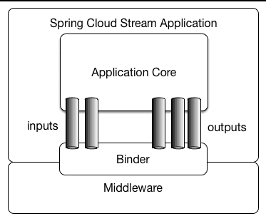

# DiscoveryClient

# LoadBalancerClient

# SpringCloud

Spring Cloud是一个基于Spring Boot实现的云应用开发工具，它为基于JVM的云应用开发中涉及的配置管理、服务发现、断路器、智能路由、微代理、控制总线、全局锁、决策竞选、分布式会话和集群状态管理等操作提供了一种简单的开发方式。

Spring Cloud包含了多个子项目（针对分布式系统中涉及的多个不同开源产品），比如：Spring Cloud Config、Spring Cloud Netflix、Spring Cloud CloudFoundry、Spring Cloud AWS、Spring Cloud Security、Spring Cloud Commons、Spring Cloud Zookeeper、Spring Cloud CLI等项目。

## 微服务架构

微服务架构就是将一个完整的应用从数据存储开始垂直拆分成多个不同的服务，每个服务都能独立部署、独立维护、独立扩展，服务与服务间通过诸如RESTful API的方式互相调用。

## SpringCloud Netflix

SpringCloud Netflix是SpringCloud的一个具体实现，其提供的模块包括：服务发现（Eureka），断路器（Hystrix），智能路由（Zuul），客户端负载均衡（Ribbon）等。

# Eureka（服务治理）

依靠SpringCloud对服务治理做了一层抽象接口，Spring Cloud应用中可以支持多种不同的服务治理框架，而且非常方便的进行切换，并且不影响任何其他的服务注册、服务发现、服务调用等逻辑。

Eureka本身是一个SpringBoot项目，需要单独部署。支持将自己作为服务注册上去，从而实现高可用。

实际使用中需要先部署一个`app-register-server`项目，用于启动Eureka服务注册中心，再分别部署两个SpringCloud Web应用，分别是`app-common-server`、`app-common-client`，作为服务生产者和服务消费者。

## 服务注册中心

**入口**

```java
@EnableEurekaServer//启用服务注册中心
@SpringBootApplication
public class Application {

    public static void main(String[] args) {
        new SpringApplicationBuilder(Application.class).web(true).run(args);
    }
}
```

**配置**

```conf
spring.application.name=app-register-server
server.port=1001

#非高可用配置
eureka.instance.hostname=localhost
eureka.client.register-with-eureka=false
eureka.client.fetch-registry=false
```

## 服务生产者

**入口**

```java
@EnableDiscoveryClient//启用服务发现
@SpringBootApplication
public class Application {

    public static void main(String[] args) {
        new SpringApplicationBuilder(Application.class).web(true).run(args);
    }
}
```

**Controller**

```java
@RestController
public class DcController {

    @Autowired
    DiscoveryClient discoveryClient;

    @GetMapping("/dc")
    public String dc() {
        String services = "Services: " + discoveryClient.getServices();//获取服务列表
        System.out.println(services);
        return services;
    }

}
```

**配置**

```conf
spring.application.name=app-common-server
server.port=2001
eureka.client.serviceUrl.defaultZone=http://localhost:1001/eureka/
```

## 服务消费者

**入口**

```java
@EnableDiscoveryClient
@SpringBootApplication
public class Application {

	@Bean
	public RestTemplate restTemplate() {
		return new RestTemplate();
	}

	public static void main(String[] args) {
		new SpringApplicationBuilder(Application.class).web(true).run(args);
	}
}
```
**Controller**

```java
@RestController
public class DcController {

    @Autowired
    LoadBalancerClient loadBalancerClient;
    @Autowired
    RestTemplate restTemplate;

    @GetMapping("/consumer")
    public String dc() {
        ServiceInstance serviceInstance = loadBalancerClient.choose("app-common-server");//从名为app-common-server的服务中选出一个实例（负载均衡）
        String url = "http://" + serviceInstance.getHost() + ":" + serviceInstance.getPort() + "/dc";//组装接口
        System.out.println(url);
        return restTemplate.getForObject(url, String.class);//调用服务
    }
}
```

**配置**

```conf
spring.application.name=app-common-client
server.port=2101

eureka.client.serviceUrl.defaultZone=http://localhost:1001/eureka/
```

# Ribbon & Feign（服务调用与负载均衡）

## Ribbon

Spring Cloud Ribbon是基于Netflix Ribbon实现的一套客户端负载均衡的工具，通过http和tcp调用服务并实现负载均衡。当Ribbon与Eureka配合使用时，Ribbon会扩展成从Eureka注册中心中获取服务实例列表，同时依托Eureka来确保服务是否正常。

使用Ribbon在代码上不需要再使用LoadBalancerClient的相关逻辑，Ribbon内置的拦截器会自动拦截请求并负载均衡到真正的服务实例地址。

```java
@EnableDiscoveryClient//启用服务发现
@SpringBootApplication
public class Application {

	@Bean
	@LoadBalanced//启用负载均衡
	public RestTemplate restTemplate() {
		return new RestTemplate();
	}

	public static void main(String[] args) {
		new SpringApplicationBuilder(Application.class).web(true).run(args);
	}
}
```

```java
@RestController
public class DcController {

    @Autowired
    RestTemplate restTemplate;

    @GetMapping("/consumer")
    public String dc() {
        return restTemplate.getForObject("http://app-common-client/dc", String.class);//这里不需要请求具体服务实例的IP和Port
    }

}
```

## Fegin

Spring Cloud Feign是一套基于Netflix Feign实现的声明式服务调用客户端，它使得编写Web服务客户端变得更加简单。我们只需要通过创建接口并用注解来配置它既可完成对Web服务接口的绑定。它具备可插拔的注解支持，包括Feign注解、JAX-RS注解。Spring Cloud Feign还扩展了对Spring MVC注解的支持，同时还整合了Ribbon和Eureka来提供均衡负载的HTTP客户端实现。此外Fegin还可以结合Hystrix来实现服务容错保护。

简单来说Fegin就是扩展了Ribbon的HTTP客户端调用实现，也是目前SpringCloud推荐的服务调用实践。

从思想上来说Fegin的写法类似于Dubbo声明式服务调用。

**入口**

```java
@EnableFeignClients//启用Fegin客户端
@EnableDiscoveryClient//启用服务发现
@SpringBootApplication
public class Application {

	public static void main(String[] args) {
		new SpringApplicationBuilder(Application.class).web(true).run(args);
	}
}
```

**Fegin服务接口**

```java
@FeignClient("app-common-server")//需要调用的服务名称
public interface DcClient {

    @GetMapping("/dc")//具体需要调用的服务接口
    String consumer();

}
```

**Controller**

```java
@RestController
public class DcController {

    @Autowired
    DcClient dcClient;

    @GetMapping("/consumer")
    public String dc() {
        return dcClient.consumer();
    }

}
```

**配置**

```conf
spring.application.name=app-common-client-fegin
server.port=2201

eureka.client.serviceUrl.defaultZone=http://localhost:1001/eureka/
```

# Spring Cloud Config（分布式配置中心）

Spring Cloud Config用于为分布式系统提供集中化的外部配置管理，分为服务端与客户端两个部分。其中服务端也称为分布式配置中心，它是一个独立的微服务应用，用来连接配置仓库并为客户端提供获取配置信息、加密/解密信息等访问接口；而客户端则是微服务架构中的各个微服务应用或基础设施，它们通过指定的配置中心来管理应用资源与业务相关的配置内容，并在启动的时候从配置中心获取和加载配置信息。

Spring Cloud Config可以通过部署注册多个服务端来通过负载均衡实现高可用，同时客户端开出了`/refresh`服务刷新接口，可以配合如Git的WebHook以及Spring Cloud Bus（消息总线实现配置广播刷新）来实现应用配置的热更新。另外Spring Cloud Config也支持其他如SVN、本地文件作为配置数据源。

Spring Cloud Config的缺点在于官方没有提供Dashboard，目前有开源的项目如：[Spring Cloud Config Admin](https://github.com/dyc87112/spring-cloud-config-admin)。

# Hystrix（服务容错）


# Zuul（服务网关）

# Spring Cloud Stream（消息驱动）

## 概念

消息驱动的微服务：微服务是松耦合的架构，而基于消息驱动模式可以实现业务高度解耦。

Spring Cloud Stream的意义：以往构建消息驱动的微服务，应用中均需代码实现具体消息中间件的通信细节，此时如果再更换一个新的消息中间件，需要新增通信代码，会比较繁琐，Spring Cloud Stream主要就是为了简化这个流程。



- Inputs 接收消息的通道
- Output 发送消息的通道
- Binder 抽象的消息队列中间件，应用通过在Spring Cloud Stream中所注入的

通过Spring Cloud Stream可以对应用层隐藏具体的消息通讯实现，应用层只需要将相应业务绑定到Binder上即可实现消息通信，提高开发效率。

## 特性

### Publish-Subscribe（发布-订阅）

相对于点对点队列实现的消息通信来说，Spring Cloud Stream采用的发布-订阅模式可以有效的降低消息生产者与消费者之间的耦合。生产者把消息通过某个 topic 广播出去（Spring Cloud Stream 中的 destinations）。其他的微服务，通过订阅特定 topic 来获取广播出来的消息来触发业务的进行。当我们需要对同一类消息增加一种处理方式时，只需要增加一个应用程序并将输入通道绑定到既有的Topic中就可以实现功能的扩展，而不需要改变原来已经实现的任何内容。

### Consumer Groups（消费组）

默认情况下，绑定的消费者都属于独立的消费组，当分布式多实例部署的时候会出现重复消费的情况，此时需要使用消息组。将同属应用指定一个组名，这样这个应用的多个实例在接收到消息的时候，只会有一个成员真正的收到消息并进行处理。

未使用消费组


使用消费组


### Durability（持久化）

Spring Cloud Stream 可以动态的选择一个消息队列是持久化，还是 present。

## 消息分区

# Spring Cloud Sleuth（分布式服务跟踪【链路追踪】）

# 