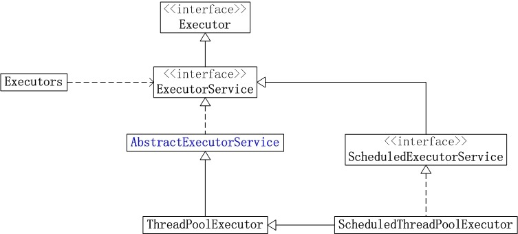
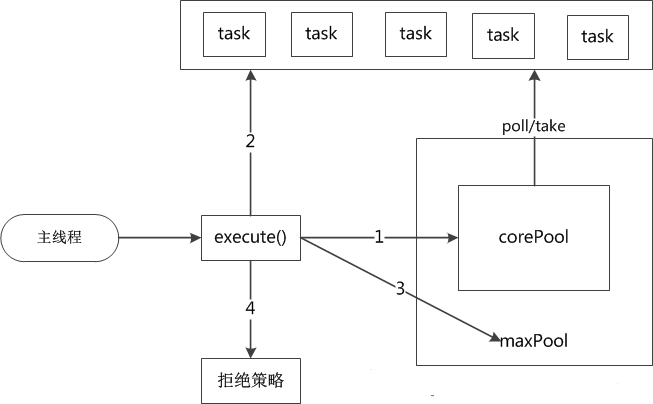
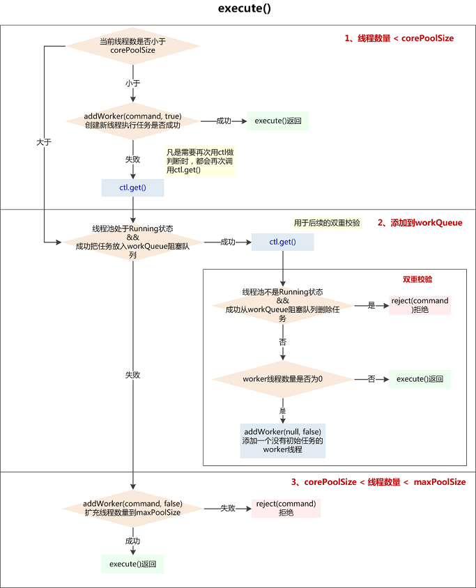

> JDK 1.8

# new Thread()的弊端

先看一段传统的线程创建方式

```java
new Thread(new Runnable() {
    @Override
    public void run() {
        // TODO Auto-generated method stub
    }
}).start();
```

这种线程创建方式简单容易理解，但是存在很多问题：

 - 每次都要`new Thread`来创建，性能差。
 - 线程无法进行统一管理，不断的创建线程可能导致线程之间相互竞争，占用过多的系统资源。
 - 没有诸如**定时执行**、**定期执行**、**线程中断**等方法。

对于第一个问题，我们很容易想到通过池化来解决，对此Java提供了四种线程池。

使用线程池带来的好处主要体现在：

 - 重用存在的线程，减少对象创建、消亡的开销，性能好很多。
 - 可有效控制**最大并发线程数**，提高系统资源的使用率，同时避免过多资源竞争，避免堵塞。
 - 提供**定时执行**、**定期执行**、**单线程**、**并发数控制**等功能。

# Java线程池

Java通过Executors提供四种线程池，分别为：

 - `newCachedThreadPool`创建一个可缓存线程池，如果线程池长度超过处理需要，可灵活回收空闲线程，若无可回收，则新建线程。
 - `newFixedThreadPool`创建一个定长线程池，可控制线程最大并发数，超出的线程会在队列中等待。
 - `newScheduledThreadPool`创建一个定长线程池，支持定时及周期性任务执行。
 - `newSingleThreadExecutor`创建一个单线程化的线程池，它只会用唯一的工作线程来执行任务，保证所有任务按照指定顺序(FIFO, LIFO, 优先级)执行。

## 四种线程池

### newCachedThreadPool

创建一个可缓存线程池，如果线程池长度超过处理需要，可灵活回收空闲线程，若无可回收，则新建线程。

```java
ExecutorService cachedThreadPool = Executors.newCachedThreadPool();
for (int i = 0; i < 10; i++) {
    final int index = i;
    try {
        Thread.sleep(index * 1000);
    } catch (InterruptedException e) {
        e.printStackTrace();
    }

    cachedThreadPool.execute(new Runnable() {

        @Override
        public void run() {
            System.out.println(index);
        }
    });
}
```

**分析**

`newCachedThreadPool`实例化的源码

```java
public static ExecutorService newCachedThreadPool() {
    return new ThreadPoolExecutor(0, Integer.MAX_VALUE,
                                  60L, TimeUnit.SECONDS,
                                  new SynchronousQueue<Runnable>());
}
```

参数为：

 - 线程池的基本大小为`0`
 - 最大线程数为无限大（`Integer.MAX_VALUE`）
 - 空闲线程等待时间为`60L`
 - 时间单位为`TimeUnit.SECONDS`
 - 堵塞队列使用`SynchronousQueue`

由于使用了`SynchronousQueue`，插入的任务会堵塞，当执行第二个任务时第一个任务已经完成，会复用执行第一个任务的线程，而不用每次新建线程。

### newFixedThreadPool

创建一个定长线程池，可控制线程最大并发数，超出的线程会在队列中等待；

效率高、节省创建线程的开销，但是线程池空闲也不会释放工作线程，对系统资源占用较大；

```java
ExecutorService fixedThreadPool = Executors.newFixedThreadPool(3);
for (int i = 0; i < 10; i++) {
    final int index = i;
    fixedThreadPool.execute(new Runnable() {


        @Override
        public void run() {
            try {
                System.out.println(index);
                Thread.sleep(2000);
            } catch (InterruptedException e) {
                // TODO Auto-generated catch block
                e.printStackTrace();
            }
        }
    });
}
```

**分析**

`newFixedThreadPool`实例化的源码

```java
public static ExecutorService newFixedThreadPool(int nThreads) {
    return new ThreadPoolExecutor(nThreads, nThreads,
                                  0L, TimeUnit.MILLISECONDS,
                                  new LinkedBlockingQueue<Runnable>());
}
```

参数为：

 - 线程池的基本大小为参数`nThreads`
 - 最大线程数为为参数`nThreads`
 - 空闲线程等待时间为`0L`
 - 时间单位为`TimeUnit.MILLISECONDS`
 - 堵塞队列使用`LinkedBlockingQueue`

通过传入参数`nThreads`设置了线程池基本大小，堵塞队列使用`LinkedBlockingQueue`的默认值，即队列长度为无限大（`Integer.MAX_VALUE`）。

此时最大线程数和空闲的等待时间由于队列不会占满所以失去意义，即实现了一个定长的线程池，一旦线程数超过核心线程数量就会在队列中等待。

### newScheduledThreadPool

创建一个定长线程池，支持定时及周期性任务执行。

```java
ScheduledExecutorService scheduledThreadPool = Executors.newScheduledThreadPool(5);
scheduledThreadPool.schedule(new Runnable() {

    @Override
    public void run() {
        System.out.println("delay 3 seconds");
    }
}, 3, TimeUnit.SECONDS);
```

**分析**

`newScheduledThreadPool`实例化的源码

```java
public static ScheduledExecutorService newScheduledThreadPool(int corePoolSize) {
    return new ScheduledThreadPoolExecutor(corePoolSize);
}
```

可见其返回的是一个`ScheduledThreadPoolExecutor`，再一下`ScheduledThreadPoolExecutor`实例化的源码,
其继承了`ThreadPoolExecutor`。

```java
public ScheduledThreadPoolExecutor(int corePoolSize) {
    super(corePoolSize, Integer.MAX_VALUE, 0, NANOSECONDS,
          new DelayedWorkQueue());
}
```

参数为：

 - 线程池的基本大小为参数`corePoolSize`
 - 最大线程数为为无限大（`Integer.MAX_VALUE`）
 - 空闲线程等待时间为`0L`
 - 时间单位为`TimeUnit.NANOSECONDS`
 - 堵塞队列使用`DelayedWorkQueue`

内部实现了一个阻塞队列`DelayedWorkQueue`，同样是实现了`BlockingQueue`接口。

其数据结构本身是一个二叉堆，比较重要的地方在于`take`时候的判断。

```java
public RunnableScheduledFuture<?> take() throws InterruptedException {
    final ReentrantLock lock = this.lock;
    lock.lockInterruptibly();
    try {
        for (;;) {
            RunnableScheduledFuture<?> first = queue[0];
            if (first == null)
                available.await();
            else {
                //获取Delay的剩余时间
                long delay = first.getDelay(NANOSECONDS);
                //如果时间delay<=0 Delay到期执行Poll返回
                if (delay <= 0)
                    return finishPoll(first);
                //否则继续循环，会被一直block住，直到delay <= 0
                first = null; // don't retain ref while waiting
                if (leader != null)
                    available.await();
                else {
                    Thread thisThread = Thread.currentThread();
                    leader = thisThread;
                    try {
                        //Delay扣除时间
                        available.awaitNanos(delay);
                    } finally {
                        if (leader == thisThread)
                            leader = null;
                    }
                }
            }
        }
    } finally {
        if (leader == null && queue[0] != null)
            available.signal();
        lock.unlock();
    }
}
```

这样可以阻塞自己内部的元素，设置阻塞时间，实现定时的功能。

### newSingleThreadExecutor

创建一个单线程化的线程池，它只会用唯一的工作线程来执行任务，保证所有任务按照指定顺序(FIFO, LIFO, 优先级)执行。

```java
ExecutorService singleThreadExecutor = Executors.newSingleThreadExecutor();
for (int i = 0; i < 10; i++) {
    final int index = i;
    singleThreadExecutor.execute(new Runnable() {

        @Override
        public void run() {
            try {
                System.out.println(index);
                Thread.sleep(2000);
            } catch (InterruptedException e) {
                // TODO Auto-generated catch block
                e.printStackTrace();
            }
        }
    });
}

**分析**

`newSingleThreadExecutor`实例化的源码

```java
public static ExecutorService newSingleThreadExecutor() {
    return new FinalizableDelegatedExecutorService
        (new ThreadPoolExecutor(1, 1,
                                0L, TimeUnit.MILLISECONDS,
                                new LinkedBlockingQueue<Runnable>()));
}
```

参数为：

 - 线程池的基本大小为`1`
 - 最大线程数为`1`
 - 空闲线程等待时间为`0L`
 - 时间单位为`TimeUnit.MILLISECONDS`
 - 堵塞队列使用`LinkedBlockingQueue`

线程池基本大小和最大线程数都为1，保证当前线程池为单线程工作。

同时堵塞队列使用`LinkedBlockingQueue`的默认值，队列长度为无限大（`Integer.MAX_VALUE`），当唯一的核心线程在工作时，其他任务在队列中堵塞等待。

# 线程池架构分析

**线程池架构图示：**



|  参数  |  说明  |
|---|---|
|  Executor  |  线程池最基础的接口，提供了`execute()`执行方法  |
|  ExecutorService  |  接口，继承了Executor，提供了如`shutdown()`、`submit()`等方法  |
|  AbstractExecutorService  |  ExecutorService的抽象类，实现了大部分的方法  |
|  TheadPoolExecutor  |  继承了AbstractExecutorService，是线程池的具体实现  |
|  ScheduledExecutorService  |  接口，继承了ExecutorService，提供了**周期执行**的ExecutorService  |
|  ScheduledThreadPoolExecutor  |  实现类，继承了TheadPoolExecutor，也实现了ScheduledExecutorService，是带**周期执行**的线程池  |
|  Executors  |  线程池静态工厂，提供了几种预定义的线程池  |

## Executor

```java
public interface Executor {
    void execute(Runnable command);
}
```

`execute()`是执行方法，负责执行已经提交的`Runnable`任务对象。

这里初步对运行线程进行解耦，将线程任务提交与执行进行分离。

## ExecutorService

ExecutorService接口继承了Executor，提供了三类方法：

**1. 一类是有关任务如何终止，即`shutdown`相关方法。**

```java
void shutdown();

List<Runnable> shutdownNow();

boolean isShutdown();

boolean isTerminated();

boolean awaitTermination(long timeout, TimeUnit unit)
        throws InterruptedException;
```

**2. 一类是有关追踪一个或多个异步任务执行结果的`submit`相关方法。**

```java
<T> Future<T> submit(Callable<T> task);

<T> Future<T> submit(Runnable task, T result);

Future<?> submit(Runnable task);
```

**3. 一类是有关批量提交任务，提供任务容器`Collection`执行，返回结果容器`Future`。**

这里有两种实现，它们都是阻塞的。

 - `invokeAll`是当任务完成后一起返回。
 - `invokeAny`是当有一个任务完后就中断其他任务，返回结果。

```java
<T> List<Future<T>> invokeAll(Collection<? extends Callable<T>> tasks)
        throws InterruptedException;

<T> List<Future<T>> invokeAll(Collection<? extends Callable<T>> tasks,
                              long timeout, TimeUnit unit)
    throws InterruptedException;

<T> T invokeAny(Collection<? extends Callable<T>> tasks)
    throws InterruptedException, ExecutionException;

<T> T invokeAny(Collection<? extends Callable<T>> tasks,
                long timeout, TimeUnit unit)
    throws InterruptedException, ExecutionException, TimeoutException;
```

## AbstractExecutorService

## TheadPoolExecutor

## ScheduledExecutorService

```java
public interface ScheduledExecutorService extends ExecutorService {

    //在给定延迟后delay，创建并执行一个一次性的Runnable任务
    public ScheduledFuture<?> schedule(Runnable command,
                                       long delay, TimeUnit unit);

    //在给定延迟后delay,创建并执行一个ScheduledFutureTask
    public <V> ScheduledFuture<V> schedule(Callable<V> callable,
                                           long delay, TimeUnit unit);

    //创建并执行一个在给定初始延迟后首次启用的定期操作，后续操作具有给定的周期
    public ScheduledFuture<?> scheduleAtFixedRate(Runnable command,
                                                  long initialDelay,
                                                  long period,
                                                  TimeUnit unit);

    //创建并执行一个在给定初始延迟后首次启用的定期操作，随后，在每一次执行终止和下一次执行开始之间都存在给定的延迟
    public ScheduledFuture<?> scheduleWithFixedDelay(Runnable command,
                                                     long initialDelay,
                                                     long delay,
                                                     TimeUnit unit);
}
```

## ScheduledThreadPoolExecutor

## Executors

# ThreadPoolExecutor

从资料参考来看，受限于硬件、内存和性能，我们不可能无限制的创建任意数量的线程，因为每一台机器允许的最大线程是一个有界值。线程池就是用这些有限个数的线程，去执行提交的任务。在一些多用户、高并发的环境中，提交的任务量是非常巨大的，一定会超过最大线程的界限，这时就必须使用排队机制。排队时的数据可以是存储在内存介质也可以是硬盘介质。这里`ThreadPoolExecutor`就是一个只支持任务在内存中排队的线程池实现，它通过`BlockingQueue`来暂存还没有执行的任务。

上面四种线程池其实都是`ThreadPoolExecutor`，通过构造函数初始化不同的参数。

从继承关系来看，`ThreadPoolExecutor`是`ExecutorService`接口的一个实现类。

## ThreadPoolExecutor构造参数

看一下其构造函数的代码：

```java
public ThreadPoolExecutor(int corePoolSize,
                              int maximumPoolSize,
                              long keepAliveTime,
                              TimeUnit unit,
                              BlockingQueue<Runnable> workQueue,
                              ThreadFactory threadFactory,
                              RejectedExecutionHandler handler) {
        if (corePoolSize < 0 ||
            maximumPoolSize <= 0 ||
            maximumPoolSize < corePoolSize ||
            keepAliveTime < 0)
            throw new IllegalArgumentException();
        if (workQueue == null || threadFactory == null || handler == null)
            throw new NullPointerException();
        this.acc = System.getSecurityManager() == null ?
                null :
                AccessController.getContext();
        this.corePoolSize = corePoolSize;
        this.maximumPoolSize = maximumPoolSize;
        this.workQueue = workQueue;
        this.keepAliveTime = unit.toNanos(keepAliveTime);
        this.threadFactory = threadFactory;
        this.handler = handler;
    }
```

可以看到参数构成为：

|  参数  |  说明  |
|---|---|
|  int corePoolSize  |  线程池的基本大小  |
|  int maximumPoolSize  |  线程池中允许的最大线程数  |
|  long keepAliveTime  |  空闲线程超时时间  |
|  TimeUnit unit  |  时间间隔单位颗粒  |
|  BlockingQueue<Runnable> workQueue  |  线程暂存队列  |
|  ThreadFactory threadFactory  |  线程创建工厂  |
|  RejectedExecutionHandler handler  |  线程池的饱和策略  |

### corePoolSize

线程池的基本大小，即在没有任务执行时候的线程池的大小，只有当工作任务队列满了的时候才会创建超出这个数量的线程。

其中，在刚刚创建`ThreadPoolExecutor`的时候，线程不会立即启动，而是有任务提交的时候才会启动，除非调用`prestartCoreThread`和`prestartAllCoreThreads`。

### maximumPoolSize

线程池中允许的最大线程数，线程池中的当前线程数目不会超过该值。如果队列中任务已满，并且当前线程个数小于`maximumPoolSize`，那么会创建新的线程来执行任务。

线程池创建之后，可以调用`setMaximumPoolSize()`改变运行的最大线程的数目。

### keepAliveTime

当线程数大于核心时，`keepAliveTime`为终止前多余的空闲线程等待新任务的最长时间。

### TimeUnit

时间间隔单位颗粒

|  参数  |  说明  |
|---|---|
|  TimeUnit.DAYS  |  天  |
|  TimeUnit.HOURS  |  小时  |
|  TimeUnit.MINUTES  |  分钟  |
|  TimeUnit.SECONDS  |  秒  |
|  TimeUnit.MILLISECONDS  |  毫秒  |

### BlockingQueue

`BlockingQueue`是一种阻塞队列。当线程池中的线程数超过它的`corePoolSize`的时候，线程会进入阻塞队列进行阻塞等待。

通过`BlockingQueue`，线程池实现了阻塞功能

|    |  Throws Exception  |  Special Value  |  Blocks  |  Times Out  |
|---|---|---|---|---|
|  Insert  |  add(o)  |  offer(o)  |  put(o)  |  offer(o, timeout, timeunit)  |
|  Remove  |  remove(o)  |  poll()  |  take()  |  poll(timeout, timeunit)  |
|  Examine  |  element()  |  peek()  |    |    |

`BlockingQueue`的实现类有以下几种：

#### ArrayBlockingQueue

`ArrayBlockingQueue`是一个有边界的阻塞队列，它的内部实现是一个数组。有边界的意思是它的容量是有限的，我们必须在其初始化的时候指定它的容量大小，容量大小一旦指定就不可改变。

ArrayBlockingQueue是以先进先出的方式存储数据，最新插入的对象是尾部，最新移出的对象是头部。

```java
public ArrayBlockingQueue(int capacity, boolean fair) {
    if (capacity <= 0)
        throw new IllegalArgumentException();
    //数组实现
    this.items = new Object[capacity];
    lock = new ReentrantLock(fair);
    notEmpty = lock.newCondition();
    notFull =  lock.newCondition();
}
```

```java
//先进先出
private void enqueue(E x) {
    // assert lock.getHoldCount() == 1;
    // assert items[putIndex] == null;
    final Object[] items = this.items;
    items[putIndex] = x;
    if (++putIndex == items.length)
        putIndex = 0;
    count++;
    notEmpty.signal();
}
```

#### DelayQueue

`DelayQueue`阻塞的是其内部元素，其本身是无界的。

`DelayQueue`可以用于定时关闭连接、缓存对象，超时处理等场景。

```java
//DelayQueue存放Delayed的实现类，可以通过getDelay返回保持的时间
//如果返回<=0则需要被释放
//同时也实现了Comparable接口，可以按照过期时间进行排序
public interface Delayed extends Comparable<Delayed> {

    /**
     * Returns the remaining delay associated with this object, in the
     * given time unit.
     *
     * @param unit the time unit
     * @return the remaining delay; zero or negative values indicate
     * that the delay has already elapsed
     */
    long getDelay(TimeUnit unit);
}
```

#### LinkedBlockingQueue

`LinkedBlockingQueue`阻塞队列大小的配置是可选的，如果我们初始化时指定一个大小，它就是有边界的，如果不指定，它就是无边界的。说是无边界，其实是采用了默认大小为Integer.MAX_VALUE的容量 。

`LinkedBlockingQueue`是通过链表实现的。

和ArrayBlockingQueue一样，LinkedBlockingQueue 也是以先进先出的方式存储数据，最新插入的对象是尾部，最新移出的对象是头部。

```java
//默认构造器，边界使用Integer.MAX_VALUE
public LinkedBlockingQueue() {
    this(Integer.MAX_VALUE);
}
```

```java
//先进先出
private void enqueue(Node<E> node) {
    // assert putLock.isHeldByCurrentThread();
    // assert last.next == null;
    last = last.next = node;
}
```

#### PriorityBlockingQueue

`PriorityBlockingQueue`是一个没有边界的队列，允许插入`null`对象。

所有插入`PriorityBlockingQueue`的对象必须实现 java.lang.Comparable接口，队列优先级的排序规则就是按照对这个接口的实现来定义的。

#### SynchronousQueue

`SynchronousQueue`队列内部并不容纳元素。当一个线程插入一个元素后会被阻塞，除非这个元素被另一个线程消费。

```java
//当有元素被put进去后，就会中断线程，直到被take出去
public void put(E e) throws InterruptedException {
    if (e == null) throw new NullPointerException();
    if (transferer.transfer(e, false, 0) == null) {
        Thread.interrupted();
        throw new InterruptedException();
    }
}
```

#### 排队策略

**阻塞队列有几种常见的策略：**

1. 不排队，直接提交

将任务直接交给线程处理而不保持它们，可使用`SynchronousQueue`。
如果不存在可用于立即运行任务的线程（即线程池中的线程都在工作），则试图把任务加入缓冲队列将会失败，因此会构造一个新的线程来处理新添加的任务，并将其加入到线程池中（`corePoolSize`-->`maximumPoolSize`扩容）。

2. 无界队列


3. 有界队列


### ThreadFactory

`ThreadPoolExecutor`默认使用`Executors`静态工厂里`defaultThreadFactory()`。

默认线程命名规则为`"pool-" +poolNumber.getAndIncrement() +"-thread-"`。

```java
static class DefaultThreadFactory implements ThreadFactory {
    private static final AtomicInteger poolNumber = new AtomicInteger(1);
    private final ThreadGroup group;
    private final AtomicInteger threadNumber = new AtomicInteger(1);
    private final String namePrefix;

    DefaultThreadFactory() {
        SecurityManager s = System.getSecurityManager();
        group = (s != null) ? s.getThreadGroup() :
                              Thread.currentThread().getThreadGroup();
        namePrefix = "pool-" +
                      poolNumber.getAndIncrement() +
                     "-thread-";
    }

    public Thread newThread(Runnable r) {
        Thread t = new Thread(group, r,
                              namePrefix + threadNumber.getAndIncrement(),
                              0);
        if (t.isDaemon())
            t.setDaemon(false);
        if (t.getPriority() != Thread.NORM_PRIORITY)
            t.setPriority(Thread.NORM_PRIORITY);
        return t;
    }
}
```

### RejectedExecutionHandler

线程池的饱和策略，这里`RejectedExecutionHandler`提供了四种策略：

**AbortPolicy**

直接抛出异常`RejectedExecutionException`，丢弃任务。

```java
public void rejectedExecution(Runnable r, ThreadPoolExecutor e) {
    throw new RejectedExecutionException("Task " + r.toString() +
                                         " rejected from " +
                                         e.toString());
}
```

**CallerRunsPolicy**

这里不丢弃任务，调用该`execute`的线程本身执行。

```java
public void rejectedExecution(Runnable r, ThreadPoolExecutor e) {
    if (!e.isShutdown()) {
        r.run();
    }
}
```

**DiscardOldestPolicy**

如果执行程序尚未关闭，则位于工作队列头部的任务将被删除，然后重试执行程序（如果再次失败，则重复此过程）

```java
public void rejectedExecution(Runnable r, ThreadPoolExecutor e) {
    if (!e.isShutdown()) {
        e.getQueue().poll();
        e.execute(r);
    }
}
```

**DiscardPolicy**

不做任何处理，直接丢弃任务。

```java
public void rejectedExecution(Runnable r, ThreadPoolExecutor e) {
}
```

## 执行策略



1. 如果线程池中的线程数量少于`corePoolSize`，就创建新的线程来执行新添加的任务；

2. 如果线程池中的线程数量大于等于`corePoolSize`，但队列`BlockingQueue`未满，则将新添加的任务放到`BlockingQueue`中，按照FIFO的原则依次等待执行（线程池中有线程空闲出来后依次将队列中的任务交付给空闲的线程执行）；

3. 如果线程池中的线程数量大于等于`corePoolSize`，且队列`BlockingQueue`已满，但线程池中的线程数量小于`maximumPoolSize`，则会创建新的线程来处理被添加的任务；

4. 如果线程池中的线程数量等于了`maximumPoolSize`，就用`RejectedExecutionHandler`来做拒绝处理；

**总结：**

当有新的任务要处理时，先看线程池中的线程数量是否大于corePoolSize，再看缓冲队列`BlockingQueue`是否满，最后看线程池中的线程数量是否大于maximumPoolSize；

> 另外，当线程池中的线程数量大于corePoolSize时，如果里面有线程的空闲时间超过了keepAliveTime，就将其移除线程池；

## 内部分析

### execute()-提交任务



```java
/**
 * Executes the given task sometime in the future.  The task
 * may execute in a new thread or in an existing pooled thread.
 * 在未来的某个时刻执行给定的任务。这个任务用一个新线程执行，或者用一个线程池中已经存在的线程执行
 *
 * If the task cannot be submitted for execution, either because this
 * executor has been shutdown or because its capacity has been reached,
 * the task is handled by the current {@code RejectedExecutionHandler}.
 * 如果任务无法被提交执行，要么是因为这个Executor已经被shutdown关闭，要么是已经达到其容量上限，任务会被当前的RejectedExecutionHandler处理
 *
 * @param command the task to execute
 * @throws RejectedExecutionException at discretion of
 *         {@code RejectedExecutionHandler}, if the task
 *         cannot be accepted for execution                 RejectedExecutionException是一个RuntimeException
 * @throws NullPointerException if {@code command} is null
 */
public void execute(Runnable command) {
    if (command == null)
        throw new NullPointerException();

    /*
     * Proceed in 3 steps:
     *
     * 1. If fewer than corePoolSize threads are running, try to
     * start a new thread with the given command as its first
     * task.  The call to addWorker atomically checks runState and
     * workerCount, and so prevents false alarms that would add
     * threads when it shouldn't, by returning false.
     * 如果运行的线程少于corePoolSize，尝试开启一个新线程去运行command，command作为这个线程的第一个任务
     *
     * 2. If a task can be successfully queued, then we still need
     * to double-check whether we should have added a thread
     * (because existing ones died since last checking) or that
     * the pool shut down since entry into this method. So we
     * recheck state and if necessary roll back the enqueuing if
     * stopped, or start a new thread if there are none.
     * 如果任务成功放入队列，我们仍需要一个双重校验去确认是否应该新建一个线程（因为可能存在有些线程在我们上次检查后死了） 或者 从我们进入这个方法后，pool被关闭了
     * 所以我们需要再次检查state，如果线程池停止了需要回滚入队列，如果池中没有线程了，新开启 一个线程
     *
     * 3. If we cannot queue task, then we try to add a new
     * thread.  If it fails, we know we are shut down or saturated
     * and so reject the task.
     * 如果无法将任务入队列（可能队列满了），需要新开区一个线程（自己：往maxPoolSize发展）
     * 如果失败了，说明线程池shutdown 或者 饱和了，所以我们拒绝任务
     */
    int c = ctl.get();

    /**
     * 1、如果当前线程数少于corePoolSize（可能是由于addWorker()操作已经包含对线程池状态的判断，如此处没加，而入workQueue前加了）
     */
    if (workerCountOf(c) < corePoolSize) {
        //addWorker()成功，返回
        if (addWorker(command, true))
            return;

        /**
         * 没有成功addWorker()，再次获取c（凡是需要再次用ctl做判断时，都会再次调用ctl.get()）
         * 失败的原因可能是：
         * 1、线程池已经shutdown，shutdown的线程池不再接收新任务
         * 2、workerCountOf(c) < corePoolSize 判断后，由于并发，别的线程先创建了worker线程，导致workerCount>=corePoolSize
         */
        c = ctl.get();
    }

    /**
     * 2、如果线程池RUNNING状态，且入队列成功
     */
    if (isRunning(c) && workQueue.offer(command)) {
        int recheck = ctl.get();//再次校验位

        /**
         * 再次校验放入workerQueue中的任务是否能被执行
         * 1、如果线程池不是运行状态了，应该拒绝添加新任务，从workQueue中删除任务
         * 2、如果线程池是运行状态，或者从workQueue中删除任务失败（刚好有一个线程执行完毕，并消耗了这个任务），确保还有线程执行任务（只要有一个就够了）
         */
        //如果再次校验过程中，线程池不是RUNNING状态，并且remove(command)--workQueue.remove()成功，拒绝当前command
        if (! isRunning(recheck) && remove(command))
            reject(command);
        //如果当前worker数量为0，通过addWorker(null, false)创建一个线程，其任务为null
        //为什么只检查运行的worker数量是不是0呢？？ 为什么不和corePoolSize比较呢？？
        //只保证有一个worker线程可以从queue中获取任务执行就行了？？
        //因为只要还有活动的worker线程，就可以消费workerQueue中的任务
        else if (workerCountOf(recheck) == 0)
            addWorker(null, false);  //第一个参数为null，说明只为新建一个worker线程，没有指定firstTask
                                     //第二个参数为true代表占用corePoolSize，false占用maxPoolSize
    }
    /**
     * 3、如果线程池不是running状态 或者 无法入队列
     *   尝试开启新线程，扩容至maxPoolSize，如果addWork(command, false)失败了，拒绝当前command
     */
    else if (!addWorker(command, false))
        reject(command);
}
```

**1. 准备使用核心线程`corePoolSize`**

 - 判断线程池当前线程数量是否少于`corePoolSize`，是则`addWorker(command, true)`创建新`worker`线程；
   - 判断`addWorker(command, true)`是否成功，成功则跳出`return`

**`addWorker(command, true)`失败的原因可能是：**

 - A. 线程池已经`shutdown`，`shutdown`的线程池不再接收新任务；
 - B. `workerCountOf(c) < corePoolSize`判断后，由于并发，别的线程先创建了`worker`线程，导致此时`workerCount>=corePoolSize`；

**2. 准备把任务添加入队列**

 - 如果线程池还在running状态，将任务加入`workQueue`阻塞队列中，返回加入结果；
   - 如果加入成功，进行double-check；
     - 如果线程池不在running状态，将任务移除队列，并拒绝服务；
     - 如果线程池在running状态，检查`worker`数量是否为`0`，是则`addWorker(null, false)`占用`maxPoolSize`新建线程执行；
 - 如果线程池不在running状态，则尝试`addWorker(null, false)`占用`maxPoolSize`新建线程，返回创建结果；
   - 如果失败则拒绝服务；

### addWorker()-添加Worker线程

```java
private boolean addWorker(Runnable firstTask, boolean core) {
        retry:
        for (;;) {
            int c = ctl.get();
            int rs = runStateOf(c);

            // Check if queue empty only if necessary.
            if (rs >= SHUTDOWN &&
                ! (rs == SHUTDOWN &&
                   firstTask == null &&
                   ! workQueue.isEmpty()))
                return false;

            for (;;) {
                int wc = workerCountOf(c);
                if (wc >= CAPACITY ||
                    wc >= (core ? corePoolSize : maximumPoolSize))
                    return false;
                if (compareAndIncrementWorkerCount(c))
                    break retry;
                c = ctl.get();  // Re-read ctl
                if (runStateOf(c) != rs)
                    continue retry;
                // else CAS failed due to workerCount change; retry inner loop
            }
        }

        boolean workerStarted = false;
        boolean workerAdded = false;
        Worker w = null;
        try {
            w = new Worker(firstTask);
            final Thread t = w.thread;
            if (t != null) {
                final ReentrantLock mainLock = this.mainLock;
                mainLock.lock();
                try {
                    // Recheck while holding lock.
                    // Back out on ThreadFactory failure or if
                    // shut down before lock acquired.
                    int rs = runStateOf(ctl.get());

                    if (rs < SHUTDOWN ||
                        (rs == SHUTDOWN && firstTask == null)) {
                        if (t.isAlive()) // precheck that t is startable
                            throw new IllegalThreadStateException();
                        workers.add(w);
                        int s = workers.size();
                        if (s > largestPoolSize)
                            largestPoolSize = s;
                        workerAdded = true;
                    }
                } finally {
                    mainLock.unlock();
                }
                if (workerAdded) {
                    t.start();
                    workerStarted = true;
                }
            }
        } finally {
            if (! workerStarted)
                addWorkerFailed(w);
        }
        return workerStarted;
    }
```

### 内部类Worker

### runWorker()-执行任务

```java
final void runWorker(Worker w) {
        Thread wt = Thread.currentThread();
        Runnable task = w.firstTask;
        w.firstTask = null;
        w.unlock(); // allow interrupts
        boolean completedAbruptly = true;
        try {
            //当有任务的时候才会启动线程
            while (task != null || (task = getTask()) != null) {
                w.lock();
                // If pool is stopping, ensure thread is interrupted;
                // if not, ensure thread is not interrupted.  This
                // requires a recheck in second case to deal with
                // shutdownNow race while clearing interrupt
                if ((runStateAtLeast(ctl.get(), STOP) ||
                     (Thread.interrupted() &&
                      runStateAtLeast(ctl.get(), STOP))) &&
                    !wt.isInterrupted())
                    wt.interrupt();
                try {
                    beforeExecute(wt, task);
                    Throwable thrown = null;
                    try {
                        task.run();
                    } catch (RuntimeException x) {
                        thrown = x; throw x;
                    } catch (Error x) {
                        thrown = x; throw x;
                    } catch (Throwable x) {
                        thrown = x; throw new Error(x);
                    } finally {
                        afterExecute(task, thrown);
                    }
                } finally {
                    task = null;
                    w.completedTasks++;
                    w.unlock();
                }
            }
            completedAbruptly = false;
        } finally {
            processWorkerExit(w, completedAbruptly);
        }
    }
```

### getTask()-获取任务

```java
private Runnable getTask() {
        boolean timedOut = false; // Did the last poll() time out?

        for (;;) {
            int c = ctl.get();
            int rs = runStateOf(c);

            // Check if queue empty only if necessary.
            if (rs >= SHUTDOWN && (rs >= STOP || workQueue.isEmpty())) {
                decrementWorkerCount();
                return null;
            }

            int wc = workerCountOf(c);

            // Are workers subject to culling?
            boolean timed = allowCoreThreadTimeOut || wc > corePoolSize;

            if ((wc > maximumPoolSize || (timed && timedOut))
                && (wc > 1 || workQueue.isEmpty())) {
                if (compareAndDecrementWorkerCount(c))
                    return null;
                continue;
            }

            try {
                Runnable r = timed ?
                    workQueue.poll(keepAliveTime, TimeUnit.NANOSECONDS) :
                    workQueue.take();
                if (r != null)
                    return r;
                timedOut = true;
            } catch (InterruptedException retry) {
                timedOut = false;
            }
        }
    }
```

### processWorkerExit()-worker线程退出


