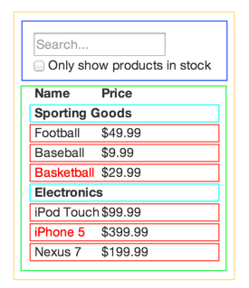

# 元素渲染

## 更新已渲染的元素

React 元素是 不可突变（immutable） 的，更新 UI 的唯一方法是创建一个新的元素, 并将其传入 ReactDOM.render() 方法。

```javascript
function tick() {
  const element = (
    <div>
      <h1>Hello, world!</h1>
      <h2>It is {new Date().toLocaleTimeString()}.</h2>
    </div>
  );
  ReactDOM.render(
    element,document.getElementById("root")
  );
}

setInterval(tick,1000);
```

# 组件(Components) 和 属性(Props)


## 渲染一个组件

 React 将用户定义组件的元素以一个单独对象的形式传递给相应的组件，这个对象为`props`对象。

**组件名称总是以大写字母开始。**

```javascript
function Welcome(props) {
  return <h1>Hello, {props.name}</h1>;
}

const element = <Welcome name="Sara" />;
ReactDOM.render(element, document.getElementById("root"));
```

## 构成组件

组件可以在它们的输出中引用其它组件。这使得我们可以使用同样的组件来抽象到任意层级。

**组件必须返回一个单独的根元素。**

```javascript
function Welcome(props) {
  return <h1>Hello, {props.name}</h1>;
}

function Main() {
  return (
    <div>
      <Welcome name="AAA" />
      <Welcome name="BBB" />
      <Welcome name="CCC" />
    </div>
  );
}

ReactDOM.render(<Main/>, document.getElementById("root"));
```

## 提取组件

提高组件的复用率

```javascript
function formatDate(date) {
    return date.toISOString();
}

function Comment(props) {
  return (
    <div className="Comment">
      <UserInfo user={props.user}/>
      <div className="Comment-text">{props.text}</div>
      <div className="Comment-date">{formatDate(props.date)}</div>
    </div>
  );
}

function Avatar(props) {
  return (
    
  );
}

function UserInfo(props) {
  return (
    <div className="UserInfo">
      <Avatar user={props.user} />
      <div className="UserInfo-name">{props.user.name}</div>
    </div>
  );
}

ReactDOM.render(
  <Comment text={'可以的'} date={new Date()} user={{
    'avatarUrl':'https://www.baidu.com/img/baidu_jgylogo3.gif',
    'name':'gobhazeng'
  }}/>,
  document.getElementById("root")
);
```

# 状态(State) 和生命周期

## 在类组件中添加本地状态(state)

```javascript
class Clock extends React.Component {
  constructor(props) {
    super(props);
    this.state = { date: new Date() };
  }
  render() {
    return (
      <div>
        <h1>Hello, world!</h1>
        <h2>It is {this.state.date.toLocaleTimeString()}.</h2>
      </div>
    );
  }
}

ReactDOM.render(<Clock />, document.getElementById("root"));
```

## 在类中添加生命周期方法

在一个具有许多组件的应用程序中，在组件被销毁时释放所占用的资源是非常重要的。

当组件第一次渲染到DOM时，设置一个定时器 。在 React 中称为“挂载(mounting)”。
当组件产生的DOM被销毁时，清除该计时器。 在 React 中称为“卸载(unmounting)”。

`componentDidMount()`钩子在组件输出被渲染到 DOM 之后运行。
`componentWillUnmount()`钩子在组件产生的DOM被销毁后运行。

```javascript
class Clock extends React.Component {
  /* 构造函数 */
  constructor(props) {
    super(props);
    this.state = { date: new Date() };
  }

  /* 挂载 */
  componentDidMount() {
    this.timeId = setInterval(() => this.tick(), 1000);
  }

  /* 卸载 */
  componentWillUnmount() {
    clearInterval(this.timeId);
  }

  /* 更新状态 */
  tick() {
    this.setState({
      date: new Date()
    });
  }

  render() {
    return (
      <div>
        <h1>Hello, world!</h1>
        <h2>It is {this.state.date.toLocaleTimeString()}.</h2>
      </div>
    );
  }
}

ReactDOM.render(<Clock />, document.getElementById("root"));
```

### 注意

**不要直接修改 state(状态)**

唯一可以分配`this.state`的地方是构造函数。

```javascript
// 错误
this.state.comment = 'Hello';

// 正确
this.setState({comment: 'Hello'});
```

**state(状态) 更新可能是异步的**

React 为了优化性能，有可能会将多个 `setState()` 调用合并为一次更新。

因为 `this.props` 和 `this.state` 可能是异步更新的，你不能依赖他们的值计算下一个state(状态)。

```javascript
// 错误
this.setState({
  counter: this.state.counter + this.props.increment,
});
```

要弥补这个问题，使用另一种 `setState()`的形式，它接受一个函数而不是一个对象。这个函数将接收前一个状态作为第一个参数，应用更新时的 props 作为第二个参数。

```javascript
// 正确
this.setState((prevState, props) => ({
  counter: prevState.counter + props.increment
}));
```

## 数据向下流动

无论作为父组件还是子组件，它都无法获悉一个组件是否有状态。

一个组件可以选择将 state(状态) 向下传递，作为其子组件的 props(属性)。

```javascript
class Clock extends React.Component {
  constructor(props) {
    super(props);
    this.state = { date: new Date() };
  }

  render() {
    /* 将state(状态) 向下传递 */
    return <FormattedDate date={this.state.date} />;
  }
}

function FormattedDate(props) {
  return <h2>It is {props.date.toLocaleTimeString()}.</h2>;
}

ReactDOM.render(<Clock />, document.getElementById("root"));
```

# 处理事件

`preventDefault()`达到`return false`的效果来阻止默认行为。

```javascript
function ActionLink() {
  function handleClick(e) {
    e.preventDefault();
    console.log("Thank");
  }

  return (
    <a href="#" onClick={handleClick}>
      Click me
    </a>
  );
}

ReactDOM.render(<ActionLink/>,document.getElementById("root"));
```

当使用一个 ES6 类 定义一个组件时，通常的一个事件处理程序是类上的一个方法。

一般情况下，如果引用一个后面没跟()的方法，例如`onClick={this.handleClick}`，就应该绑定(bind) 该方法。

```javascript
class Toggle extends React.Component{
  constructor(props){
    super(props);
    this.state={isToggleOn:true};

    // 使`this`在回调中起作用
    this.handleClick=this.handleClick.bind(this);
  }

  handleClick(){
    this.setState(prevState => ({
      isToggleOn:!prevState.isToggleOn
    }));
  }

  render() {
    return (
      <button onClick={this.handleClick}>
        {this.state.isToggleOn ? 'ON' : 'OFF'}
      </button>
    );
  }
}

ReactDOM.render(<Toggle/>,document.getElementById("root"));
```

# 条件渲染

React 可以像JavaScript 中的条件语句一样，使用 JavaScript 操作符如 `if` 或者条件操作符来创建渲染当前状态的元素，并且让 React 更新匹配的 UI 。

```javascript
function Greeting(props) {
  const isLoggedIn = props.isLoggedIn;
  if (isLoggedIn) {
    return <UserGreeting />;
  }
  return <GuestGreeting />;
}

function UserGreeting(props) {
  return <h1>Welcome back!</h1>;
}

function GuestGreeting(props) {
  return <h1>Please sign up.</h1>;
}

ReactDOM.render(
  /* <Greeting isLoggedIn={true} />, */
  <Greeting isLoggedIn={false} />,
  document.getElementById("root")
);
```

## 元素变量

可以用变量来存储元素，条件地渲染组件的一部分，而输出的其余部分不会更改。

```javascript
function Greeting(props) {
  const isLoggedIn = props.isLoggedIn;
  if (isLoggedIn) {
    return <UserGreeting />;
  }
  return <GuestGreeting />;
}

function UserGreeting(props) {
  return <h1>Welcome back!</h1>;
}

function GuestGreeting(props) {
  return <h1>Please sign up.</h1>;
}

class LoginControl extends React.Component{
  constructor(props){
    super(props);
    this.state={isLoggedIn:false};
    this.handleLoginClick=this.handleLoginClick.bind(this);
    this.handleLogoutClick=this.handleLogoutClick.bind(this);

  }

  handleLoginClick(){
    this.setState({isLoggedIn:true});
  }

  handleLogoutClick(){
    this.setState({isLoggedIn:false});
  }

  render() {
    const isLoggedIn = this.state.isLoggedIn;

    let button = null;

    if(isLoggedIn){
      button=<LogoutButton onClick={this.handleLogoutClick}/>;
    }else{
      button=<LoginButton onClick={this.handleLoginClick}/>;
    }

    return (
      <div>
        <Greeting isLoggedIn={isLoggedIn}/>
        {button}
      </div>
    );
  }

}

function LoginButton(props) {
  return (
    <button onClick={props.onClick}>
    Login
  </button>
  );
}

function LogoutButton(props) {
  return (
    <button onClick={props.onClick}>
    Logout
  </button>
  );
}

ReactDOM.render(<LoginControl/>,document.getElementById("root"));
```

## 使用逻辑 && 操作符的内联 if 用法

`true && expression` 总是会显示为 `expression` ，而 `false && expression` 总是执行为 `false`。

如果条件为 `true` ，则 `&&` 后面的元素将显示在输出中。 如果是 `false`，React 将会忽略并跳过它。

```javascript
function Mailpbox(props) {
  const unreadMessages = props.unreadMessages;

  return (
    <div>
      <h1>Hello!</h1>
      {unreadMessages.length > 0 && (
        <h2>You have {unreadMessages.length} unread messages.</h2>
      )}
    </div>
  );
}

const message_1 =['React','react'];
const message_2 =[];

ReactDOM.render(<Mailpbox unreadMessages={message_1}/>,document.getElementById("root"));
```

## 使用条件操作符的内联 If-Else

另一个用于条件渲染元素的内联方法是使用 JavaScript 的条件操作符`condition ? true : false`。

```javascript
class LoginControl extends React.Component {
  constructor(props) {
    super(props);
    this.state = { isLoggedIn: false };
    this.handleLoginClick = this.handleLoginClick.bind(this);
    this.handleLogoutClick = this.handleLogoutClick.bind(this);
  }

  handleLoginClick() {
    this.setState({ isLoggedIn: true });
  }

  handleLogoutClick() {
    this.setState({ isLoggedIn: false });
  }

  render() {
    const isLoggedIn = this.state.isLoggedIn;
    /* return (
      <div>
        This user is <b>{isLoggedIn?'currently':'not'}</b>
      </div>
    ); */

    return (
      <div>
        {isLoggedIn ? (
          <LogoutButton onClick={this.handleLogoutClick} />
        ) : (
          <LoginButton onClick={this.handleLoginClick} />
        )}
      </div>
    );
  }
}

function LoginButton(props) {
  return <button onClick={props.onClick}>Login</button>;
}

function LogoutButton(props) {
  return <button onClick={props.onClick}>Logout</button>;
}

ReactDOM.render(<LoginControl />, document.getElementById("root"));
```

## 防止组件渲染

在极少数情况下，您可能希望组件隐藏自身，即使它是由另一个组件渲染的。为此，返回 null 而不是其渲染输出。

**从组件的 `render` 方法返回 null 不会影响组件生命周期方法的触发。 例如， `componentWillUpdate` 和 `componentDidUpdate` 仍将被调用。**

```javascript
function WarningBanner(props) {
  if (!props.warn) {
    return null;
  }

  return <div className="warning">Warning</div>;
}

class Page extends React.Component {
  constructor(props) {
    super(props);
    this.state = { showWarning: true };
    this.handleToggleClick = this.handleToggleClick.bind(this);
  }

  handleToggleClick() {
    this.setState(prevState => ({
      showWarning: !prevState.showWarning
    }));
  }

  render() {
    return (
      <div>
        <WarningBanner warn={this.state.showWarning} />
        <button onClick={this.handleToggleClick}>
          {this.state.showWarning ? "Hide" : "Show"}
        </button>
      </div>
    );
  }
}
ReactDOM.render(<Page />, document.getElementById("root"));
```

## 多组件渲染

可以创建元素集合，并用一对大括号 {} 在 JSX 中直接将其引用。

```javascript
const numbers = [1, 2, 3, 4, 5];
const listItems = numbers.map(number => <li>{number}</li>);

ReactDOM.render(<ul>{listItems}</ul>, document.getElementById("root"));
```

## 基本列表组件

当创建元素列表时，“key” 是一个需要包含的特殊字符串属性。

```javascript
function NumberList(props) {
  const numbers = props.numbers;
  const listItems = numbers.map(number => <li key={number.toString()}>{number}</li>);

  return <ul>{listItems}</ul>;
}

const numbers=[1,2,3,4,5];
ReactDOM.render(
  <NumberList numbers={numbers}/>,
  document.getElementById("root")
)
```

## 键(Keys)

键(Keys) 帮助 React 标识哪个项被修改、添加或者移除了。数组中的每一个元素都应该有一个唯一不变的键(Keys)来标识。

```javascript
const numbers = [1, 2, 3, 4, 5];
const listItems = numbers.map((number) =>
  <li key={number.toString()}>
    {number}
  </li>
);
```

## 使用 keys 提取组件

keys 只在数组的上下文中存在意义。

一个好的经验准则是元素中调用 map() 需要 keys 。

**错误的用法：**

```javascript
function ListItems(props) {
  const value = props.value;
  // 错误，不要在这里指定key
  return <li key={value.toString()}>{value}</li>;
}

function NumberList(props) {
  const numbers = props.numbers;
  // 错误，要在这里指定key
  const listItems = numbers.map(number => <ListItems value={number} />);

  return <ul>{listItems}</ul>;
}

const numbers = [1, 2, 3, 4, 5];
ReactDOM.render(
  <NumberList numbers={numbers} />,
  document.getElementById("root")
);
```

**正确的用法：**

```javascript
function ListItems(props) {
  const value = props.value;
  // 正确，这里不需要指定key
  return <li>{value}</li>;
}

function NumberList(props) {
  const numbers = props.numbers;
  // 正确，这里需要指定key
  const listItems = numbers.map(number => (
    <ListItems key={number.toString()} value={number} />
  ));

  return <ul>{listItems}</ul>;
}

const numbers = [1, 2, 3, 4, 5];
ReactDOM.render(
  <NumberList numbers={numbers} />,
  document.getElementById("root")
);
```

## keys 在同辈元素中必须是唯一的

在数组中使用的 keys 必须在它们的同辈之间唯一，然而它们并不需要全局唯一。可以在操作两个不同数组的时候使用相同的 keys 。

```javascript
function Blog(props) {
  const sidebar = (
    <ul>{props.posts.map(post => <li key={post.id}>{post.title}</li>)}</ul>
  );

  const content = props.posts.map(post => (
    <div key={post.id}>
      <h3>{post.title}</h3>
      <p>{post.content}</p>
    </div>
  ));
  return(
    <div>
      {sidebar}
      <hr/>
      {content}
    </div>
  );
}

const posts=[
  {id:1,title:'aaa',content:'AAA'},
  {id:2,title:'bbb',content:'BBB'}
];

ReactDOM.render(<Blog posts={posts}/>,document.getElementById("root"));
```

## 在 JSX 中嵌入 map()

JSX允许在大括号中嵌入任何表达式，可以内联 `map()` 结果。

```javascript
function NumberList(props) {
  const numbers = props.numbers;

  return (
    <ul>
      {numbers.map(number => (
        <ListItems key={number.toString()} value={number} />
      ))}
    </ul>
  );
}
```

# 表单(Forms)

## 受控组件(Controlled Components)

```javascript
class NameForm  extends React.Component {
  constructor(props){
    super(props);
    this.state={value:''};
    this.handleSubmit=this.handleSubmit.bind(this);
    this.handleChange=this.handleChange.bind(this);
  }

  handleSubmit(event){
    alert('A name was submitted: '+this.state.value);
  }

  handleChange(event){
    this.setState({value:event.target.value});
  }

  render() {
    return (
      <form onSubmit={this.handleSubmit}>
        <label>
          Name:
          <input type="text" value={this.state.value} onChange={this.handleChange} />
        </label>
        <input type="submit" value="Submit" />
      </form>
    );
  }
}

ReactDOM.render(<NameForm/>,document.getElementById("root"));
```

对于受控组件来说，每一次 state(状态) 变化都会伴有相关联的处理函数。这使得可以直接修改或验证用户的输入。比如，如果我们希望强制 name 的输入都是大写字母，可以这样来写 handleChange 方法。

```javascript
handleChange(event){
    this.setState({value:event.target.value.toUpperCase()});
  }
```

## textare 标签

在 React 中，`<textarea>` 的赋值使用 value 属性替代。这样一来，表单中 `<textarea>` 的书写方式接近于单行文本输入框。

```javascript
class EssayForm extends React.Component {
  constructor(props) {
    super(props);
    this.state = {
      value: 'Please write an essay about your favorite DOM element.'
    };

    this.handleChange = this.handleChange.bind(this);
    this.handleSubmit = this.handleSubmit.bind(this);
  }

  handleChange(event) {
    this.setState({value: event.target.value});
  }

  handleSubmit(event) {
    alert('An essay was submitted: ' + this.state.value);
    event.preventDefault();
  }

  render() {
    return (
      <form onSubmit={this.handleSubmit}>
        <label>
          Name:
          <textarea value={this.state.value} onChange={this.handleChange} />
        </label>
        <input type="submit" value="Submit" />
      </form>
    );
  }
}
```

## select 标签

React 中，并不使用`selected`属性来标注默认选中状态，而是在根 select 标签中使用了一个 value 属性。

```javascript
class FlavorForm  extends React.Component {
  constructor(props){
    super(props);
    this.state={value:'coconut'};
    this.handleSubmit = this.handleSubmit.bind(this);
    this.handleChange = this.handleChange.bind(this);
  }

  handleSubmit(event){
    alert('Your favorite flavor is: ' + this.state.value);
    event.preventDefault();
  }

  handleChange(event){
    this.setState({value:event.target.value});
  }

  render() {
    return (
      <form onSubmit={this.handleSubmit}>
        <label>
          Pick your favorite La Croix flavor:
          <select value={this.state.value} onChange={this.handleChange}>
            <option value="grapefruit">Grapefruit</option>
            <option value="lime">Lime</option>
            <option value="coconut">Coconut</option>
            <option value="mango">Mango</option>
          </select>
        </label>
        <input type="submit" value="Submit" />
      </form>
    );
  }
}

ReactDOM.render(<FlavorForm/>,document.getElementById("root"));
```

可以将一个数组传递给 value 属性，允许在 select 标签中选择多个选项。

`<select  multiple={true} value={['coconut','grapefruit']} onChange={this.handleChange}>`

## file input 标签

使用 File API 与文件进行交互。

```javascript
class FileInput  extends React.Component {
  constructor(props){
    super(props);
    this.handleSubmit=this.handleSubmit.bind(this);
  }

  handleSubmit(event){
    alert(
      `Selected file - ${
        this.fileInput.files[0].name
      }`
    );
    event.preventDefault();
  }

  render() {
    return (
      <form onSubmit={this.handleSubmit}>
        <label>
        Upload file:
        <input type="file"  ref={input=>{this.fileInput=input}}/>
        </label>
        <br/>
        <button type="submit">Submit</button>
      </form>
    );
  }
}

ReactDOM.render(<FileInput/>,document.getElementById("root"));
```

## 处理多个输入元素

当需要处理多个受控的 `input` 元素时，可以为每个元素添加一个 `name` 属性，并且让处理函数根据` event.target.name` 的值来选择要做什么。

```javascript
class Reservation extends React.Component {
  constructor(props) {
    super(props);
    this.state = {
      isGoing: true,
      numberOfGuests: 2
    };

    this.handleInputChange = this.handleInputChange.bind(this);
  }

  handleInputChange(event) {
    const target = event.target;
    const value = target.type === "checkbox" ? target.checked : target.value;
    const name = target.name;

    this.setState({
      [name]: value
    });
  }

  render() {
    return (
      <form>
        <label>
          Is going:
          <input
            name="isGoing"
            type="checkbox"
            checked={this.state.isGoing}
            onChange={this.handleInputChange}
          />
        </label>
        <br />
        <label>
          Number of guests:
          <input
            name="numberOfGuests"
            type="number"
            value={this.state.numberOfGuests}
            onChange={this.handleInputChange}
          />
        </label>
      </form>
    );
  }
}

ReactDOM.render(<Reservation />, document.getElementById("root"));
```

## 受控 Input 组件的 null 值

在 受控组件 上指定值 prop 可防止用户更改输入。

**演示：输入首先被锁定，但在短暂的延迟后可以编辑。**

```javascript
setTimeout(function() {
  ReactDOM.render(<input value={null} />, document.getElementById("root"));
}, 1000);
```

# 状态提升(Lifting State Up)

> 通过一个称为 `BoilingVerdict` 的组件开始。它接受 celsius（摄氏温度）作为 prop ，并打印是否足以使水沸腾。
> 接下来，我们将会创建一个` Calculator `组件。它渲染一个 `<input>` 让你输入温度，并在 `this.state.temperature` 中保存它的值。

```javascript
function BoilingVerdict(props) {
  if (props.celsius >= 100) {
    return <p>The water would boil.</p>;
  } else {
    return <p>The water would not boil.</p>;
  }
}

class Calculator  extends React.Component {
  constructor(props){
    super(props);
    this.state={temperature:''};
    this.handleChange=this.handleChange.bind(this);
  }

  handleChange(event){
    this.setState({temperature:event.target.value});
  }

  render() {
    const temperature = this.state.temperature;
    return (
      <fieldset>
        <legend>Enter temperature in Celsius:</legend>
        <input
          value={temperature}
          onChange={this.handleChange} />
        <BoilingVerdict
          celsius={parseFloat(temperature)} />
      </fieldset>
    );
  }
}

ReactDOM.render(<Calculator/>,document.getElementById("root"));
```

## 添加第二个输入

> 我们新的需求是，除了一个摄氏温度输入之外，我们再提供了一个华氏温度输入，并且两者保持自动同步。
> 我们可以从 Calculator 中提取一个 TemperatureInput 组件开始。我们将添加一个新的 scale 属性，值可能是 "c" 或者 "f" 。

```javascript
const scaleNames = {
  c: "Celsius",
  f: "Fahrenheit"
};

function BoilingVerdict(props) {
  if (props.celsius >= 100) {
    return <p>The water would boil.</p>;
  } else {
    return <p>The water would not boil.</p>;
  }
}

class TemperatureInput extends React.Component {
  constructor(props) {
    super(props);
    this.state = { temperature: "" };
    this.handleChange = this.handleChange.bind(this);
  }

  handleChange(event) {
    this.setState({ temperature: event.target.value });
  }

  render() {
    const temperature = this.state.temperature;
    const scale = this.props.scale;
    return (
      <fieldset>
        <legend>Enter temperature in {scaleNames[scale]}:</legend>
        <input value={temperature} onChange={this.handleChange} />
        <BoilingVerdict celsius={parseFloat(temperature)} />
      </fieldset>
    );
  }
}

class Calculator extends Component {
  render() {
    return (
      <div>
        <TemperatureInput scale="c" />
        <TemperatureInput scale="f" />
      </div>
    );
  }
}

ReactDOM.render(<Calculator />, document.getElementById("root"));
```

在 React 中，共享 state(状态) 是通过将其移动到需要它的组件的最接近的共同祖先组件来实现的。 这被称为“状态提升(Lifting State Up)”。

```javascript
const scaleNames = {
  c: "Celsius",
  f: "Fahrenheit"
};

function BoilingVerdict(props) {
  if (props.celsius >= 100) {
    return <p>The water would boil.</p>;
  } else {
    return <p>The water would not boil.</p>;
  }
}

class TemperatureInput extends React.Component {
  constructor(props) {
    super(props);
    this.handleChange = this.handleChange.bind(this);
  }

  handleChange(e) {
    this.props.onTemperatureChange(e.target.value);
  }

  render() {
    const temperature = this.props.temperature;
    const scale = this.props.scale;
    return (
      <fieldset>
        <legend>Enter temperature in {scaleNames[scale]}:</legend>
        <input value={temperature} onChange={this.handleChange} />
      </fieldset>
    );
  }
}

function toCelsius(fahrenheit) {
  return (fahrenheit - 32) * 5 / 9;
}

function toFahrenheit(celsius) {
  return celsius * 9 / 5 + 32;
}

function tryConvert(temperature, convert) {
  const input = parseFloat(temperature);
  if (Number.isNaN(input)) {
    return "";
  }
  const output = convert(input);
  const rounded = Math.round(output * 1000) / 1000;
  return rounded.toString();
}

class Calculator extends React.Component {
  constructor(props) {
    super(props);
    this.state = { scale: "c", temperature: "" };
    this.handleCelsiusChange = this.handleCelsiusChange.bind(this);
    this.handleFahrenheitChange = this.handleFahrenheitChange.bind(this);
  }

  handleCelsiusChange(temperature) {
    this.setState({ scale: "c", temperature });
  }

  handleFahrenheitChange(temperature) {
    this.setState({ scale: "f", temperature });
  }

  render() {
    const scale = this.state.scale;
    const temperature = this.state.temperature;
    const celsius =
      scale === "f" ? tryConvert(temperature, toCelsius) : temperature;
    const fahrenheit =
      scale === "c" ? tryConvert(temperature, toCelsius) : temperature;

    return (
      <div>
        <TemperatureInput
          scale="c"
          temperature={celsius}
          onTemperatureChange={this.handleCelsiusChange}
        />
        <TemperatureInput
          scale="f"
          temperature={fahrenheit}
          onTemperatureChange={this.handleFahrenheitChange}
        />
        <BoilingVerdict celsius={parseFloat(celsius)} />
      </div>
    );
  }
}

ReactDOM.render(<Calculator />, document.getElementById("root"));
```

# 组合 VS 继承（Composition vs Inheritance）

React 拥有一个强大的组合模型，我们建议使用组合而不是继承以实现代码的重用。

在 `<FancyBorder>` JSX 标签中的任何内容被传递到 `FancyBorder` 组件中，作为一个 `children prop`(属性)。由于 `FancyBorder` 渲染 `{props.children}` 到一个 `<div>` 中，传递的元素会呈现在最终的输出中。

```javascript
function FancyBorder(props) {
  return <div className={"Color:" + props.color}>{props.children}</div>;
}

function WelcomeDialog(props) {
  return (
    <FancyBorder color="green">
      <h1 className="Dialog-title">Welcome</h1>
      <p className="Dialog-message">Thank you for visiting our spacecraft!</p>
    </FancyBorder>
  );
}

ReactDOM.render(<WelcomeDialog />, document.getElementById("root"));
```

有时候，在一个组件中可能需要多个 “占位符” 。在这种情况下，可以使用自定义的 `prop`(属性)，而不是使用 `children`。

```javascript
function SplitPane(props) {
  return (
    <div className="SplitPane">
      <div className="SplitPane-left">{props.left}</div>
      <div className="SplitPane-right">{props.right}</div>
    </div>
  );
}

function Contacts() {
  return <h1>AAA</h1>;
}

function Chat() {
  return <h1>BBB</h1>;
}

function Demo() {
  return <SplitPane left={<Contacts />} right={<Chat />} />;
}


ReactDOM.render(<Demo/>,document.getElementById('root'));
```

# React 的编程思想

**从一个线框图开始**

返回数据JSON API，和从设计者那里得来的一个线框图 。这个线框图如图所示：


JSON数据：

```json
[
  {category: "Sporting Goods", price: "$49.99", stocked: true, name: "Football"},
  {category: "Sporting Goods", price: "$9.99", stocked: true, name: "Baseball"},
  {category: "Sporting Goods", price: "$29.99", stocked: false, name: "Basketball"},
  {category: "Electronics", price: "$99.99", stocked: true, name: "iPod Touch"},
  {category: "Electronics", price: "$399.99", stocked: false, name: "iPhone 5"},
  {category: "Electronics", price: "$199.99", stocked: true, name: "Nexus 7"}
];
```

## 步骤1：将 UI 拆解到组件层次结构中




 - 1.FilterableProductTable （orange）： 包含整个示例
 - 2.SearchBar（蓝色）： 接收所有的 用户输入
 - 3.ProductTable（绿色）： 根据 用户输入 显示和过滤 数据集合
 - 4.ProductCategoryRow（宝石绿）： 显示每个 类别 的标题
 - 5.ProductRow（红色）： 显示每个 产品 的行数据

**层次结构：**

 - FilterableProductTable
   - SearchBar
   - ProductTable
     - ProductCategoryRow
     - ProductRow

## 步骤2： 用 React 构建一个静态版本

构建app的一个静态版本，用于渲染数据模型，将需要构建复用其他组件并使用 props 传递数据的组件。props 是将数据从父级组件 传递到子级的一种方式。在构建静态版本时，不要使用`state` 。`state`只用于交互，也就是说，数据可以随时被改变。由于这是一个静态版本 app，所以并不需要使用`state` 。

# 一个OX棋Demo

```javascript
//方格
function Square(props) {
  return (
    <button className="square" onClick={props.onClick}>
      {props.value}
    </button>
  );
}

//棋盘
class Board extends React.Component {
  renderSquare(i) {
    return (
      <Square
        value={this.props.squares[i]}
        onClick={() => this.props.onClick(i)}
      />
    );
  }

  render() {
    return (
      <div>
        <div className="board-row">
          {this.renderSquare(0)}
          {this.renderSquare(1)}
          {this.renderSquare(2)}
        </div>
        <div className="board-row">
          {this.renderSquare(3)}
          {this.renderSquare(4)}
          {this.renderSquare(5)}
        </div>
        <div className="board-row">
          {this.renderSquare(6)}
          {this.renderSquare(7)}
          {this.renderSquare(8)}
        </div>
      </div>
    );
  }
}

// 游戏
class Game extends React.Component {
  constructor(props) {
    super(props);
    this.state = {
      history: [{ squares: Array(9).fill(null) }],
      stepNumber: 0,
      xIsNext: true
    };
  }

  jumpTo(step) {
    this.setState({
      stepNumber: step,
      xIsNext: (step % 2) ? false : true,
    });
  }

  handleClick(i) {
    const history = this.state.history. slice(0, this.state.stepNumber + 1);
    const current = history[history.length - 1];
    const squares = current.squares.slice();
    if (calculateWinner(squares) || squares[i]) {
      return;
    }
    squares[i] = this.state.xIsNext ? "X" : "O";
    this.setState({
      history: history.concat([
        {
          squares: squares
        }
      ]),
      stepNumber: history.length,
      xIsNext: !this.state.xIsNext
    });
  }

  render() {
    const history = this.state.history;
    const current = history[this.state.stepNumber];
    const winner = calculateWinner(current.squares);

    console.log(history);

    const moves = history.map((step, move) => {
      const desc = move ? "Move #" + move : "Game Start";
      return (
        <li key={move}>
          <a href="#" onClick={() => this.jumpTo(move)}>{desc}</a>
        </li>
      );
    });

    let status;
    if (winner) {
      status = "Winner " + winner;
    } else {
      status = "Next player: " + (this.state.xIsNext ? "X" : "O");
    }
    return (
      <div className="game">
        <div className="game-board">
          <Board squares={current.squares} onClick={i => this.handleClick(i)} />
        </div>
        <div className="game-info">
          <div>{status}</div>
          <ol>{moves}</ol>
        </div>
      </div>
    );
  }
}

//判断胜利者
function calculateWinner(squares) {
  const lines = [
    [0, 1, 2],
    [3, 4, 5],
    [6, 7, 8],
    [0, 3, 6],
    [1, 4, 7],
    [2, 5, 8],
    [0, 4, 8],
    [2, 4, 6]
  ];

  for (let index = 0; index < lines.length; index++) {
    const [a, b, c] = lines[index];
    if (squares[a] === squares[b] && squares[a] === squares[c]) {
      return squares[a];
    }
  }
  return null;
}

ReactDOM.render(<Game />, document.getElementById("root"));
```
