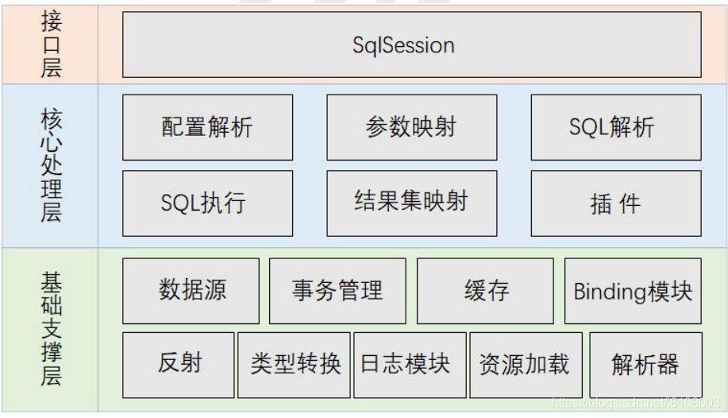
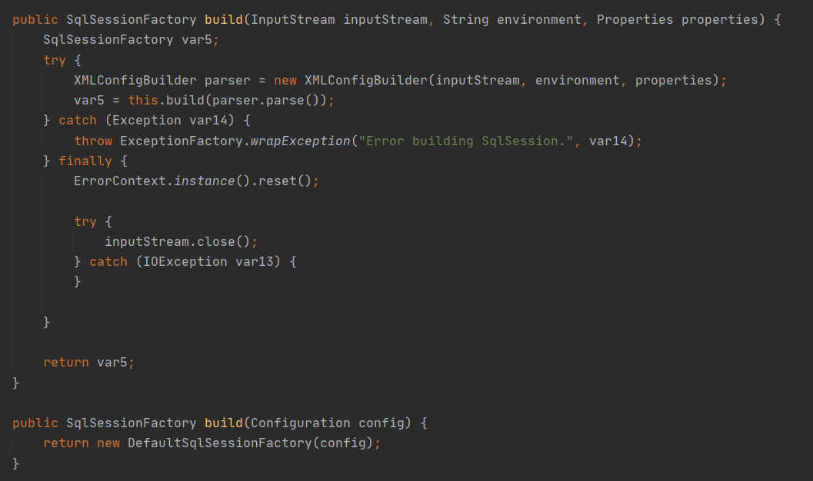
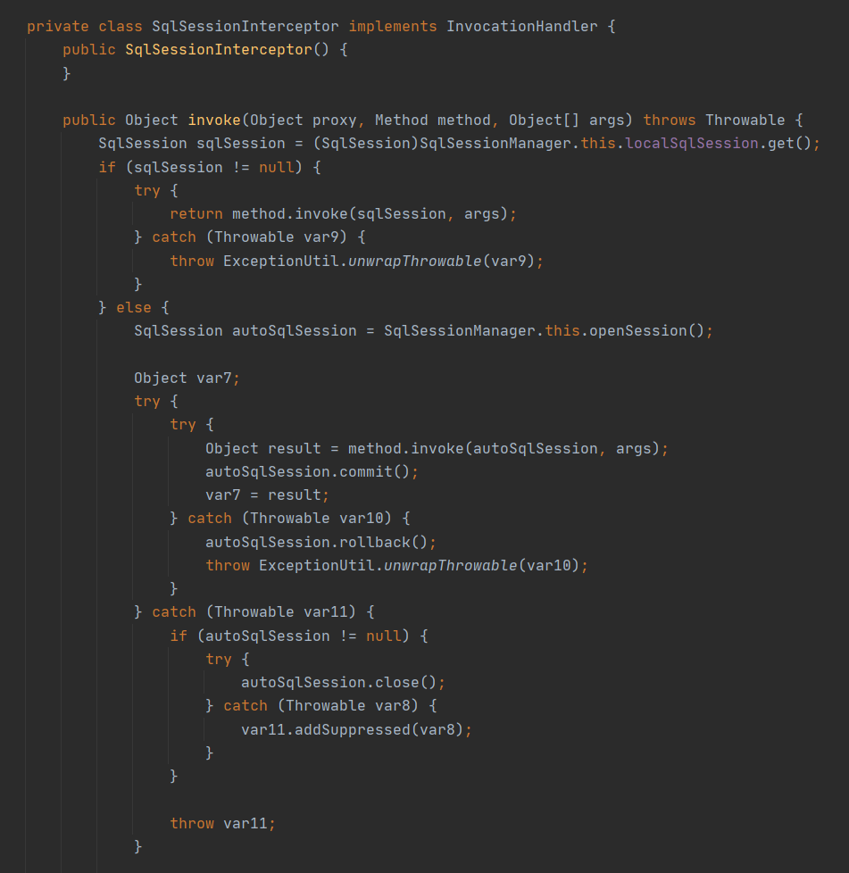

# MyBatis

## 准备名词

DB,DBS,DBMS

Statement,PreparedStatement

## 通过MyBatis看设计模式



门面模式（外观模式 Facade）---整体
工厂模式---日志


## 组件

### SqlSession与MyBatis

mybatis将用户从传统的JDBC中解放出来，在这其中，sqlsession与sqlsessionfactory是最重要的两个对象。
从字面可以得知sqlsessionfactory是创建sqlsession的工厂，而sqlsessionfactory则是通过sqlsessionfactorybuilder来获得，这往往可以通过Configuration配置类、xml配置文件等来构建。
SqlSession是执行持久化操作的核心对象，类似jdbc中的connection，是线程不安全的，每次使用完毕需要被正确的关闭。查看SqlSession的源码可以得知，形如“selectOne”
的方法表示SqlSession的实例被用来直接执行被映射的SQL语句。
与spring的结合，mybatis提供了增强的factorybean即SqlSessionFactoryBean，可以更简便的创建sqlsessionfactory实例。

```java
public class MyBatisTest {

    public static void main(String[] args) {
        try {
            //读取mybatis-config.xml文件
            InputStream rs = Resources.getResourceAsStream("mybatis-config.xml");
            //初始化mybatis,创建SqlSessionFactory类的实例
            SqlSessionFactory sqlSessionFactory =  new SqlSessionFactoryBuilder().build(rs);
            //创建session实例
            SqlSession session = sqlSessionFactory.openSession();
            //插入数据
            User user = new User();
            user.setC_password("123");
            user.setC_username("123");
            user.setC_salt("123");
            //第一个参数为方法的完全限定名:位置信息+映射文件当中的id
            session.insert("com.myhexin.dao.UserMapping.insertUserInformation", user);
            //提交事务
            session.commit();
            //关闭session
            session.close();
        } catch (IOException e) {
            e.printStackTrace();
        }
    }
}
```

第一步 通过解析XMLConfigBuilder来构建SqlSessionFactory实例
第二步 通过SqlSessionFactory的openSession()方法获取SqlSession

而真实的Connection则是在SqlSession进行后续的CRUD操作中进行获取的，主要通过三种模式即JndiDatasource，PooledDataSource，UnpooledDataSource。
其中PooledDataSource，UnpooledDataSource是两种常用的模式，即带连接池的数据源于不带连接池的数据源，由于MyBatis自身的池化技术使用了大量的同步锁，

### 来点新东西？


可以看到SqlSession本身是一个接口，目前3有三个实现，上述的代码通过查看源码可以得知我们创建的其实是一个DefaultSqlSessionFactory对象，而其创建的SqlSession则是DefaultSqlSession，这是一个线程不安全的
对象。



那么有没有线程安全的实现，其他的两个实现SqlSessionManager和SqlSessionTemplate是线程安全的。


我们注意到其构造器中通过sqlSessionProxy为SqlSession生成了一个内部类代理对象，那么关注一下invoke方法：



可以非常清晰的发现是通过ThreadLocal来维持SqlSession从而保证线程安全，SqlSessionTemplate的整体原理类似，只是维持对象的方式变为了Spring事务的上下文。

总的来看，由于现在的框架基本都与Spring做了整合，目前大多数都是在使用SqlSessionTemplate来获取SqlSession。

### DataSource与MyBatis

### 缓存

### 反射