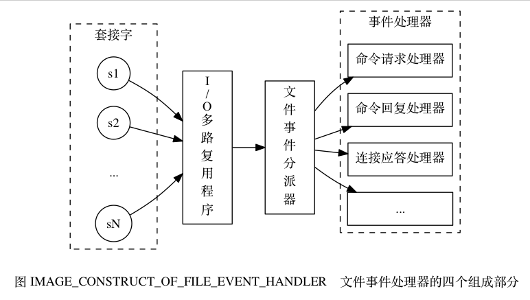
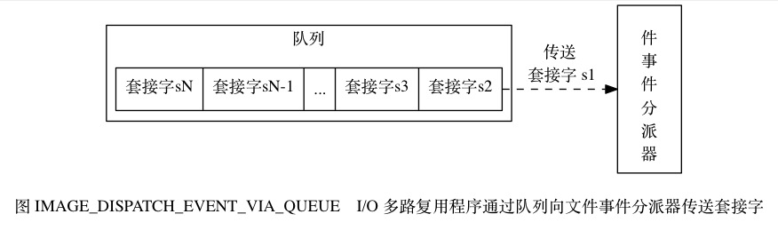
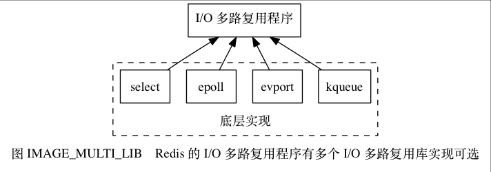
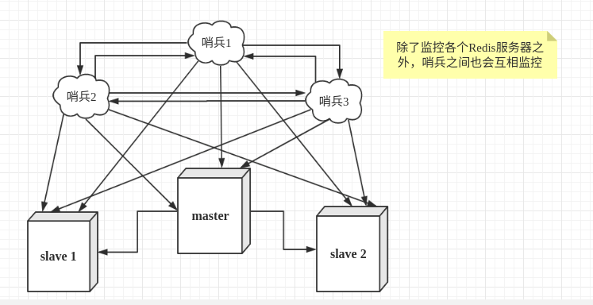

# 数据结构、算法

## 红黑树、二叉树的算法

## 快排的时间复杂度，最坏情况呢，最好情况呢，堆排序的时间复杂度呢，建堆的复杂度是多少

# 计算机网络

## TCP 3次握手4次挥手

**3次握手**

- 主机A发送SYN
- 主机B收到SYN，返回ACK
- 主机收到ACK，发送ACK，连接建立

**4次挥手**

- 主机A发送FIN（半关闭 关闭A到B）
- 主机B发送ACK，同时发送FIN（进入close-wait 半关闭 关闭B到A）
- 主机A发送ACK，进入TIME-WAIT，之后关闭

## http和https的区别，http1.x和http2.0的区别，SSL和TSL之间的区别

https是加入SSL后的安全版http

**https流程**

- 建立连接，客户端请求证书
- 客户端验证证书合法，校验域名
- 客户端生成对称加密AES密钥，通过使用服务器RSA公钥加密
- 服务端通过RSA私钥解密获取AES密钥，后续通讯都会通过AES密钥加密进行（即通过RSA确保AES的安全传输，数字信封）

**http1.x和http2.0的区别**

http1.0 每次请求结束都会关闭
http1.1 支持Host 支持长连接

http2.0 IO多路复用，二进制传输格式，Header头压缩，支持服务端推送

## 多个RPC请求进来，服务器怎么处理并发呢

# Java

## 基础

## Java类执行顺序

- 如果父类有静态成员赋值或者静态初始化块，执行静态成员赋值和静态初始化块
- 如果类有静态成员赋值或者静态初始化块，执行静态成员赋值和静态初始化块
- 将类的成员赋予初值（原始类型的成员的值为规定值，例如int型为0，float型为0.0f，boolean型为false；对象类型的初始值为null）
- 如果构造方法中存在this()调用（可以是其它带参数的this()调用）则执行之，执行完毕后进入第7步继续执行，如果没有this调用则进行下一步。（这个有可能存在递归调用其它的构造方法）
- 执行显式的super()调用（可以是其它带参数的super()调用）或者隐式的super()调用（缺省构造方法），此步骤又进入一个父类的构造过程并一直上推至Object对象的构造。
- 执行类申明中的成员赋值和初始化块。
- 执行构造方法中的其它语句。

## Java类加载过程，类加载器

**类加载过程：**

- 载入：字节码生成class对象
- 校验：通过一定的方式校验class对象合法性（规范、正确初始化等）
- 准备：类变量（static）分配内存初始化，但还没有值
- 解析：常量的符号引用转化为直接引用
- 初始化：执行类构造器

**类加载器：**

启动类加载器：jre/lib

扩展类加载器：jre/lib/ext

应用类加载器：classpath

自定义类加载器

**双亲委派模型**

### Java异常分类及处理

### Java反射

### Java注解

### Java内部类

### Java泛型

### Java序列化(创建可复用的Java对象)

### Java复制

## JVM

### 线程

### JVM内存区域

- 程序计数器：标记Java字节码执行位置
- Java虚拟机栈：线程私有，每个方法执行都会创建一个栈帧，用于保存局部变量、操作栈、动态链接等
- 本地方法栈：为native方法提供服务
- Java堆：线程共享，保存对象的实例
- 方法区：线程共享，类信息、常量、静态变量

### JVM运行时内存

### 新生代、年老代的构造

新生代：eden区域、from surviver区域、to surviver区域

老年代：JDK8前，存在持久代，在堆中；JDK8后，元空间取代持久代，在本地内存

### 垃圾回收与算法

GC算法：复制算法、标记整理、标记清除

触发minor gc：eden空间不足、大对象分配eden

触发full gc：直接调用System.gc、空间分配担保失败（晋升到老年代的平均对象大小大于老年代的剩余大小）、老年代空间不足、持久代空间不足、元空间不足

### Java四中引用类型

- 强引用：
- 软引用：
- 弱引用：
- 虚引用：

### GC 可达性分析中哪些算是GC ROOT？

- 虚拟机栈引用
- 静态对象引用
- 常量引用
- native方法引用

### GC分代收集算法VS分区收集算法

### GC垃圾收集器

### 你熟悉的JVM调优参数，使用过哪些调优工具？

最大堆内存、最小堆内存（调整一致，防止扩容）

设置元空间大小、设置堆外内存大小、dump堆内存异常日志

**工具：** 内置的 jstat、jmap、VisualVM

## 多线程

### Lock

### Semaphore

信号量 共享资源互斥、控制并发

底层是通过AQS实现

### CountDownLatch

同步工具类 可以保证线程一直等待，直到其他线程执行完后才执行 一次性

底层是通过AQS实现

### CyclicBarrier

同步工具类 所有线程会等待全部线程到达栅栏之后才会继续执行 重复使用

### ConcurrentHashMap

线程安全容器 分段锁

### ConcurrentLinkedQueue

高并发 FIFO队列 无锁 CAS 非阻塞 三个不等式 head tail不一定指向队列头和尾

### BlockingQueue

ArrayBlockingQueue：基于数据的阻塞队列，读写不能并行，需要定义长度，有界队列

LinkedBlockingQueue：基于链表的阻塞队列，读写可以并行，无界队列

### DelayQueue

延迟队列

### SynchronousQueue

无缓冲队列

## 集合

## IO

### Java IO/NIO


## Java 有什么锁类型?

公平、非公平：先等待锁是否可以先获得锁（fair、unfair）。

可重入锁：同一个线程在外层方法获取锁，在内层方法可直接获取锁（ReentrantLock）。

独享锁、共享锁：独享只可被一个线程持有；共享可以被多个线程持有，如ReadWriteLock，读是共享，写是独占。

乐观锁、悲观锁：设计思想，乐观锁认为数据一般不会发生修改，使用尝试更新的方式不断重试知道成功（CAS）；悲观锁认为资源一定会有安全问题，先进行加锁操作。

分段锁：通过分段加锁实现高效的锁并发操作，如ConcurrentHashMap。

偏向锁、轻量锁、重量锁：偏向即一直被一个线程获取锁；轻量即在锁是偏向锁时，其他线程尝试通过自旋获取锁，升级为轻量锁；当自旋到一定程度后，自旋不会无限进行下去，尝试获取锁的线程会被阻塞（挂起），升级为重量级锁，性能最差。

自旋锁：一种获取锁的方式，不断尝试获取锁，减少线程上下文切换的开销，但占用大量CPU时间片。

## AtomicInteger怎么实现原子修改的？

CAS 比较并交换

## 分布式锁的实现你知道的有哪些？具体详细谈一种实现方式

基于的redis分布式锁、基于Zookeeper分布式锁

## Java线程池有哪些参数，如果自己设计一个线程池要考虑哪些问题？

- corePoolSize：核心工作线程数
- maximumPoolSize：最大核心工作线程数
- workQueue：等待队列长度
- RejectedExecutionHandler：拒绝处理

线程池大小，考虑OOM；核心工作线程数，吞吐量

## 描述下线程池的处理流程？

Java线程池的核心类是ThreadPoolExecutor，其核心是CTL：记录有效线程数量，线程状态

RUNNING状态：线程池正常运行，可以接受新的任务并处理队列中的任务；

SHUTDOWN状态：不再接受新的任务，但是会执行队列中的任务；

STOP状态：不再接受新任务，不处理队列中的任务

- 1.判断核心工作线程数是否满了，没满添加任务，满了进入下一阶段
- 2.判断工作队列是否满了，没满添加队列，满了进入下一阶段
- 3.判断最大核心工作线程是否满了，没满扩充任务，满了进入饱和处理

## ArrayList和LinkedList区别

ArrayList：底层使用数组，查询和更新速度快

LinkedList：底层使用链表，插入和删除速度快

## hashmap是线程不安全的，concurrenthashmap是线程安全的，怎么实现的线程安全？

使用了分段锁与CAS，减少串行、阻塞、上下文切换

初始化操作，volatile保证可见性，通过标志位判断有无线程进行初始化，可通过yieid让出时间片（不是一定保证，也无法保证线程安全），之后通过CAS进行初始化操作

通过unsafe的volatile来保证node的可见性，之后进行加锁操作，在不考虑hash冲突的情况下，可以同时加16把锁，锁的粒度小，减少上下文切换和阻塞。

1.7是segment+hashmap分段 1.8是node

## 如何解决hash冲突的，以及如果冲突了，怎么在hash表中找到目标值

开放地址法（线性探测、二次探测、再哈希）、链地址法（冲突的hash值使用链表存储冲突数据）

## 什么是rehash

当装填因子大于0.75时，hash表性能将开始下降，rehash即扩展hash表长度以降低装填因子，其中会重新计算每个元素的hash值并移动到新的table

## hashmap，怎么扩容，怎么处理数据冲突？怎么高效率的实现数据迁移？

**hashmap扩容：**

当hashmap装填因子大于0.75时，hash表性能将开始下降，hashmap会进行扩容，即创建一个新的两倍于现在长度的Entry数组，然后遍历数组，重新计算每个元素的hash值，然后链接到新Entry数组对应的位置

高效？指的估计是1.8的优化，不需要重新计算hash，只需要判断原hash与原长度的与运算是不是0，0则索引不变，不然则变成原索引加上原长度

## volatile关键字解决了什么问题，实现原理是什么？

可见性，禁止指令重排

jmm内存模型，线程会从主存复制数据到工作内存，当改变内存数据值的时候只是改变了工作内存，还没有写入主存，如果是共享数据其他线程的工作内存里的值还是旧值。
volatile通过设置内存屏障，保证主存在拷贝到工作内存之前一定会将工作内存中的数据写入主存。

可以解决DCL（双重检查加锁）问题；线程退出的判断标识。

但不能解锁原子性问题，如i++不是一个原子操作。

## 并发容器有哪些,并发容器和同步容器的区别

**并发容器：**

ConcurrentHashMap：线程安全hashmap

CopyOnWriteArrayList：写时复制，线程安全且在读操作时无锁的ArrayList，占用内存，适合读多写少，不能保证数据一致性

ArrayBlockingQueue：基于数组、先进先出、线程安全，可实现指定时间的阻塞读写，并且容量可以限制

LinkedBlockingQueue：基于链表实现，读写各用一把锁，在高并发读写操作都多的情况下，性能优于ArrayBlockingQueue

**同步容器：**

Vector

HashTable

使用了同步锁

## Java网络编程中：BIO、NIO、AIO的区别和联系

BIO：同步阻塞模型，一请求一应答，如果要处理多个客户端请求，必须使用多线程，开销大

NIO：同步非阻塞模型，是面向缓冲，基于管道的I/O模型

- IO流是阻塞的，NIO流是不阻塞的：单线程从通道读取数据到buffer，之后线程可以去执行其他事情，当数据读取到buffer中后，线程再继续处理数据，写数据同理。而阻塞IO当线程调用read()或者write()时，线程是阻塞的，浪费线程资源
- IO 面向流(Stream oriented)，而 NIO 面向缓冲区(Buffer oriented)：阻塞IO操作Stream而NIO操作Buffer
- NIO通过通道进行读写，是双向的，只和buffer交互，可以进行异步读写
- NIO通过Selectors实现单线程操作多个通道，减少线程上下文切换

AIO：异步非阻塞

## 哪些库或者框架用到NIO

Netty使用NIO进行网络通信，Lettuce Redis连接池，DubboRPC

NIO是非阻塞

## ThreadLocal？应用场景？

ThreadLocal即线程局部变量，可以很好的解决线程安全问题。

应用场景：保存日志上下文、维持连接对象、保存traceId、保持JWT会话

## session的生命周期是多久

如果是Java的中的httpservletsession的话，默认30分钟，可设置。

## Spring 都有哪几种注入方式，什么情况下用哪种，ioc实现原理

接口、构造器、setter

ioc：控制反转，即创建调用者的过程由创建者转向容器。

实现原理：通过反射机制，从xml或者@bean构建beanfactory，之后可以通过beanfactory创建并注入对象。

## Spring Bean生命周期


## Spring AOP

Spring 提供了两种方式来生成代理对象: JDKProxy 和 Cglib，具体使用哪种方式生成由 AopProxyFactory 根据 AdvisedSupport 对象的配置来决定。默认的策略是如果目标类是接口，则使用 JDK 动态代理技术，否则使用 Cglib 来生成代理。

- JDK 动态接口代理:Proxy 和 InvocationHandler
- CGLib 动态代理:在运行期扩展 Java 类与实现 Java 接口，CGLib 封装了 asm，可以再运行期动态生成新的 class。

# 分布式事务

## 两阶段提交 2PC XA

**准备阶段：**

事务协调者(事务管理器)给每个参与者(资源管理器)发送 Prepare 消息，每个参与者要么直接返回
失败(如权限验证失败)，要么在本地执行事务，写本地的 redo 和 undo 日志，但不提交，到达一
种“万事俱备，只欠东风”的状态。

**提交阶段：**

如果协调者收到了参与者的失败消息或者超时，直接给每个参与者发送回滚(Rollback)消息；否则，
发送提交(Commit)消息；参与者根据协调者的指令执行提交或者回滚操作，释放所有事务处理过
程中使用的锁资源。(注意:必须在最后阶段释放锁资源)
将提交分成两阶段进行的目的很明确，就是尽可能晚地提交事务，让事务在提交前尽可能地完成
所有能完成的工作。

## TCC 应用层面3段提交（强一致性，但实现复杂）

## 基于消息队列的

# MySQL

## 事务的ACID，其中把事务的隔离性详细解释一遍

A：原子性：要么全部成功，要么全部失败回滚。

C：一致性：事务执行后，数据库要处于一致性状态。

I：隔离性：一个事务的执行不能不被其他事务干扰。

- 读未提交：一个事务可以读取到另一个事务未提交的数据，会产生脏读：即A事务读到了B事务未提交的数据，之后B事务异常回滚了，A事务发现数据又没了
- 读提交：一个事务只能读取到另一个事务已提交的数据，会产生不可重复读：A事务读取数据，之后A事务再次读取数据时发现数据变了
- 可重复读：保证在事务处理过程中，多次读取同一个数据时，其值都和事务开始时刻是一致的，会产生幻读：一个事务在前后两次查询同一范围的时候，后一次查询看到了前一次查询没有看到的行。（行锁只能锁住当前行更新，无法阻止数据插入） MySQL的innodb采用间隙锁解决幻读
- 串行化：所有事务串行执行，性能最差

D：持久性：一旦事务提交，那么它对数据库中的对应数据的状态的变更就会永久保存到数据库中。

## mysql数据库默认存储引擎，有什么优点

默认是innodb，支持标准的ACID事务，锁粒度支持行级锁，支持聚集索引

## mysql实现事务的原理(MVCC)

MVCC，即多版本并发控制，

## Redo、Undo、BinLog

Redo：重做日志

Undo：回滚日志，可设置truncate阈值大小，可设置独立表空间，分离数据空间和挂载路径，如使用高速磁盘提高性能。


事务执行，从磁盘读取数据到内存，修改值后，先写Undo日志，刷盘后写Redo日志，然后脏页的Redo日志刷盘后提交事务，持久化数据块。

目的是为了实现CrashSafe，MySQL保证宕机后重启，所有已提交事务的数据都存在，所有未提交事务的数据都回滚。

Binlog

## 聚集索引和非聚集索引知道吗？什么情况用聚集索引什么情况用非聚集索引

聚集索引：该索引可以直接定位到表中相应行的物理顺序，即可以理解为通过索引查到一个值的行后可以直接获取到整行的数据。

非聚集索引：该索引的逻辑顺序与磁盘上行的物理存储顺序不同，即可以理解为索引树（b+tree）上的叶子节点存储的是主键id数据，而非具体数据，之后可以通过主键id走聚集索引获取数据，这个过程即回表操作。

优化的过程即索引覆盖，即使用覆盖索引。 使用聚合索引可以不需要二次回表，但需要注意最左覆盖原则。

何时用聚集索引：小数目的、有范围的不同值

何时用非聚集索引：大小数目的、频繁更新的值

## mysql同步机制原理，有哪几种同步方法

## 数据库主从同步如何实现，事务如何实现

## MySQL行锁是否会有死锁的情况？

## 行级锁、间隙锁

## MySQL索引的实现，innodb的索引，b+树索引是怎么实现的，为什么用b+树做索引节点，一个节点存了多少数据，怎么规定大小，与磁盘页对应。

## 在工作中，SQL语句的优化和注意的事项

减少使用宽表，减少使用表关联（按业务，通过DDD拆分）

设置合理的索引，考虑覆盖索引（使用联合索引，在一个索引树获取数据，减少回表次数）

## 如何定位一个慢查询，一个服务有多条SQL你怎么快速定位

慢查询日志、连接池慢查询日志

## 数据库分库分表一般数据量多大才需要？

2000w

## 如何保证数据库与redis缓存一致的

# Redis

## 关系型数据库和NoSQL各自的优劣点是什么，如何技术选型？

关系型数据库：支持标准SQL查询，支持ACID事务

## 项目相关你用过redis，用在什么场景，怎么使用的？

验证码、分布式锁、缓存、秒杀场景

## Redis是单线程？网络模型？线程模型？

- 网络模型：IO多路复用
- 线程模型：命令被顺序压入队列，文件事件分发器以单线程运行

Redis 基于 Reactor 模式开发了自己的网络事件处理器： 这个处理器被称为文件事件处理器（file event handler）：

- 文件事件处理器使用 I/O 多路复用（multiplexing）程序来同时监听多个套接字， 并根据套接字目前执行的任务来为套接字关联不同的事件处理器。
- 当被监听的套接字准备好执行连接应答（accept）、读取（read）、写入（write）、关闭（close）等操作时， 与操作相对应的文件事件就会产生， 这时文件事件处理器就会调用套接字之前关联好的事件处理器来处理这些事件。

虽然文件事件处理器以单线程方式运行， 但通过使用 I/O 多路复用程序来监听多个套接字， 文件事件处理器既实现了高性能的网络通信模型， 又可以很好地与 redis 服务器中其他同样以单线程方式运行的模块进行对接， 这保持了 Redis 内部单线程设计的简单性。







## Redis高并发快的原因？

- 纯内存访问
- 非阻塞IO：采用epoll作为IO多路复用的实现，减少IO时间
- 单线程避免了线程切换和竞态产生的消耗

## Redis数据结构？

**使用者数据结构：**

- String
- Hash
- List
- Set
- ZSet

**底层数据结构：**

### SDS

simple dynamic string - 支持自动动态扩容的字节数组

头指针保存字符串长度，o(1)获取

每次扩容2倍，大于1MB后每次扩容1MB

- list - 平平无奇的链表
- dict - 使用双哈希表实现的, 支持平滑扩容的字典
- zskiplist - 附加了后向指针的跳跃表
- intset - 用于存储整数数值集合的自有结构
- ziplist - 一种实现上类似于TLV, 但比TLV复杂的, 用于存储任意数据的有序序列的数据结构
- quicklist - 一种以ziplist作为结点的双链表结构, 实现的非常苟
- zipmap - 一种用于在小规模场合使用的轻量级字典结构

## Redis数据过期策略和淘汰机制？

Redis过期策略实际使用的是惰性删除+定期删除的配合使用

**惰性删除：**放任键过期不管，直到获取键时采取检查键是否过期（有点像乐观锁你提交修改时才做冲突检查，扯远了），过期的话就删除该键，不过期就返回键；惰性删除可以归类为被动删除策略；

优劣：对CPU友好，取键时才过期检查；对内存不友好库中可能存在大量没被访问到的过期键，它们可能永远不会被删除；

**定期删除：**每隔一段时间，对库进行一次检查删除过期键。删除多少及检查多少库由算法决定；定期删除是（定时删除及惰性删除）的一种折中，他会通过限制操作执行时长及频率来减少删除操作对CPU执行时间影响，而确定删除策略的时长和频率就是主要难点；定期删除也是一种主动删除策略；

Reids淘汰机制即当Redis的内存使用达到设置的内存上限，触发内存淘汰机制，根据淘汰规则释放内存

内存淘汰机制默认设置是noeviction

1.volatile-lru：使用lru算法（Least Recently Used,最近最久未使用），从已设置过期时间的数据集中挑选最近最少使用的淘汰；

2.volatile-ttl：从已设置过期时间的数据集中挑选将要过期的数据淘汰；

3.volatile-random：从已设置过期时间的数据集中任意选择数据淘汰；

4.allkeys-lru：使用lru算法，从数据集中选择最近最少使用的淘汰；

5.allkeys-random：从数据集中选择任意数据淘汰；

6.noenviction(驱逐)：禁止淘汰数据；当内存不足以写入新数据时，直接报异常，Redis只响应读操作；

## 如何利用Redis处理热点数据

无论是单机模式还是集群模式（未开启读写分离），都可能存在热点数据导致超过单Server的性能极限。

1.服务端缓存，如使用SpringCache+Caffine+LFU，缓存击穿？（刷新时间）多线程构建缓存？（异步单线程构建缓存）  
脏读问题？（无法完全解决，可以缩短刷新时间） 数据不一致（无法完全解决，可以通过消息通知，缩短刷新时间）

2.读写分离

3.热点发现+Proxy缓存  
服务端无需自行实现本地缓存


## 谈谈Redis哨兵、复制、集群

### Sentinel

监控多个Redis实例，实现主从切换，

- 通过发送命令，让Redis服务器返回监控其运行状态，包括主服务器和从服务器。
- 当哨兵监测到master宕机，会自动将slave切换成master，然后通过发布订阅模式通知其他的从服务器，修改配置文件，让它们切换主机。

**多哨兵模式：**

假设主服务器宕机，哨兵1先检测到这个结果，系统并不会马上进行failover过程，仅仅是哨兵1主观的认为主服务器不可用，这个现象成为主观下线。当后面的哨兵也检测到主服务器不可用，并且数量达到一定值时，那么哨兵之间就会进行一次投票，投票的结果由一个哨兵发起，进行failover操作。切换成功后，就会通过发布订阅模式，让各个哨兵把自己监控的从服务器实现切换主机，这个过程称为客观下线。这样对于客户端而言，一切都是透明的。



**Redis Sentinel 脑裂：**

由于网络问题，slave由于无法感知master存在被sentinel升级为master，此时集群中存在2个master，客户端向slave写入数据，之后网络恢复后，sentinel将原来的master降为slave节点，并从master同步数据，此时原master节点将丢失从脑裂开始到恢复后的所有数据。

解决方案：  
edis的配置文件中，存在两个参数  
```conf
min-slaves-to-write 3 #连接到master的最少slave数量
min-slaves-max-lag 10 #slave连接到master的最大延迟时间
```

可以配置连接到master的最少slave数量为集群slave数量的一半以上

### 主从复制

### Cluster

### 常用Redis集群方案

## 如果Redis有1亿个key，使用keys命令是否会影响线上服务？

## Redis的持久化方式，aof和rdb，具体怎么实现，追加日志和备份文件，底层实现原理的话知道么?

### AOF 日志追加

### RDB 数据文件存储

# Zookeeper

## 分布式一致性协议raft，paxos 了解吗

## Zookeeper中的ZAB协议，选主算法

# 消息队列

# Netty

## 简介

Netty 是一个高性能、异步事件驱动的 NIO 框架，基于 JAVA NIO 提供的 API 实现。

## IO多路复用

IO 多路复用技术通过把多个 IO 的阻塞复用到同一个 select 的阻塞上，从而使得系统在
单线程的情况下可以同时处理多个客户端请求。与传统的多线程/多进程模型比，I/O 多路复用的
最大优势是系统开销小，系统不需要创建新的额外进程或者线程，也不需要维护这些进程和线程
的运行，降低了系统的维护工作量，节省了系统资源。

## 零拷贝

Netty 的接收和发送 ByteBuffer 采用 DIRECT BUFFERS，使用堆外直接内存进行 Socket 读写，
不需要进行字节缓冲区的二次拷贝。如果使用传统的堆内存（HEAP BUFFERS）进行 Socket 读写，
JVM 会将堆内存 Buffer 拷贝一份到直接内存中，然后才写入 Socket 中。相比于堆外直接内存，
消息在发送过程中多了一次缓冲区的内存拷贝。

## 内存池

减少堆外直接内存的回收，通过内存池缓冲区实现重用机制。

## 高效的 Reactor 线程模型

**Reactor 单线程模型**

**Reactor 多线程模型**

**主从 Reactor 多线程模型**


## 网络编程nio和netty相关，netty的线程模型，零拷贝实现

# Nginx

## Nginx负载均衡策略？

## Nginx和其他负载均衡框架对比过吗？

# Linux

## Linux的共享内存如何实现

## 进程通信、线程通信

进程通信：管道、信号量、共享内存、消息队列、socket

线程通信：信号量、锁机制

## select、poll、epoll

# 微服务

## Spring Cloud用到什么东西？如何实现负载均衡？服务挂了注册中心怎么判断？


## 微服务架构下，如果有一个订单系统，一个库存系统，怎么保证事务？

分布式事务，XA模式，2PC,3PC,TCC

## 谈谈你对SOA和微服务的理解，以及分布式架构从应用层面涉及到的调整和挑战。

## 阿里系中间件metaQ及原理与现有的kafka有什么异同

## 在阿里有了解过什么中间件吗？实现原理？与其他开源消息队列有什么特点？

RocketMQ

可靠性，同步刷盘、异步刷盘，多Topic性能好

## 高并发的应用场景，技术需要涉及到哪些？怎样来架构设计？

# 分布式缓存

## 常见的缓存Server

Memcache、Redis

## Redis构造大索引回源问题

缓存失效时，返回简单数据，消息队列通知更新缓存

## 缓存一致性

### 问题

1.并发读写导致的一致性问题  
2. 主从同步延时导致的一致性问题  
3. 缓存污染导致的一致性问题

### 解决方案

**1. binlog+消息队列+消费者del cache**

上图是现在常用的清缓存策略，每次表发生变动，通过mysql产生的binlog去给消息队列发送变动消息，这里监听DB变动的服务由canal提供，canal可以简单理解成一个实现了mysql通信协议的从库，通过mysql主从配置完成binlog同步，且它只接收binlog，通过这种机制，就可以很自然的监听数据库表数据变动了，可以保证每次数据库发生的变动，都会被顺序发往消费者去清除对应的缓存key。

**2. 从库binlog+消息队列+消费者del cache**

只需要将canal监听的数据库设置成从库即可，保证在canal推送过来消息时，所有的从库和主库完全一致，不过这只针对一主一从的情况，如果一主多从，且回源读取的从库有多个，那么上述也是存在一定的风险的（一主多从需要订阅每个从节点的binlog，找出最后发过来的那个节点，然后清缓存，确保所有的从节点全部和主节点一致）。

不过，正常情况下，从库binlog的同步速度都要比canal发消息快，因为canal要接收binlog，然后组装数据变动实体（这一步是有额外开销的），然后通过消息队列推送给各消费者（这一步也是有开销的），所以即便是订阅的master库的表变更，出问题的概率也极小。

3. 更新后key升级

## 缓存命中率

判断数据更新频繁率，如果频繁更新，则不删除缓存而是更新缓存，要注意单线程更新防止出现顺序问题。

## 缓存穿透

一直无法被缓存的数据，不存在的客户Id的数据，由于BUG的异常访问的Id，恶意攻击

布隆过滤器、简单的业务Key规则过滤、缓存空Key

## 缓存击穿

当缓存Key失效后，大量方法打进回源方法，多线程构建缓存，从而提高了DB的压力

1.单应用通过互斥锁，将构建缓存的QPS降低为1，多个实例会存在多个构建，但应用节点不会很多无需考虑

2.应用使用分布式锁，完全解决并发缓存构建的问题，但存在分布式锁服务可靠性问题，使用Redis集群+RedLock

## 缓存雪崩

缓存雪崩是指缓存数据某一时刻出现大量失效的情况，所有请求全部打进DB，导致短期内DB负载暴增的问题

1.缓存服务扩容

2.缓存服务宕机

**解决方案：**

1.redis缓存服务集群部署，读写分离，哨兵模式主从切换

2.一致性hash，防止上下节点导致大量Key不可用

3.开启本地缓存，SpringCache+Caffine

4.服务限流，粗细管道，保护DB

# Dubbo

## 简述

**里程碑**  
2.6稳定   
2.7 支持Cloud  
2.7.5 支持gRPG

**角色：**  

节点	角色说明  
Consumer	需要调用远程服务的服务消费方  
Registry	注册中心  
Provider	服务提供方  
Container	服务运行的容器  
Monitor	监控中心

## 服务注册

SpringIOC容器初始化后，通过ProxyFactory.getInvoker，利用javassist进行动态代理，封装服务实现类，再通过URL参数选择对应协议进行Export，默认是Dubbo协议。Export的时候会调用对应的Regsiter进行注册，默认是Zookeeper。

最终会将Exporter存入Map中，提供远程调用查找。

## 服务发现

通过配置的注册中心，构建RegistryDirectory，向注册中心注册消费者，之后订阅subscribeUrl的通知，此过程中会把invoker封装为invokerDelegate并在RegistryDirectory中缓存urlInvokerMap。

## 服务调用

通过调用的方法查找对应服务提供者invoker的invokerDelegate，之后通过LoadBalance选择一个invoker进行调用，之后会经过filter-chain，包括日志、异常处理、自定义等。最终是DubboInvoke，之后会区分同步异步，然后通过NettyCleint（channel）进行调用，设置超时时间（feature），Netty会经过Dubbo Protocol进行Encode，之后服务提供者会Decode，然后调用选择对应的Export（代理类），执行目标方法。

## SPI

按需加载

## Javassist

cglib基于asm，需要了解虚拟机规范，操作汇编，易用性差

javassist上手简单


