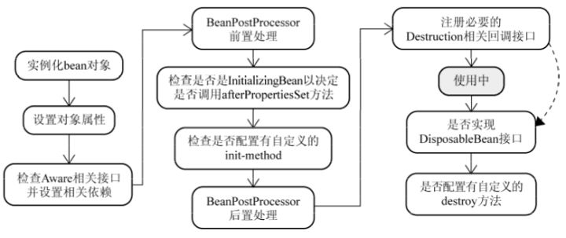

# 数据结构、算法

## 红黑树、二叉树的算法

## 快排的时间复杂度，最坏情况呢，最好情况呢，堆排序的时间复杂度呢，建堆的复杂度是多少

# 计算机网络

## http和https的区别，http1.x和http2.0的区别，SSL和TSL之间的区别

## 多个RPC请求进来，服务器怎么处理并发呢

# Java

## 基础

## Java类执行顺序

- 如果父类有静态成员赋值或者静态初始化块，执行静态成员赋值和静态初始化块
- 如果类有静态成员赋值或者静态初始化块，执行静态成员赋值和静态初始化块
- 将类的成员赋予初值（原始类型的成员的值为规定值，例如int型为0，float型为0.0f，boolean型为false；对象类型的初始值为null）
- 如果构造方法中存在this()调用（可以是其它带参数的this()调用）则执行之，执行完毕后进入第7步继续执行，如果没有this调用则进行下一步。（这个有可能存在递归调用其它的构造方法）
- 执行显式的super()调用（可以是其它带参数的super()调用）或者隐式的super()调用（缺省构造方法），此步骤又进入一个父类的构造过程并一直上推至Object对象的构造。
- 执行类申明中的成员赋值和初始化块。
- 执行构造方法中的其它语句。

## Java类加载过程，类加载器

**类加载过程：**

- 载入：字节码生成class对象
- 校验：通过一定的方式校验class对象合法性（规范、正确初始化等）
- 准备：类变量（static）分配内存初始化，但还没有值
- 解析：常量的符号引用转化为直接引用
- 初始化：执行类构造器

**类加载器：**

启动类加载器：jre/lib

扩展类加载器：jre/lib/ext

应用类加载器：classpath

自定义类加载器

**双亲委派模型**

### Java异常分类及处理

### Java反射

### Java注解

### Java内部类

### Java泛型

### Java序列化(创建可复用的Java对象)

### Java复制

## JVM

### 线程

### JVM内存区域

- 程序计数器：标记Java字节码执行位置
- Java虚拟机栈：线程私有，每个方法执行都会创建一个栈帧，用于保存局部变量、操作栈、动态链接等
- 本地方法栈：为native方法提供服务
- Java堆：线程共享，保存对象的实例
- 方法区：线程共享，类信息、常量、静态变量

### JVM运行时内存

### 新生代、年老代的构造

新生代：eden区域、from surviver区域、to surviver区域

老年代：JDK8前，存在持久代，在堆中；JDK8后，元空间取代持久代，在本地内存

### 垃圾回收与算法

GC算法：复制算法、标记整理、标记清除

触发minor gc：eden空间不足、大对象分配eden

触发full gc：直接调用System.gc、空间分配担保失败（晋升到老年代的平均对象大小大于老年代的剩余大小）、老年代空间不足、持久代空间不足、元空间不足

### Java四中引用类型

- 强引用：
- 软引用：
- 弱引用：
- 虚引用：

### GC 可达性分析中哪些算是GC ROOT？

- 虚拟机栈引用
- 静态对象引用
- 常量引用
- native方法引用

### GC分代收集算法VS分区收集算法

### GC垃圾收集器

### 你熟悉的JVM调优参数，使用过哪些调优工具？

最大堆内存、最小堆内存（调整一致，防止扩容）

设置元空间大小、设置堆外内存大小、dump堆内存异常日志

**工具：** 内置的 jstat、jmap、VisualVM

## 多线程

### Lock

### Semaphore

信号量 共享资源互斥、控制并发

底层是通过AQS实现

### CountDownLatch

同步工具类 可以保证线程一直等待，直到其他线程执行完后才执行 一次性

底层是通过AQS实现

### CyclicBarrier

同步工具类 所有线程会等待全部线程到达栅栏之后才会继续执行 重复使用

### ConcurrentHashMap

线程安全容器 分段锁

### ConcurrentLinkedQueue

高并发 FIFO队列 无锁 CAS 非阻塞 三个不等式 head tail不一定指向队列头和尾

### BlockingQueue

ArrayBlockingQueue：基于数据的阻塞队列，读写不能并行，需要定义长度，有界队列

LinkedBlockingQueue：基于链表的阻塞队列，读写可以并行，无界队列

### DelayQueue

延迟队列

### SynchronousQueue

无缓冲队列

## 集合

## IO

### Java IO/NIO

## Java 有什么锁类型?

公平、非公平：先等待锁是否可以先获得锁（fair、unfair）。

可重入锁：同一个线程在外层方法获取锁，在内层方法可直接获取锁（ReentrantLock）。

独享锁、共享锁：独享只可被一个线程持有；共享可以被多个线程持有，如ReadWriteLock，读是共享，写是独占。

乐观锁、悲观锁：设计思想，乐观锁认为数据一般不会发生修改，使用尝试更新的方式不断重试知道成功（CAS）；悲观锁认为资源一定会有安全问题，先进行加锁操作。

分段锁：通过分段加锁实现高效的锁并发操作，如ConcurrentHashMap。

偏向锁、轻量锁、重量锁：偏向即一直被一个线程获取锁；轻量即在锁是偏向锁时，其他线程尝试通过自旋获取锁，升级为轻量锁；当自旋到一定程度后，自旋不会无限进行下去，尝试获取锁的线程会被阻塞（挂起），升级为重量级锁，性能最差。

自旋锁：一种获取锁的方式，不断尝试获取锁，减少线程上下文切换的开销，但占用大量CPU时间片。

## AtomicInteger怎么实现原子修改的？

CAS 比较并交换

## 分布式锁的实现你知道的有哪些？具体详细谈一种实现方式

基于的redis分布式锁、基于Zookeeper分布式锁

## Java线程池有哪些参数，如果自己设计一个线程池要考虑哪些问题？

- corePoolSize：核心工作线程数
- maximumPoolSize：最大核心工作线程数
- workQueue：等待队列长度
- RejectedExecutionHandler：拒绝处理

线程池大小，考虑OOM；核心工作线程数，吞吐量

## 描述下线程池的处理流程？

Java线程池的核心类是ThreadPoolExecutor，其核心是CTL：记录有效线程数量，线程状态

RUNNING状态：线程池正常运行，可以接受新的任务并处理队列中的任务；

SHUTDOWN状态：不再接受新的任务，但是会执行队列中的任务；

STOP状态：不再接受新任务，不处理队列中的任务

- 1.判断核心工作线程数是否满了，没满添加任务，满了进入下一阶段
- 2.判断工作队列是否满了，没满添加队列，满了进入下一阶段
- 3.判断最大核心工作线程是否满了，没满扩充任务，满了进入饱和处理

## ArrayList和LinkedList区别

ArrayList：底层使用数组，查询和更新速度快

LinkedList：底层使用链表，插入和删除速度快

## hashmap是线程不安全的，concurrenthashmap是线程安全的，怎么实现的线程安全？

使用了分段锁与CAS，减少串行、阻塞、上下文切换

初始化操作，volatile保证可减少，通过标志位判断有无线程进行初始化，可通过yieid让出时间片（不是一定保证，也无法保证线程安全），之后通过CAS进行初始化操作

通过unsafe的volatile来保证node的可见性，之后进行加锁操作，在不考虑hash冲突的情况下，可以同时加16把锁，锁的粒度小，减少上下文切换和阻塞。

1.7是segment+hashmap分段 1.8是node

## 如何解决hash冲突的，以及如果冲突了，怎么在hash表中找到目标值

开放地址法（线性探测、二次探测、再哈希）、链地址法（冲突的hash值使用链表存储冲突数据）

## 什么是rehash

当装填因子大于0.75时，hash表性能将开始下降，rehash即扩展hash表长度以降低装填因子，其中会重新计算每个元素的hash值并移动到新的table

## hashmap，怎么扩容，怎么处理数据冲突？怎么高效率的实现数据迁移？

**hashmap扩容：**

当hashmap装填因子大于0.75时，hash表性能将开始下降，hashmap会进行扩容，即创建一个新的两倍于现在长度的Entry数组，然后遍历数组，重新计算每个元素的hash值，然后链接到新Entry数组对应的位置

高效？指的估计是1.8的优化，不需要重新计算hash，只需要判断原hash与原长度的与运算是不是0，0则索引不变，不然则变成原索引加上原长度

## volatile关键字解决了什么问题，实现原理是什么？

可见性，禁止指令重排

jmm内存模型，线程会从主存复制数据到工作内存，当改变内存数据值的时候只是改变了工作内存，还没有写入主存，如果是共享数据其他线程的工作内存里的值还是旧值。
volatile通过设置内存屏障，保证主存在拷贝到工作内存之前一定会将工作内存中的数据写入主存。

可以解决DCL（双重检查加锁）问题；线程退出的判断标识。

但不能解锁原子性问题，如i++不是一个原子操作。

## 并发容器有哪些,并发容器和同步容器的区别

**并发容器：**

ConcurrentHashMap：线程安全hashmap

CopyOnWriteArrayList：写时复制，线程安全且在读操作时无锁的ArrayList，占用内存，适合读多写少，不能保证数据一致性

ArrayBlockingQueue：基于数组、先进先出、线程安全，可实现指定时间的阻塞读写，并且容量可以限制

LinkedBlockingQueue：基于链表实现，读写各用一把锁，在高并发读写操作都多的情况下，性能优于ArrayBlockingQueue

**同步容器：**

Vector

HashTable

使用了同步锁

## Java网络编程中：BIO、NIO、AIO的区别和联系

BIO：同步阻塞模型，一请求一应答，如果要处理多个客户端请求，必须使用多线程，开销大

NIO：同步非阻塞模型，是面向缓冲，基于管道的I/O模型

- IO流是阻塞的，NIO流是不阻塞的：单线程从通道读取数据到buffer，之后线程可以去执行其他事情，当数据读取到buffer中后，线程再继续处理数据，写数据同理。而阻塞IO当线程调用read()或者write()时，线程是阻塞的，浪费线程资源
- IO 面向流(Stream oriented)，而 NIO 面向缓冲区(Buffer oriented)：阻塞IO操作Stream而NIO操作Buffer
- NIO通过通道进行读写，是双向的，只和buffer交互，可以进行异步读写
- NIO通过Selectors实现单线程操作多个通道，减少线程上下文切换

AIO：异步非阻塞

## 哪些库或者框架用到NIO

Netty使用NIO进行网络通信，Lettuce Redis连接池，DubboRPC

NIO是非阻塞

## ThreadLocal？应用场景？

ThreadLocal即线程局部变量，可以很好的解决线程安全问题。

应用场景：保存日志上下文、维持连接对象、保存traceId、保持JWT会话

## session的生命周期是多久

如果是Java的中的httpservletsession的话，默认30分钟，可设置。

# Spring

## Spring 都有哪几种注入方式，什么情况下用哪种，ioc实现原理

接口、构造器、setter

ioc：控制反转，即创建调用者的过程由创建者转向容器。

实现原理：通过反射机制，从xml或者@bean构建beanfactory，之后可以通过beanfactory创建并注入对象。

## Spring Bean生命周期

# MySQL

## 事务的ACID，其中把事务的隔离性详细解释一遍

A：原子性：要么全部成功，要么全部失败回滚。

C：一致性：事务执行后，数据库要处于一致性状态。

I：隔离性：一个事务的执行不能不被其他事务干扰。

- 读未提交：一个事务可以读取到另一个事务未提交的数据，会产生脏读：即A事务读到了B事务未提交的数据，之后B事务异常回滚了，A事务发现数据又没了
- 读提交：一个事务只能读取到另一个事务已提交的数据，会产生不可重复读：A事务读取数据，之后A事务再次读取数据时发现数据变了
- 可重复读：保证在事务处理过程中，多次读取同一个数据时，其值都和事务开始时刻是一致的，会产生幻读：一个事务在前后两次查询同一范围的时候，后一次查询看到了前一次查询没有看到的行。（行锁只能锁住当前行更新，无法阻止数据插入） MySQL的innodb采用间隙锁解决幻读
- 串行化：所有事务串行执行，性能最差

D：持久性：一旦事务提交，那么它对数据库中的对应数据的状态的变更就会永久保存到数据库中。

## mysql数据库默认存储引擎，有什么优点

默认是innodb，支持标准的ACID事务，锁粒度支持行级锁，支持聚集索引

## mysql实现事务的原理(MVCC)

MVCC，即多版本并发控制，

## 聚集索引和非聚集索引知道吗？什么情况用聚集索引什么情况用非聚集索引

聚集索引：该索引可以直接定位到表中相应行的物理顺序，即可以理解为通过索引查到一个值的行后可以直接获取到整行的数据。

非聚集索引：该索引的逻辑顺序与磁盘上行的物理存储顺序不同，即可以理解为索引树（b+tree）上的叶子节点存储的是主键id数据，而非具体数据，之后可以通过主键id走聚集索引获取数据，这个过程即回表操作。

优化的过程即索引覆盖，即使用覆盖索引。 使用聚合索引可以不需要二次回表，但需要注意最左覆盖原则。

何时用聚集索引：小数目的、有范围的不同值

何时用非聚集索引：大小数目的、频繁更新的值

## mysql同步机制原理，有哪几种同步方法

## 数据库主从同步如何实现，事务如何实现

## MySQL行锁是否会有死锁的情况？

## 行级锁、间隙锁

## MySQL索引的实现，innodb的索引，b+树索引是怎么实现的，为什么用b+树做索引节点，一个节点存了多少数据，怎么规定大小，与磁盘页对应。

## 在工作中，SQL语句的优化和注意的事项

减少使用宽表，减少使用表关联（按业务，通过DDD拆分）

设置合理的索引，考虑覆盖索引（使用联合索引，在一个索引树获取数据，减少回表次数）

## 如何定位一个慢查询，一个服务有多条SQL你怎么快速定位

慢查询日志、连接池慢查询日志

## 数据库分库分表一般数据量多大才需要？

2000w

## 如何保证数据库与redis缓存一致的

# Redis

## Nosql引擎用的什么存储结构，关系型数据库和NoSQL各自的优劣点是什么，如何技术选型？

## 项目相关你用过redis，用在什么场景，怎么使用的？

验证码、分布式锁、缓存、秒杀场景

## Redis是单线程？

## Redis高并发快的原因？

## redis数据结构？

## redis数据淘汰机制？

## 如何利用Redis处理热点数据

## 谈谈Redis哨兵、复制、集群

## 如果Redis有1亿个key，使用keys命令是否会影响线上服务？

## Redis的持久化方式，aod和rdb，具体怎么实现，追加日志和备份文件，底层实现原理的话知道么?

# Zookeeper

## 分布式一致性协议raft，paxos 了解吗

## Zookeeper中的ZAB协议，选主算法

# Netty

## 网络编程nio和netty相关，netty的线程模型，零拷贝实现

# Nginx

## Nginx负载均衡策略？

## Nginx和其他负载均衡框架对比过吗？

# Linux

## Linux的共享内存如何实现

## 进程通信、线程通信

进程通信：管道、信号量、共享内存、消息队列、socket

线程通信：信号量、锁机制

## select、poll、epoll

# 微服务

## Spring Cloud用到什么东西？如何实现负载均衡？服务挂了注册中心怎么判断？

## 微服务架构下，如果有一个订单系统，一个库存系统，怎么保证事务？

## 谈谈你对SOA和微服务的理解，以及分布式架构从应用层面涉及到的调整和挑战。

## 阿里系中间件metaQ及原理与现有的kafka有什么异同

## 在阿里有了解过什么中间件吗？实现原理？与其他开源消息队列有什么特点？

## 高并发的应用场景，技术需要涉及到哪些？怎样来架构设计？

