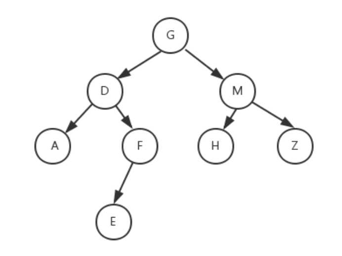

# 遍历



## 前序遍历

访问顺序：先根节点，再左子树，最后右子树；上图的访问结果为：GDAFEMHZ。

```java
public void preOrderTraverse1(TreeNode root) {
    if (root != null) {
        System.out.print(root.val + "->");
        preOrderTraverse1(root.left);
        preOrderTraverse1(root.right);
    }
}
```

## 中序遍历

访问顺序：先左子树，再根节点，最后右子树；上图的访问结果为：ADEFGHMZ。

```java
public void inOrderTraverse(TreeNode root) {
    if (root != null) {
        inOrderTraverse(root.left);
        System.out.print(root.val + "->");
        inOrderTraverse(root.right);
    }
}
```

# 后序遍历

访问顺序：先左子树，再右子树，最后根节点，上图的访问结果为：AEFDHZMG。

```java
public void postOrderTraverse(TreeNode root) {
    if (root != null) {
        postOrderTraverse(root.left);
        postOrderTraverse(root.right);
        System.out.print(root.val + "->");
    }
}
```

# DFS

# BFS

# 红黑树旋转

# 二叉树最大深度

深度优先遍历、递归

```java
/**
 * Definition for a binary tree node.
 * public class TreeNode {
 *     int val;
 *     TreeNode left;
 *     TreeNode right;
 *     TreeNode() {}
 *     TreeNode(int val) { this.val = val; }
 *     TreeNode(int val, TreeNode left, TreeNode right) {
 *         this.val = val;
 *         this.left = left;
 *         this.right = right;
 *     }
 * }
 */
class Solution {
    public int maxDepth(TreeNode root) {
        if (root == null) {
            return 0;
        } else {
            int leftHeight = maxDepth(root.left);
            int rightHeight = maxDepth(root.right);
            return Math.max(leftHeight, rightHeight) + 1;
        }
    }
}
```

# 验证二叉搜索树

递归

```java
/**
 * Definition for a binary tree node.
 * public class TreeNode {
 *     int val;
 *     TreeNode left;
 *     TreeNode right;
 *     TreeNode() {}
 *     TreeNode(int val) { this.val = val; }
 *     TreeNode(int val, TreeNode left, TreeNode right) {
 *         this.val = val;
 *         this.left = left;
 *         this.right = right;
 *     }
 * }
 */
class Solution {
    public boolean isValidBST(TreeNode root) {
        return helper(root, null, null);
    }

    public boolean helper(TreeNode node, Integer lower, Integer upper) {
        if (node == null) {
            return true;
        }

        int val = node.val;
        if (lower != null && val <= lower) {
            return false;
        }
        if (upper != null && val >= upper) {
            return false;
        }

        if (!helper(node.right, val, upper)) {
            return false;
        }
        if (!helper(node.left, lower, val)) {
            return false;
        }
        return true;
    }
}
```

中序遍历

```java
```

# 对称二叉树

递归

```java
/**
 * Definition for a binary tree node.
 * public class TreeNode {
 *     int val;
 *     TreeNode left;
 *     TreeNode right;
 *     TreeNode() {}
 *     TreeNode(int val) { this.val = val; }
 *     TreeNode(int val, TreeNode left, TreeNode right) {
 *         this.val = val;
 *         this.left = left;
 *         this.right = right;
 *     }
 * }
 */
class Solution {
    public boolean isSymmetric(TreeNode root) {
        return check(root, root);
    }

    public boolean check(TreeNode p, TreeNode q) {
        if (p == null && q == null) {
            return true;
        }
        if (p == null || q == null) {
            return false;
        }
        return p.val == q.val && check(p.left, q.right) && check(p.right, q.left);
    }
}
```

# 二叉树的层序遍历

广度优先遍历

```java
/**
 * Definition for a binary tree node.
 * public class TreeNode {
 *     int val;
 *     TreeNode left;
 *     TreeNode right;
 *     TreeNode(int x) { val = x; }
 * }
 */
class Solution {
    public List<List<Integer>> levelOrder(TreeNode root) {
        List<List<Integer>> list = new ArrayList<>();
        if(root==null){
            return list;
        }
        Queue<TreeNode> queue = new LinkedList<TreeNode>();
        queue.offer(root);
        while(!queue.isEmpty()){
            List<Integer> level = new ArrayList<Integer>();
            int size = queue.size();
            for(int i=0;i<size;i++){
                TreeNode node = queue.poll();
                level.add(node.val);
                if(node.left!=null){
                    queue.offer(node.left);
                }
                if(node.right!=null){
                    queue.offer(node.right);
                }
            }
            list.add(level);
        }
        return list;
    }
}
```

# 将有序数组转换为二叉搜索树

```java
class Solution {
    public TreeNode sortedArrayToBST(int[] nums) {
        return helper(nums, 0, nums.length - 1);
    }

    public TreeNode helper(int[] nums, int left, int right) {
        if (left > right) {
            return null;
        }

        // 总是选择中间位置左边的数字作为根节点
        int mid = (left + right) / 2;

        TreeNode root = new TreeNode(nums[mid]);
        root.left = helper(nums, left, mid - 1);
        root.right = helper(nums, mid + 1, right);
        return root;
    }
}
```

