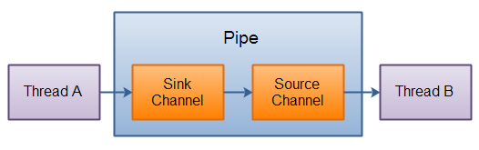

# IO的典型使用

## 缓存输入文件

```java
import java.io.BufferedReader;
import java.io.FileNotFoundException;
import java.io.FileReader;
import java.io.IOException;

//缓存输入文件
public class BufferedInputFile {

	public static String read(String fileName) {
		try {
			BufferedReader in = new BufferedReader(new FileReader(fileName));
			String s;
			StringBuffer sb = new StringBuffer();
			while ((s = in.readLine()) != null)
				sb.append(s + "\n");
				in.close();
			return sb.toString();

		} catch (FileNotFoundException e) {
			e.printStackTrace();
		} catch (IOException e) {
			e.printStackTrace();
		}
		return null;
	}

}
```

## 从内存输入

```java
import java.io.IOException;
import java.io.StringReader;

//从内存输入
public class MemoryInput {

	public static void main(String[] args) throws IOException {
		StringReader sr = new StringReader(BufferedInputFile.read("D:\\workspace\\Demo\\src\\123.txt"));
		int c;
		while((c=sr.read())!=-1) {
			//read是以int类型返回下一字节，必须转换为char
			System.out.println((char) c);
		}
	}

}
```
## 格式化的内存输入

```java
import java.io.ByteArrayInputStream;
import java.io.DataInputStream;
import java.io.IOException;

//格式化的内存输入
public class FormattedMemoryInput {

	public static void main(String[] args) throws IOException {

		DataInputStream in = new DataInputStream(
				new ByteArrayInputStream(BufferedInputFile.read("D:\\workspace\\Demo\\src\\123.txt").getBytes()));

		while (in.available() != 0)
			System.out.println((char) in.readByte());

	}

}
```

## 基本的文件输出

```java
import java.io.BufferedReader;
import java.io.BufferedWriter;
import java.io.FileWriter;
import java.io.IOException;
import java.io.PrintWriter;
import java.io.StringReader;

//基本的文件输出
public class BasicFileOutput {

	private static String fileIn = "D:\\workspace\\Demo\\src\\in.txt";
	private static String fileOut = "D:\\workspace\\Demo\\src\\out.txt";

	public static void main(String[] args) throws IOException {
		BufferedReader in = new BufferedReader(new StringReader(BufferedInputFile.read(fileIn)));

		PrintWriter out = new PrintWriter(new BufferedWriter(new FileWriter(fileOut)));

		// 行号
		int lineCount = 1;

		String s;
		while ((s = in.readLine()) != null)
			// out.print(s+"\n");
			out.print(lineCount++ + ":" + s + "\n");

		out.close();
		System.out.println(BufferedInputFile.read(fileOut));

	}

}
```

## 文本文件输出的简化版本

这里依旧使用了缓存，利用`PrintWriter`的辅助构造器。

```java
import java.io.BufferedReader;
import java.io.IOException;
import java.io.PrintWriter;
import java.io.StringReader;

//文本文件输出的简化版本
public class FileOutputShortcut {

	private static String fileIn = "D:\\workspace\\Demo\\src\\in.txt";
	private static String fileOut = "D:\\workspace\\Demo\\src\\out.txt";

	public static void main(String[] args) throws IOException {
		BufferedReader in = new BufferedReader(new StringReader(BufferedInputFile.read(fileIn)));

		PrintWriter out = new PrintWriter(fileOut);

		// 行号
		int lineCount = 1;

		String s;
		while ((s = in.readLine()) != null)
			// out.print(s+"\n");
			out.print(lineCount++ + ":" + s + "\n");

		out.close();
		System.out.println(BufferedInputFile.read(fileOut));
	}

}
```

## 存储和恢复数据

使用`DataOutputStream`写入数据，同时使用`DataInputStream`读取数据可以保证数据准确。

```java
import java.io.BufferedInputStream;
import java.io.BufferedOutputStream;
import java.io.DataInputStream;
import java.io.DataOutputStream;
import java.io.FileInputStream;
import java.io.FileOutputStream;
import java.io.IOException;

//存储和恢复数据
public class StoringAndRecoveringData {

	private static String file = "D:\\workspace\\Demo\\src\\out.txt";

	public static void main(String[] args) throws IOException {
		DataOutputStream out = new DataOutputStream(new BufferedOutputStream(new FileOutputStream(file)));
		out.writeDouble(3.14159);
		out.writeUTF("测试1");
		out.writeDouble(1.41413);
		out.writeUTF("测试2");
		out.close();

		DataInputStream in = new DataInputStream(new BufferedInputStream(new FileInputStream(file)));
		System.out.println(in.readDouble());
		System.out.println(in.readUTF());
		System.out.println(in.readDouble());
		System.out.println(in.readUTF());
		in.close();
	}

}
```

# NIO

NIO的核心组成部分

> Channels
> Buffers
> Selectors

主要的Buffer实现

> ByteBuffer
> CharBuffer
> DoubleBuffer
> FloatBuffer
> IntBuffer
> LongBuffer
> ShortBuffer

## Channel

主要的Channel实现

> FileChannel  从文件中读写数据
> DatagramChannel  能通过UDP读写网络中的数据
> SocketChannel  能通过TCP读写网络中的数据
> ServerSocketChannel  可以监听新进来的TCP连接，对每一个新进来的连接都会创建一个SocketChannel

### FileChannel

FileChannel是一个连接到文件的通道。可以通过文件通道读写文件。

FileChannel无法设置为非阻塞模式，它总是运行在阻塞模式下。

### SocketChannel

创建的方式：

- 1. 打开一个SocketChannel并连接到互联网上的某台服务器。

```java
SocketChannel socketChannel = SocketChannel.open();
socketChannel.connect(new InetSocketAddress("http://jenkov.com", 80));
```

- 2. 一个新连接到达ServerSocketChannel时，会创建一个SocketChannel。

当用完SocketChannel之后调用SocketChannel.close()关闭SocketChannel：`socketChannel.close();`

### ServerSocketChannel

ServerSocketChannel 是一个可以监听新进来的TCP连接的通道。

**打开 ServerSocketChannel**

`ServerSocketChannel serverSocketChannel = ServerSocketChannel.open();`

**关闭 ServerSocketChannel**

`serverSocketChannel.close();`

**监听新进来的连接**

通过 ServerSocketChannel.accept() 方法监听新进来的连接。当 accept()方法返回的时候,它返回一个包含新进来的连接的 SocketChannel。因此, accept()方法会一直阻塞到有新连接到达。

**非阻塞模式**

ServerSocketChannel可以设置成非阻塞模式。在非阻塞模式下，accept() 方法会立刻返回，如果还没有新进来的连接,返回的将是null，因此，需要检查返回的SocketChannel是否是null。

`serverSocketChannel.configureBlocking(false);`

**Demo**

```java
import java.io.IOException;
import java.net.InetSocketAddress;
import java.nio.channels.ServerSocketChannel;
import java.nio.channels.SocketChannel;

public class ServerSocketChannelDemo {

	public static void main(String[] args) {
		try {
			ServerSocketChannel serverSocketChannel = ServerSocketChannel.open();

			serverSocketChannel.socket().bind(new InetSocketAddress(9999));
			serverSocketChannel.configureBlocking(false);

			while (true) {
				SocketChannel socketChannel = serverSocketChannel.accept();

				if (socketChannel != null)
					System.out.println("do something");

				Thread.sleep(100);
				System.out.println("next");

			}
		} catch (IOException e) {
			e.printStackTrace();
		} catch (InterruptedException e) {
			e.printStackTrace();
		}
	}

}
```

### DatagramChannel

DatagramChannel是一个能收发UDP包的通道。因为UDP是无连接的网络协议，所以不能像其它通道那样读取和写入。它发送和接收的是数据包。

**打开 DatagramChannel**

```java
DatagramChannel channel = DatagramChannel.open();
channel.socket().bind(new InetSocketAddress(9999));
```

**接收数据**

```java
ByteBuffer buf = ByteBuffer.allocate(48);
buf.clear();
channel.receive(buf);
```

**发送数据**

由于UDP是无连接的，没有返回结果，所以UDP在数据传送方面没有任何保证。

```java
ByteBuffer buf = ByteBuffer.allocate(48);
buf.put(newData.getBytes());
buf.flip();

int bytesSent = channel.send(buf, new InetSocketAddress("jenkov.com", 80));
```

**连接到特定的地址**

可以将DatagramChannel“连接”到网络中的特定地址的。由于UDP是无连接的，连接到特定地址并不会像TCP通道那样创建一个真正的连接。而是锁住DatagramChannel ，让其只能从特定地址收发数据。

`channel.connect(new InetSocketAddress("jenkov.com", 80));`

## Buffer

Buffer用于和NIO通道进行交互，数据是从通道读入缓冲区，从缓冲区写入到通道中的。

缓冲区本质上是一块可以写入数据，然后可以从中读取数据的内存。这块内存被包装成NIO Buffer对象，并提供了一组方法，用来方便的访问该块内存。

使用Buffer的四个步骤:

- 写入数据到Buffer
- 调用flip()方法
- 从Buffer中读取数据
- 调用clear()方法或者compact()方法

> 当向buffer写入数据时，buffer会记录下写了多少数据。一旦要读取数据，需要通过flip()方法将Buffer从写模式切换到读模式。在读模式下，可以读取之前写入到buffer的所有数据。
>
> 一旦读完了所有的数据，就需要清空缓冲区，让它可以再次被写入。有两种方式能清空缓冲区：调用clear()或compact()方法。clear()方法会清空整个缓冲区。compact()方法只会清除已经读过的数据。任何未读的数据都被移到缓冲区的起始处，新写入的数据将放到缓冲区未读数据的后面。

### Scattering Reads

Scattering Reads是指数据从一个channel读取到多个buffer中。

```java
ByteBuffer header = ByteBuffer.allocate(128);
ByteBuffer body   = ByteBuffer.allocate(1024);

ByteBuffer[] bufferArray = { header, body };

channel.read(bufferArray);
```

注意，Scattering Reads在移动下一个buffer前，必须填满当前的buffer。例如：如果存在消息头和消息体，那么消息头必须完成填充（128byte），Scattering Reads才能正常工作。

### Gathering Writes

Gathering Writes是指数据从多个buffer写入到同一个channel。

```java
ByteBuffer header = ByteBuffer.allocate(128);
ByteBuffer body   = ByteBuffer.allocate(1024);

ByteBuffer[] bufferArray = { header, body };

channel.write(bufferArray);
```

## Selector

Selector能够检测一到多个NIO通道，并能知晓通道是否为相应的事件准备就绪。

- 1. 创建Selector

`Selector selector = Selector.open();`

- 2. 向Selector注册通道

```java
channel.configureBlocking(false);
SelectionKey key = channel.register(selector, Selectionkey.OP_READ);
```

与Selector一起使用时，Channel必须处于非阻塞模式下，这意味着不能将FileChannel与Selector一起使用，因为FileChannel不能切换到非阻塞模式。而套接字通道都可以。

通道触发了一个事件意思是该事件已经就绪。所以，某个channel成功连接到另一个服务器称为“连接就绪”。一个server socket channel准备好接收新进入的连接称为“接收就绪”。一个有数据可读的通道可以说是“读就绪”。等待写数据的通道可以说是“写就绪”。

这四种事件用SelectionKey的四个常量来表示：

- SelectionKey.OP_CONNECT
- SelectionKey.OP_ACCEPT
- SelectionKey.OP_READ
- SelectionKey.OP_WRITE

多个事件可以用`|`连接起来

`int interestSet = SelectionKey.OP_READ | SelectionKey.OP_WRITE;`

### Demo

打开一个Selector，注册一个通道注册到这个Selector上(通道的初始化过程略去),然后持续监控这个Selector的四种事件（接受，连接，读，写）是否就绪。

```java
import java.io.IOException;
import java.net.InetSocketAddress;
import java.nio.channels.SelectionKey;
import java.nio.channels.Selector;
import java.nio.channels.SocketChannel;
import java.util.Iterator;
import java.util.Set;

public class SelectorDemo {

	public static void main(String[] args) throws IOException {
		SocketChannel channel = SocketChannel.open();
		channel.connect(new InetSocketAddress("http://baidu.com", 80));
		Selector selector = Selector.open();
		channel.configureBlocking(false);
		// SelectionKey key = channel.register(selector, SelectionKey.OP_READ);
		while (true) {
			int readyChannels = selector.select();
			if (readyChannels == 0)
				continue;
			Set selectedKeys = selector.selectedKeys();
			Iterator keyIterator = selectedKeys.iterator();
			while (keyIterator.hasNext()) {
				SelectionKey key = (SelectionKey) keyIterator.next();
				if (key.isAcceptable()) {
					System.out.println("Accept");
				} else if (key.isConnectable()) {
					System.out.println("Connect");
				} else if (key.isReadable()) {
					System.out.println("Read");
				} else if (key.isWritable()) {
					System.out.println("Write");
				}
				keyIterator.remove();
			}
		}
	}

}
```

## Pipe



管道是2个线程之间的单向数据连接。Pipe有一个source通道和一个sink通道。数据会被写到sink通道，从source通道读取。

**创建管道**

`Pipe pipe = Pipe.open();`

**向管道写数据**

先访问sink通道，再调用SinkChannel的write()方法，将数据写入SinkChannel。

```java
Pipe.SinkChannel sinkChannel = pipe.sink();
sinkChannel.write(buf);
```

**从管道读取数据**

```java
import java.io.IOException;
import java.nio.ByteBuffer;
import java.nio.channels.Pipe;

public class PipeDemo {

	private static final int BSIZE = 1024;

	public static void main(String[] args) {
		try {
			Pipe pipe = Pipe.open();
			// 从读取管道的数据，需要访问source通道
			Pipe.SinkChannel sinkChannel = pipe.sink();

			String newData = "New String to write to file..." + System.currentTimeMillis();
			ByteBuffer buff = ByteBuffer.allocate(BSIZE);
			buff.asCharBuffer().put(newData);

			while (buff.hasRemaining()) {
				// 向管道写入数据
				sinkChannel.write(buff);
			}

			Pipe.SourceChannel sourceChannel = pipe.source();
			buff.clear();
			// 调用source通道的read()方法来读取数据
			int bytesRead = sourceChannel.read(buff);
			buff.flip();
			System.out.println(bytesRead);
			System.out.println(buff.asCharBuffer());

		} catch (IOException e) {
			e.printStackTrace();
		}
	}

}
```

## Demo

### 简单的通道演示

一旦调用`read()`来告知`FileChannel`向`ByteBuffer`存储字节，就必须要调用缓冲器上的`flip()`。

```java
import java.io.FileInputStream;
import java.io.FileOutputStream;
import java.io.IOException;
import java.io.RandomAccessFile;
import java.nio.ByteBuffer;
import java.nio.CharBuffer;
import java.nio.channels.FileChannel;
import java.nio.charset.Charset;

//简单的通道演示
public class GetChannel {

	private static String file = "D:\\workspace\\Demo\\src\\channel.txt";

	private static final int BSIZE = 1024;

	public static void main(String[] args) throws IOException {
		//可写
		FileChannel fc = new FileOutputStream(file).getChannel();
		fc.write(ByteBuffer.wrap("可写".getBytes()));
		fc.close();

		//可读可写
		fc = new RandomAccessFile(file, "rw").getChannel();
		fc.position(fc.size());
		fc.write(ByteBuffer.wrap("可读可写".getBytes()));
		fc.close();

		//可读
		fc = new FileInputStream(file).getChannel();
		ByteBuffer buff = ByteBuffer.allocate(BSIZE);
		fc.read(buff);
		buff.flip();
		while(buff.hasRemaining()) {
			System.out.println((char)buff.get());
		}

		//解决中文乱码
		fc = new FileInputStream(file).getChannel();
		Charset cs = Charset.forName ("UTF-8");
		ByteBuffer buffer = ByteBuffer.allocate(BSIZE);
		fc.read(buffer);
		buffer.flip();
		CharBuffer cb = cs.decode (buffer);
		while(cb.hasRemaining()) {
			System.out.println((char)cb.get());
		}

	}

}
```

### 简单文件复制

执行进一步的`read()`操作，必须要调用`clear()`来为每个`read()`做好准备。

```java
import java.io.FileInputStream;
import java.io.FileOutputStream;
import java.io.IOException;
import java.nio.ByteBuffer;
import java.nio.channels.FileChannel;

//简单文件复制
public class ChannelCopy {

	private static final int BSIZE = 1024;

	private static String fileOld = "D:\\workspace\\Demo\\src\\file_old.txt";
	private static String fileNew = "D:\\workspace\\Demo\\src\\file_new.txt";

	public static void main(String[] args) throws IOException {

		FileChannel in = new FileInputStream(fileOld).getChannel(), out = new FileOutputStream(fileNew).getChannel();

		ByteBuffer buff = ByteBuffer.allocate(BSIZE);
		while (in.read(buff) != -1) {
			buff.flip();
			out.write(buff);
			buff.clear();
		}
		in.close();
		out.close();

	}

}
```

### 文件复制的改进

使用方法将两个通道直接相连。

```java
import java.io.FileInputStream;
import java.io.FileOutputStream;
import java.io.IOException;
import java.nio.channels.FileChannel;

//文件复制的改进
public class TransferTo {

	private static String fileOld = "D:\\workspace\\Demo\\src\\file_old.txt";
	private static String fileNew = "D:\\workspace\\Demo\\src\\file_new.txt";

	public static void main(String[] args) throws IOException {
		FileChannel in = new FileInputStream(fileOld).getChannel(), out = new FileOutputStream(fileNew).getChannel();
		in.transferTo(0, in.size(), out);
		// OR
		// out.transferFrom(in, 0, in.size());
	}

}
```

### 转换数据

```java
import java.io.FileInputStream;
import java.io.FileOutputStream;
import java.io.IOException;
import java.nio.ByteBuffer;
import java.nio.channels.FileChannel;
import java.nio.charset.Charset;

public class BufferToText {

	private static final int BSIZE = 1024;

	private static String file = "D:\\workspace\\Demo\\src\\file.txt";

	public static void main(String[] args) throws IOException {

		/* ========================================================= */
		// 写入数据
		FileChannel fc = new FileOutputStream(file).getChannel();
		fc.write(ByteBuffer.wrap("测试".getBytes()));
		fc.close();

		// 读取数据
		fc = new FileInputStream(file).getChannel();
		ByteBuffer buff = ByteBuffer.allocate(BSIZE);
		fc.read(buff);
		buff.flip();
		fc.close();

		// 输出乱码 未成功
		System.out.println(buff.asCharBuffer());
		/* ========================================================= */

		buff.rewind();// 返回数据开头

		/* ========================================================= */
		// 使用系统默认编码
		String encodeing = System.getProperty("file.encoding");
		System.out.println("Decoded using " + encodeing + ":" + Charset.forName(encodeing).decode(buff));
		/* ========================================================= */
		// 写入时设置编码格式

		// 写入数据
		fc = new FileOutputStream(file).getChannel();
		fc.write(ByteBuffer.wrap("测试2".getBytes("UTF-16BE")));
		fc.close();

		// 读取数据
		fc = new FileInputStream(file).getChannel();
		buff.clear();
		fc.read(buff);
		buff.flip();
		fc.close();

		System.out.println(buff.asCharBuffer());
		/* ========================================================= */

		buff.rewind();// 返回数据开头

		/* ========================================================= */
		// 写入时使用CharBuffer写入

		// 写入数据
		fc = new FileOutputStream(file).getChannel();
		buff = ByteBuffer.allocate(BSIZE);
		buff.asCharBuffer().put("测试3");
		fc.write(buff);
		fc.close();

		// 读取数据
		fc = new FileInputStream(file).getChannel();
		buff.clear();
		fc.read(buff);
		buff.flip();
		System.out.println(buff.asCharBuffer());

	}

}
```

### 获取基本类型

```java
import java.nio.ByteBuffer;

//获取基本类型
public class GetData {

	private static final int BSIZE = 1024;

	public static void main(String[] args) {

		ByteBuffer buff = ByteBuffer.allocate(BSIZE);

		int i = 0;
		while (i++ < buff.limit())
			if (buff.get() != 0)
				System.out.println("nonzero");
		System.out.println("i=" + i);
		buff.rewind();

		// 插入char数据类型
		buff.asCharBuffer().put("ABCDEFG");
		char c;
		while ((c = buff.getChar()) != 0)
			System.out.print(c + " ");

		/* ========================================================= */

		System.out.println();
		buff.rewind();

		// 插入short数据类型
		buff.asShortBuffer().put((short) 471142);// ShortBuffer的put()需要进行类型转换
		System.out.println(buff.getShort());// OUT:12390

		/* ========================================================= */

		buff.rewind();

		// 插入int数据类型
		buff.asIntBuffer().put(99471142);
		System.out.println(buff.getInt());

		/* ========================================================= */

		buff.rewind();

		// 插入long数据类型
		buff.asLongBuffer().put(99471142);
		System.out.println(buff.getLong());

		/* ========================================================= */

		buff.rewind();

		// 插入float数据类型
		buff.asFloatBuffer().put(99471142);
		System.out.println(buff.getFloat());

		/* ========================================================= */

		buff.rewind();

		// 插入double数据类型
		buff.asDoubleBuffer().put(99471142);
		System.out.println(buff.getDouble());

	}

}
```

### 字符串写入文件

```java
public static void main(String[] args) throws IOException {

    String filePath = "C:\\Users\\Admin\\Desktop\\file.txt";

    FileChannel out = new FileOutputStream(filePath).getChannel();

    ByteBuffer buffer = ByteBuffer.wrap(new String("waitng to write").getBytes());

    out.write(buffer);
    out.close();

}
```