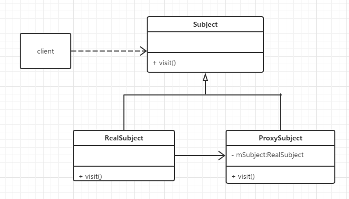

# Proxy概念

Java中的Proxy（代理）是非常重要的技术之一，代理模式是Java常见的设计模式之一。所谓代理模式是指客户端并不直接调用实际的对象，而是通过调用代理，来间接的调用实际的对象。

使用代理，可以不需要直接访问对象，就达到一定的需求。比如在对象执行前后额外进行一些任务，而不需要对对象本身进行修改。

**代理的两个主要概念:**

 - 代理对象存在的价值主要用于拦截对真实业务对象的访问。
 - 代理对象应该具有和目标对象(真实业务对象)相同的方法。

**代理模式UML图:**



代理模式在Java中主要有两种实现，分别为静态代理和动态代理。

# 静态代理

静态代理方式是为每个被代理的对象构造对应的代理类。

```java
//Calculator.java 接口
public interface Calculator {
	public int add(int a,int b);
}

//CalculatorImpl.java 实现类
public class CalculatorImpl implements Calculator {

	@Override
	public int add(int a, int b) {
		int i = a +b;
		System.out.println("result:"+i);
		return i;

	}

}

//CalculatorProxy.java 代理类
public class CalculatorProxy {

	private Calculator calculator;

	public CalculatorProxy(Calculator calculator) {
		this.calculator = calculator;
	}

	public int add(int a,int b){
		//doAfter
		System.out.println("doAfter");

		int result = calculator.add(a, b);

		//doBefore
		System.out.println("doBefore");

		return result;

	}

}

//TestStatic.java 测试
public class TestStatic {

	public static void main(String[] args) {
		CalculatorProxy proxy = new CalculatorProxy(new CalculatorImpl());

		proxy.add(1, 2);
	}

}

```

# 动态代理

动态代理方式是动态地生成具体委托类的代理类实现对象。

通过`Proxy.newProxyInstance`来创建代理的方法可以为不同的委托类都创建代理类。在具体的代理实现上，使用通用的实现，被代理的方法调用都会进入`invoke()`方法中，可以执行其他的事情。

**具体实现流程:**

 - 编写一个委托类的接口，即静态代理的（Subject接口）。
 - 实现一个真正的委托类，即静态代理的（RealSubject类）。
 - 创建一个动态代理类，实现`InvocationHandler`接口，并重写该`invoke()`方法。
 - 在测试类中，生成动态代理的对象。

```java
//Calculator.java 接口
public interface Calculator {
	public int add(int a,int b);
}

//CalculatorImpl.java 实现类
public class CalculatorImpl implements Calculator {

	@Override
	public int add(int a, int b) {
		int i = a +b;
		System.out.println("result:"+i);
		return i;

	}

}

//LogHandler.java 动态代理Handler
import java.lang.reflect.InvocationHandler;
import java.lang.reflect.Method;

public class LogHandler implements InvocationHandler {

	private Object obj;

	public LogHandler(Object obj) {
		this.obj = obj;
	}

	@Override
	public Object invoke(Object proxy, Method method, Object[] args) throws Throwable {
		this.doBefore();
		Object o = method.invoke(obj, args);
		this.doAfter();
		return o;
	}

	public void doBefore() {

		System.out.println("doSomething-before");

	}

	public void doAfter() {

		System.out.println("doSomething-after");
	}

}

//TestDynamic.java 测试
import java.lang.reflect.Proxy;

public class TestDynamic {

	public static void main(String[] args) {
		Calculator calculator = new CalculatorImpl();

		LogHandler handler = new LogHandler(calculator);

		Calculator proxy = (Calculator) Proxy.newProxyInstance(calculator.getClass().getClassLoader(),
				calculator.getClass().getInterfaces(), handler);

		proxy.add(1, 2);

	}

}
```

其中，创建动态代理的对象，需要借助`Proxy.newProxyInstance`。

**该方法的三个参数分别是：**

 - `ClassLoader loader`表示当前使用到的`appClassloader`。
 - `Class<?>[] interfaces`表示目标对象实现的一组接口。
 - `InvocationHandler handler`表示当前的`InvocationHandler`实现实例对象。
