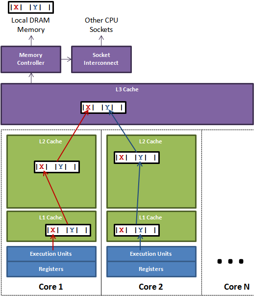

# 缓存行与伪共享

缓存系统中是以**缓存行**（cache line）为单位存储的。缓存行是2的整数幂个连续字节，一般为32-256个字节。最常见的缓存行大小是64个字节。当多线程修改互相独立的变量时，如果这些变量共享同一个缓存行，就会无意中影响彼此的性能，这就是**伪共享**。

为了让可伸缩性与线程数呈线性关系，就必须确保不会有两个线程往同一个变量或缓存行中写。

# CPU缓存执行过程

在核心1上运行的线程想更新变量X，同时核心2上的线程想要更新变量Y。不幸的是，这两个变量在同一个缓存行中。每个线程都要去竞争缓存行的所有权来更新变量。如果核心1获得了所有权，缓存子系统将会使核心2中对应的缓存行失效。当核心2获得了所有权然后执行更新操作，核心1就要使自己对应的缓存行失效。这会来来回回的经过L3缓存，大大影响了性能。如果互相竞争的核心位于不同的插槽，就要额外横跨插槽连接，问题可能更加严重。

简单来说，由于缓存区有存在多个线程的对象，当一个对象被争夺后会导致整个缓存行失效，增加了其他线程获取资源的时间。

# Disruptor的解决方案

 CPU在将主内存中数据载入到快速缓冲时，假设发现被载入的数据不足64字节，那么就会载入多个数据，以填满自己的64字节，悲催就发生了，恰恰hotspot JVM中对象指针等大小都不会超过64字节。这样一个快速缓冲中可能载入了两个对象指针，一个CPU一个快速缓冲。双核就是两个CPU各自一个快速缓冲，那么两个快速缓冲中各有两个对象指针，都是指向同样的两个对象。

由于一个CPU仅仅能訪问(写)自己快速缓存区中数据。相当于给这个数据加锁。那么另外一个CPU同一时候訪问自己快速缓冲行中相同数据时将会被锁定不能訪问。

Disruptor的解决的方法是填满快速缓冲的64字节。不是对象指针等数据不够64字节吗？那么加一些字节填满64字节，这样CPU将数据载入到快速缓冲时，就仅仅能载入一个了，刚刚好啊。

**这就发生与锁机制类似的性能陷进。**

Disruptor的解决的方法是填满快速缓冲的64字节。不是对象指针等数据不够64字节吗？那么加一些字节填满64字节，这样CPU将数据载入到快速缓冲时，就仅仅能载入一个了，刚刚好啊。